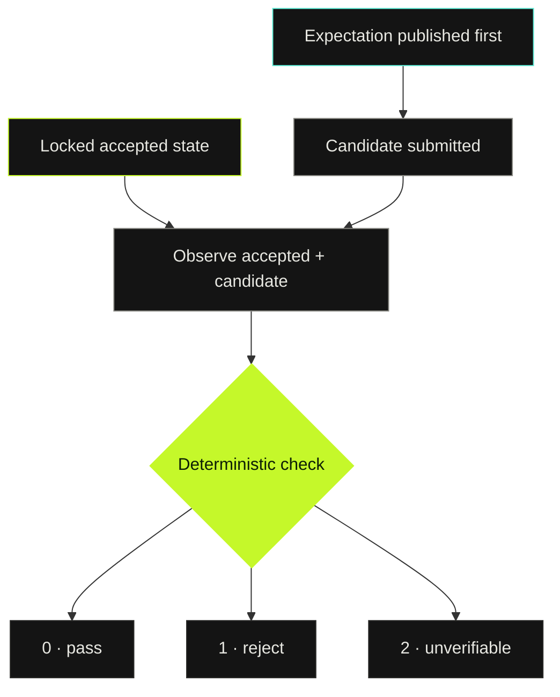
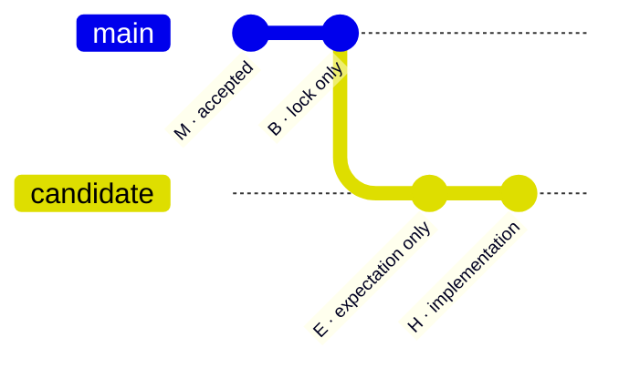
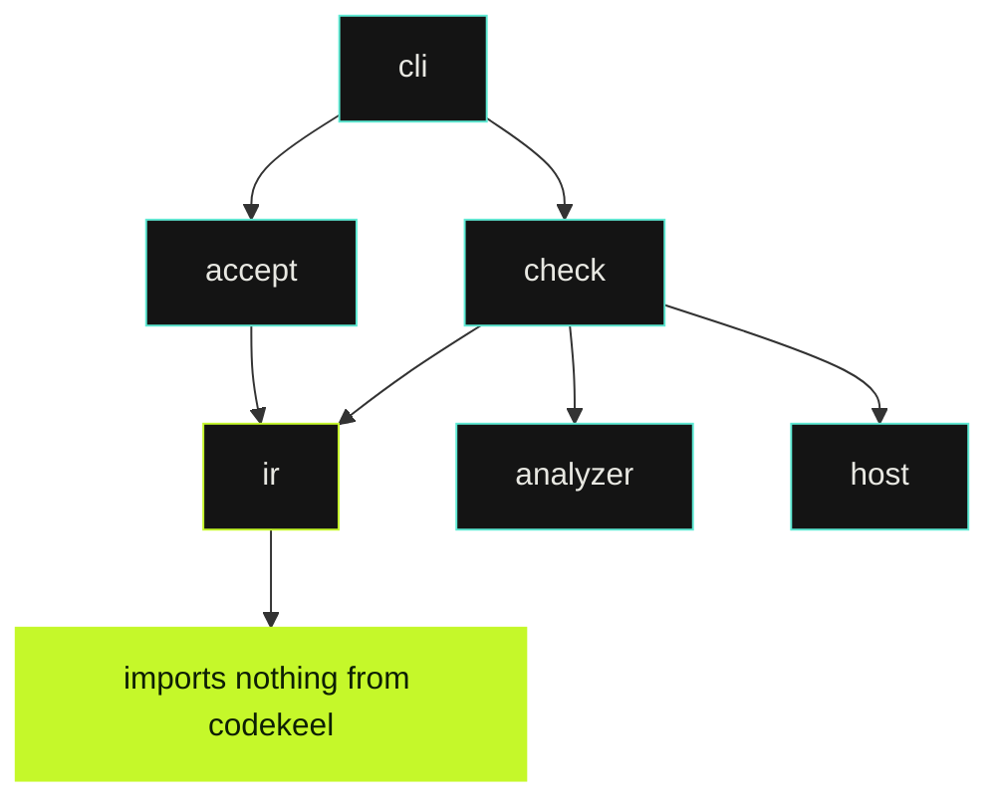

# Codekeel

**The agent declares before it submits. The check is deterministic.**

<p>
  
</p>


[](https://github.com/rapiddweller/codekeel/actions/workflows/ci.yml)
[](https://github.com/rapiddweller/codekeel/blob/main/LICENSE)
[](https://github.com/rapiddweller/codekeel/blob/main/docs/roadmap.md)

Codekeel checks architecture boundaries and declared changes in AI-assisted code.
It compares an accepted commit with a candidate, checks their scans against the
configured contract, and verifies that the candidate matches an expectation
published before its first submission.

It catches two failure modes that finding-only diffs miss:

- the architecture changed without being declared;
- the scanner saw less of the program, so the result looks clean only because
  the graph became blinder.

[Quickstart](#quickstart) · [How it works](#how-it-works) ·
[Reference](https://github.com/rapiddweller/codekeel/blob/main/docs/reference.md) · [Roadmap](https://github.com/rapiddweller/codekeel/blob/main/docs/roadmap.md)

> [!NOTE]
> **Milestone 1:** `report` and `check` work. `accept` is still a placeholder.
> The Python analyzer ships inside the Codekeel package.

## Why Codekeel

An agent can keep tests green and introduce no new architecture finding while
making the code harder to analyze. If the gate compares finding identities
only, that change passes.

Fixture A is the smallest example:

```diff
 def run(key: str) -> int:
-    return first() + second()
+    handlers = {"first": first, "second": second}
+    return handlers[key]()
```

The refactor introduces no new forbidden import, cycle, or private crossing.
But static call resolution gets worse:

| Observation | Accepted | Candidate |
| --- | ---: | ---: |
| Resolved calls | 2 of 2 | 0 of 1 |
| Unresolved calls | 0 | 1 |
| New finding fingerprints | 0 | 0 |
| Codekeel verdict | baseline | **FAIL** |

```text
expectation_fulfilled: FAIL
regression check failed in calls_unresolved: 0->1
regression check failed in unresolved_ratio: 0/2->1/1
```

Codekeel compares raw measurements as well as finding counts and fingerprints.
The ratio check uses integer cross-multiplication, never rounded percentages:

```text
U_candidate × T_accepted <= U_accepted × T_candidate   (when both T > 0)
```

### What the gate adds

- **Precommitment with evidence.** The agent publishes the intended change
  before it submits the candidate. Git ancestry and host records prove the
  order; author timestamps do not.
- **Coverage-aware regression checks.** A disappearing edge is not mistaken
  for an improvement just because a finding disappeared with it.
- **Explicit uncertainty.** An incomplete scan, broken lock, empty scope, or
  runtime mismatch returns exit `2` with a diagnostic. Unknown never becomes
  green.

Codekeel complements tests, linters, and human review. It does not replace any
of them. Its job is narrower: keep architecture changes declared, observable,
and mechanically checkable.

## Review surface

<p>
  
</p>

The HTML report is designed for a reviewer making a merge decision:

- **Decision first.** `PASS`, `REJECT`, or `UNVERIFIABLE` is visible before details.
- **No blended score.** Scan completeness, contract compliance, and expectation matching
  remain separate verdicts.
- **Unknown stays visible.** Missing or invalid evidence includes the affected subject,
  unknown claim, and remedy.
- **Evidence stays inspectable.** Exact counts, fingerprints, source locations, digests,
  and runtime provenance remain available beside the verdict.

## Quickstart

### Requirements

- Python 3.11+

Install from PyPI:

```bash
python -m pip install codekeel
codekeel --help
```

Add `codekeel.toml` to the repository you want to check:

```toml
[scan]
roots = ["src/example"]          # directories, not globs
namespace = "example"
contract = "architecture-contract.json"
```

Observe the current repository:

```bash
codekeel report \
  --root /repo \
  --output architecture.json
```

The command also writes a self-contained `interactive.html` beside the canonical JSON.
It presents the three independent verdicts, exact measurements, diagnostics and provenance.

Check a candidate against its published expectation:

```bash
codekeel check \
  --root /repo \
  --baseline "$B" \
  --expectation-commit "$E" \
  --head "$H" \
  --expected expectation.json \
  --expected-digest "$DIGEST" \
  --accepted-branch main \
  --branch candidate
```

Run the Python version required by the repository being scanned. A mismatch is
reported as `runtime_mismatch` with exit `2`, not as broken source code.

## How it works



A check answers three independent questions. It never compresses them into a
single score.

| Verdict | Question | Typical failure |
| --- | --- | --- |
| `observation_complete` | Did the scan see everything it claims to see? | Incomplete scan, empty scope, rule without subjects |
| `declared_rules` | Does the code obey the architecture contract? | Forbidden import between components |
| `expectation_fulfilled` | Did the candidate match the declaration without regressions? | Coverage regression, undeclared change, late expectation |

### Exit codes

| Exit | Meaning |
| ---: | --- |
| `0` | Complete report or successful check |
| `1` | Rejected because at least one verdict is `FAIL` |
| `2` | Unverifiable input, always with at least one diagnostic |

Every exit `2` diagnostic contains:

```text
kind · subject · unknown_claim · remedy
```

A broken lock is therefore not interpreted as an empty accepted state.

## The M → B → E → H protocol



| Commit | Contract |
| --- | --- |
| **M** | Accepted state. Codekeel re-observes it. |
| **B** | Lock-only child of M and tip of the accepted branch. It binds the config, checker, and observation digests. |
| **E** | Child of B that changes only the expectation file. It must be published before the first submission of H. |
| **H** | Descendant of E. It must not modify the lock, config, architecture contract, or expectation. |

### Agent workflow

1. Start from the lock commit **B**.
2. Write the intended architecture change and commit it alone as **E**.
3. Publish **E** before submitting implementation work.
4. Implement the change in one or more commits ending at **H**.
5. Run `codekeel check`. Fix the code or revise the proposal in a new protocol
   cycle; do not rewrite protected inputs inside H.

Fixture B writes its expectation after implementation by deriving it from the
observed delta. Its architecture findings are otherwise clean. Codekeel still
rejects it:

```text
host_order: FAIL
expectation_fulfilled: FAIL
expectation was not published before the first candidate submission
```

Precommitment proves "published before submission." It does not prove that no
private edit existed before publication.

## Host evidence

In GitLab CI, Codekeel reads merge-request diff versions through `glab` to
establish publication order.

For local testing, replay captured host records:

```bash
uv run codekeel check ... --host-records records.json
```

A local replay validates the record shape and behavior. It does not prove host
authenticity.

## Development

Run the complete project gate:

```bash
make check
```

This runs Ruff, strict mypy, pytest, and Codekeel's self-check.

Run the full release check, build both distributions, and install each one in isolation:

```bash
make release-check
```

Reproduce the protocol fixtures:

```bash
make fixtures
```

Codekeel checks its own boundaries. `codekeel.toml` and
[architecture-contract.json](https://github.com/rapiddweller/codekeel/blob/main/architecture-contract.json) define the contract;
[fixtures/D-self/result.json](https://github.com/rapiddweller/codekeel/blob/main/fixtures/D-self/result.json) contains the latest
self-scan.



## Current boundaries

Codekeel is deliberately strict about what it can prove:

- **Competing implementations:** review is still required when no declared rule
  or observed regression exposes them.
- **Private crossings:** only import records are checked. `import pkg;
  pkg._member` is not detected.
- **Precommitment:** publication order is proven; private editing order is not.
- **Analyzer runtime:** Codekeel's Python must be at least the target
  repository's Python.
- **Acceptance:** `accept` is a placeholder and returns exit `2`.

## Roadmap

Milestone 1 delivers `report` and `check`. Next:

1. CI-only `accept`
2. a review page
3. agent commands: `propose` and `next`

See [docs/roadmap.md](https://github.com/rapiddweller/codekeel/blob/main/docs/roadmap.md) for sequencing and
[docs/reference.md](https://github.com/rapiddweller/codekeel/blob/main/docs/reference.md) for lock, host-record, schema, and
regression-check details.

## License

MIT © 2026 Rapiddweller Asia Co., Ltd.

Maintained by [Alexander Kell](https://github.com/ake2l).
