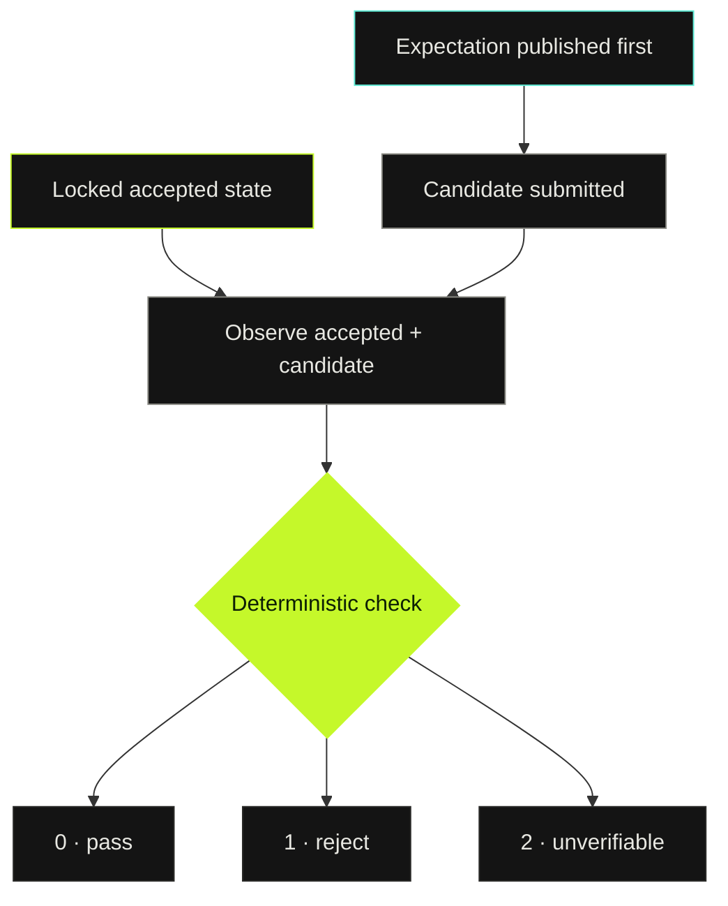
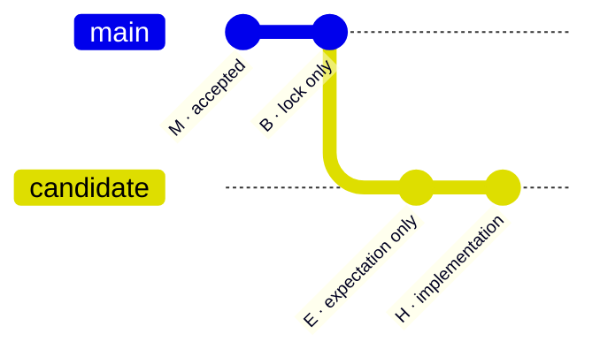

# Archkeel

**The agent declares before it submits. The check is deterministic.**

<p>
  
</p>


[](https://github.com/rapiddweller/archkeel/actions/workflows/ci.yml)
[](https://github.com/rapiddweller/archkeel/blob/main/LICENSE)
[](https://pypi.org/project/archkeel/)

Archkeel checks architecture boundaries and declared changes in AI-assisted code.
It compares an accepted commit with a candidate, checks their scans against the
configured contract, and verifies that the candidate matches an expectation
published before its first submission.

It catches two failure modes that finding-only diffs miss:

- the architecture changed without being declared;
- the scanner saw less of the program, so the result looks clean only because
  the graph became blinder.

<p>
  
</p>

<sub>A real negative case from the <code>fixtures/F-architecture</code> tour:
<code>shop.store.repository</code> imports <code>Money</code> and breaks
<code>DEP-STORE-NO-MONEY</code>. In the open HTML report, <strong>Violations only</strong> collapses
secondary detail and leaves the verdict, failures, unknowns and evidence available; Component
flow's <strong>Violating edges only</strong> control keeps only broken edges at the current level.
Both change the view, never the verdict or evidence. This capture focuses on <code>app</code>;
<strong>All components and groups</strong> restores the unassigned module omitted by that focus.</sub>

Modules without a unique declared owner remain reachable through a navigation-only
<code>Unassigned modules</code> group; it does not create a component boundary or verdict.

<p>
  
</p>

[Try the demo](#try-the-demo) · [Onboard your project](#onboard-your-project) · [How it works](#how-it-works) ·
[Reference](https://github.com/rapiddweller/archkeel/blob/main/docs/reference.md) · [Roadmap](https://github.com/rapiddweller/archkeel/blob/main/docs/roadmap.md)

Implemented and planned work is tracked in the [roadmap](https://github.com/rapiddweller/archkeel/blob/main/docs/roadmap.md).

## What it does, on one sample

Everything below runs on `fixtures/F-architecture`, a small shop with five components where
`store` is large enough to need an architecture of its own. `make demo-onboarding` replays the
whole loop in about a second, and a test pins every number on this page to what the commands
actually answer.

### 1. The agent drafts the target. It does not decide it.

`archkeel init` observes the packages and the imports, drafts one component per subpackage with
its `public` interface, and decides **no** dependency. The 20 ordered component pairs come back
as open decisions, heaviest first, each with the exact rule to choose from. `validate` then
refuses that draft — a contract nobody decided is not a target, and the gate stays shut until
the architect answers.

That is the split the whole tool rests on: **the agent does the reading, the architect does the
deciding, and the file records which is which.** Every rule carries `decided_by`, and so may a
`requires` entry and a component, whose own covers its `public` list, so a later report counts
every edge, interface and rule an agent decided and no human has reviewed.

<p>
  
</p>

<sub>Drawn from the run itself, not by hand: a test renders the figure again from the same
values and compares it byte for byte, so a picture that disagrees with the tool is a failing
test. <code>make demo-onboarding</code> prints the same six steps with the reasoning under each.</sub>

### 2. A component that outgrows its level gets one of its own

The report names `store`: 7 modules where the whole level has 5 components. That is a claim,
never a verdict — a reason to ask, not permission to split. When the architect does open it,
`init` at the narrower scope drafts 4 sub-components and 12 more pair questions; the architect
settles them with 3 `requires` entries, because absence forbids. The two levels are then held
to one public surface, and the flow view opens the component into them.

<p>
  
</p>

<sub>The five components and their scoped <code>json</code> dependency. Every edge carries its
import sites; teal means the contract allows it.
<code>store</code> shows 7 modules against a level of 5 components — that is the claim.</sub>

<p>
  
</p>

<sub>The same view after opening <code>store</code>: the level its own contract declares —
<code>api</code>, <code>repository</code>, <code>codec</code>, <code>backend</code> — with their
three crossings at 3, 2 and 2 import sites, and <code>shop.store</code>, the module no
sub-component owns, carried rather than dropped.</sub>

### 3. The gate names the boundary, the level and the fix

When an agent then imports across a boundary the architect closed, the finding is not a lint
warning. It names the rule, the level that holds it and the importing module:

<p>
  
</p>

### What each side gets out of it

| | |
|---|---|
| **For the architect** | The target is a file you own, not a description of the code. The distance between the two is measured, not argued. You decide once per pair and see every decision an agent made on your behalf. |
| **For the agent** | A boundary it can read before it writes, and a refusal it can act on: the rule id, the level that declares it, the importing module, and the contract to change. No taste, no review latency, no guessing which of ten findings matters. |
| **For the review** | Two failure modes a finding diff cannot see: architecture that changed without being declared, and a scan that got blinder so the result only looks clean. |

## Why Archkeel

An agent can keep tests green and introduce no new architecture finding while
making the code harder to analyze. If the gate compares finding identities
only, that change passes.

Fixture A is the smallest example:

```diff
 def run(key: str) -> int:
-    return first() + second()
+    handlers = {"first": first, "second": second}
+    return handlers[key]()
```

The refactor introduces no new forbidden import, cycle, or private crossing.
But static call resolution gets worse:

| Observation | Accepted | Candidate |
| --- | ---: | ---: |
| Resolved calls | 2 of 2 | 0 of 1 |
| Unresolved calls | 0 | 1 |
| New finding fingerprints | 0 | 0 |
| Archkeel verdict | baseline | **FAIL** |

```text
expectation_fulfilled: FAIL
regression check failed in calls_unresolved: 0->1
regression check failed in unresolved_ratio: 0/2->1/1
```

The same result names the call behind the count in `unresolved_call_changes`: `handlers[key]`
in `sample.work.run` at `sample/work.py:9`, reason `expression is dynamic` (AD-100).

Archkeel compares raw measurements as well as finding counts and fingerprints.
The ratio check uses integer cross-multiplication, never rounded percentages:

```text
U_candidate × T_accepted <= U_accepted × T_candidate   (when both T > 0)
```

### What the gate adds

- **Precommitment with evidence.** The agent publishes the intended change
  before it submits the candidate. Git ancestry and host records prove the
  order; author timestamps do not.
- **Coverage-aware regression checks.** A disappearing edge is not mistaken
  for an improvement just because a finding disappeared with it.
- **Explicit uncertainty.** An incomplete scan, broken lock, empty scope, or runtime mismatch
  returns exit `2` with a diagnostic. A complete report may instead exit `0` with
  `declared_rules: UNKNOWN` when a rule names the positions it could not decide; neither case is
  displayed as `PASS`.
- **Verdict is not coverage.** `PASS` means no violation among positions Archkeel decided. Seen
  positions without deterministic evidence stay `UNKNOWN` and remain counted separately.

Archkeel complements tests, linters, and human review. It does not replace any
of them. Its job is narrower: keep architecture changes declared, observable,
and mechanically checkable.

## Review surface

<p>
  
</p>

The HTML report is designed for a reviewer making a merge decision:

```bash
archkeel report --only violations
archkeel report --only violations --rule DEP-STORE-NO-MONEY
archkeel report --only violations --component store
archkeel report --only calls --component store   # unresolved and partial calls (AD-100)
```

- **Decision first.** `PASS`, `REJECT`, or `NOT CHECKED` and one sentence explaining it are
  visible before details, in the HTML report and in the terminal.
- **No blended score.** Scan completeness, contract compliance, expectation matching, Git order
  and publication order remain separate verdicts.
- **Unknown stays visible.** Missing or invalid evidence includes the affected subject,
  unknown claim, and remedy.
- **Evidence stays inspectable.** Exact counts, fingerprints, source locations, digests,
  and runtime provenance remain available beside the verdict.
- **Violations can take focus.** `Violations only` works in the already-open report: it hides
  secondary detail and non-violating flow edges without changing the verdict, totals or evidence.
- **Nested flow stays inspectable.** Physical folders lead to every observed module, including
  import-only package initializers. An inside connection is green only when all its displayed
  imports were checked, with no relevant UNKNOWN or edge violation (AD-110). No finding alone
  is not a conformance claim. Structure and Review remain
  keyboard-operable, and the diagram can restore its complete current scope with “All components
  and groups”; visible and total counts disclose focus and threshold filtering.
- **Claims are named, never gated on.** `report` and `validate` print what the five review
  claims found — on Archkeel itself 2 unreferenced symbols, 3 components larger than their
  level, 25 cross-component type fan-ins, 0 unread-binding candidates and 0 repetitions — in
  the terminal and under `claims` in `--json`, while the HTML report lists the candidates.
  Unread bindings are lexical candidates; the claim does not assess whether an interface requires
  them. Statically proven `Enum.MEMBER` uses in field annotations and defaults reference their
  enum class (AD-108). None of these claims reaches an exit code.
- **Declared facades include ordinary modules.** `boundary_types` follows an imported entry from
  an ordinary module only when its unchanged literal `__all__` explicitly exports that unique
  binding; unclear export evidence stays UNKNOWN. A type's proven export through its owner's
  facade counts as public without exposing the implementation module (AD-109).
- **Facade shape stays measured, not inferred.** The report shows declared export counts,
  re-exports, names defined in a facade, unused re-exports, consumers per export and coupling
  width. These facts do not claim a barrel is complete (AD-88). A contract may set a target for
  one facade's names or one component pair's imported names. `validate` names every counted name
  over it, a baseline freezes today's names so a new one fails, and a count it cannot complete is
  UNKNOWN, never PASS (AD-99).

## Try the demo

The demo builds three small Git repositories and runs the real checks. Fixture A is rejected
because the call graph got blinder, Fixture B because its expectation was published too late,
and Fixture C passes.

```bash
git clone https://github.com/rapiddweller/archkeel.git
cd archkeel
make demo
```

`make demo-screenshots OUTPUT=<directory>` also captures each HTML report as PNG and each
terminal view as SVG.

`make demo-onboarding` replays the loop from [What it does, on one sample](#what-it-does-on-one-sample)
on the two-level shop: what `init` drafts, what `validate` refuses, what the architect decides,
and what the gate says when an agent crosses a boundary inside the level.

```bash
make demo-onboarding
archkeel validate --root fixtures/F-architecture   # exit 0, both levels
archkeel report   --root fixtures/F-architecture   # PASS, 0 violations
archkeel validate --root fixtures/F-architecture --config archkeel-tests.toml   # its tests' own scope
```

Every violation the tool can find has a catalogued variant that produces it, listed in
[docs/architecture-demo.md](https://github.com/rapiddweller/archkeel/blob/main/docs/architecture-demo.md).

## Onboard your project

Requirements: Python 3.11+ and a Git repository with at least one commit.

```bash
uvx archkeel skill install claude    # or codex
uvx archkeel init
uvx archkeel validate
```

The contract is your target architecture, not a copy of the code. `init` observes the only
top-level package, or the one your `pyproject.toml`'s `[project] name` names when a test package
sits beside it, and writes `archkeel.toml`, `architecture-contract.json` and
`docs/architecture/architecture.md`: one component per subpackage, drafted `public` interfaces and
no dependency rule. Every ordered component pair is an open decision; `init --json` and
`validate --json` list them heaviest first, each with the exact `allowed_dependency` and
`forbidden_dependency` rule to choose from. The component table and `init --json`'s
`draft_sizes` also carry each drafted component's modules and inner edges, so a directory
that hides an outsized sub-package is visible before you decide anything about it. The
installed skill runs onboarding in one of two
modes: an interview, where the agent reads your ADRs and documents, recommends and asks only about
conflicts and gaps, or auto mode, where the agent decides. Every rule records `decided_by`, a
`requires` entry and a component may too, and reports count the decisions the architect has not
reviewed yet. The prompt is in
[docs/onboarding.md](https://github.com/rapiddweller/archkeel/blob/main/docs/onboarding.md); the
rule catalog is in [docs/rules.md](https://github.com/rapiddweller/archkeel/blob/main/docs/rules.md).
Use `root_layout` when a package root must expose an exact set of immediate packages or modules;
the root module and missing future children are ignored, while an unexpected child is a normal
baselineable violation.
When a later contract edit merges or renames components, `archkeel validate --write-graph`
rewrites the edges of the page's marked component graph and leaves the rest of the page alone;
a graph with a `subgraph`, a labeled edge or a style is left for you to edit by hand.

If your contract states the architecture you are heading for, the code that has yet to reach it
is violating it — by design. Freeze those known violations once and gate on the difference,
instead of weakening the contract to make it green:

```bash
archkeel validate --baseline known-violations.json --write-baseline   # initial file, then review it
archkeel validate --baseline known-violations.json                    # in CI
archkeel validate --baseline known-violations.json --write-baseline   # resolved-only cleanup
archkeel validate --baseline known-violations.json --write-baseline --accept-new  # deliberate widening
archkeel validate --root mobile --baseline known-violations.json      # reads mobile/known-violations.json
```

The baseline path is relative to `--root`, like the contract, or absolute inside it, so a second
code base in a subdirectory is gated from the repository root against its own file; a path
outside the root is `baseline.invalid`, exit 2 (AD-103).
The gate exits 1 on a violation the file does not state, and on one it states that nobody
violates any more, so the budget only shrinks. An existing baseline is compared before a write:
resolved-only drift may be written, while new or increased fingerprints refuse the write unless
`--accept-new` is explicit. Results expose deterministic `baseline_new` and `baseline_resolved`
counts of changed fingerprints, not violation occurrences. One fingerprint contributes one even
when its occurrence count changes by more than one. Each entry names its violation by rule and
subjects rather than by line, so unrelated edits above it do not move it. Running that loop day
to day — gating CI, keeping the target from widening, working the backlog down — is
[docs/target-first.md](https://github.com/rapiddweller/archkeel/blob/main/docs/target-first.md).

The contract may also select deterministic scalars under `declarations.measurement_budgets`.
Baseline schema 1.2 and later stores their accepted values. A rise fails; a fall must be written
back. Archkeel uses this itself for cycle edges, private crossings, typing positions, unresolved
calls and untyped private accesses (AD-89). Facade and coupling budgets put a target in the
contract (`declarations.facade_budgets`, `declarations.coupling_budgets`); baseline schema 1.3
adds each one's accepted names, so a new name fails while a known gap to the target passes
(AD-99).
With `--against <ref>`, a `calls_unresolved` change names its call sites (AD-100).

Baseline roles, introduced in schema 1.1, also prove when a resolved importer was the last reach
of one exact public module or symbol. `validate --baseline` reports the resolved violation,
suppresses only that matching `interface.unused` twin, and says to remove the now-unreached
entry; old 1.0 files and unrelated roles stay fail-closed (AD-85).

To install it permanently instead, run `pip install archkeel`. Every command explains itself
with `archkeel <command> --help`.

## Quickstart

Observe the current repository:

```bash
archkeel report
```

The command writes the canonical `architecture.json` and a self-contained
`architecture.report.html` beside it. A terminal shows the decision and verdicts; pipes and
`--json` receive the JSON result.

Check a candidate against its published expectation:

```bash
archkeel check \
  --root /repo \
  --baseline "$B" \
  --expectation-commit "$E" \
  --head "$H" \
  --expected expectation.json \
  --expected-digest "$DIGEST" \
  --accepted-branch main \
  --branch candidate
```

Run the Python version required by the repository being scanned. A mismatch is
reported as `runtime_mismatch` with exit `2`, not as broken source code.

## How it works



A check answers three independent questions. It never compresses them into a
single score.

| Verdict | Question | Typical failure |
| --- | --- | --- |
| `observation_complete` | Did the scan see everything it claims to see? | Incomplete scan, empty scope, rule without subjects |
| `declared_rules` | Does the code obey the architecture contract? | Forbidden import between components |
| `expectation_fulfilled` | Did the candidate match the declaration without regressions? | Coverage regression, undeclared change, late expectation |

### Exit codes

| Exit | Meaning |
| ---: | --- |
| `0` | Complete report or successful check |
| `1` | Rejected because at least one verdict is `FAIL`, or `validate --baseline` found a violation the baseline does not state, or one it states that nobody violates any more |
| `2` | Unverifiable input, always with at least one diagnostic |

Every exit `2` diagnostic contains:

```text
kind · subject · unknown_claim · remedy
```

A broken lock is therefore not interpreted as an empty accepted state.

## The M → B → E → H protocol



| Commit | Contract |
| --- | --- |
| **M** | Accepted state. Archkeel re-observes it. |
| **B** | Lock-only child of M and tip of the accepted branch. It binds the config, checker, and observation digests. |
| **E** | Child of B that changes only the expectation file. It must be published before the first submission of H. |
| **H** | Descendant of E. It must not modify the lock, config, architecture contract, or expectation. |

E's `selected_changes` may be `[]`, declaring that the candidate has no semantic change at all. A
refactor is a legal move under the protocol even when it moves nothing architectural. That
declaration is not weaker than naming changes: Archkeel then fails the check on any semantic
change at all, in any delta dimension, not only the six guardrail ones (AD-39). A non-empty
declaration still lets an added, undeclared entry through in most dimensions, but not in
`dependency_edges`: a new edge `selected_changes` never named is a guardrail failure there too
(AD-44).

### Agent workflow

1. Start from the lock commit **B**.
2. Write the intended architecture change and commit it alone as **E** — or declare
   `selected_changes: []` when the change is not meant to be architectural at all.
3. Publish **E** before submitting implementation work.
4. Implement the change in one or more commits ending at **H**.
5. Run `archkeel check`. Fix the code or revise the proposal in a new protocol
   cycle; do not rewrite protected inputs inside H.

Fixture B writes its expectation after implementation by deriving it from the
observed delta. Its architecture findings are otherwise clean. Archkeel still
rejects it:

```text
host_order: FAIL
expectation_fulfilled: FAIL
expectation was not published before the first candidate submission
```

Precommitment proves "published before submission." It does not prove that no
private edit existed before publication.

## Host evidence

In GitLab CI, Archkeel reads merge-request diff versions through `glab` to
establish publication order.

For local testing, replay captured host records:

```bash
uv run archkeel check ... --host-records records.json
```

A local replay validates the record shape and behavior. It does not prove host
authenticity.

## Development

Run the complete project gate, including Archkeel's own contract validation:

```bash
make gate
```

This runs the locked release checks (Ruff, strict mypy, pytest, builds and smoke tests) and then
`archkeel validate --root . --baseline architecture-baseline.json --json`. CI uses this same
Make entry point. `make check` remains the faster source, type and test loop.

A change to Python code under `src/` or to an architecture contract moves the saved
self-observation that check compares against; regenerate it with `make self-observation`. The
[contributing guide](https://github.com/rapiddweller/archkeel/blob/main/CONTRIBUTING.md) lists what a
pull request needs.

Run the full release check, build both distributions, and install each one in isolation:

```bash
make release-check
```

Reproduce the protocol fixtures:

```bash
make fixtures
```

## Archkeel checks itself

[architecture-contract.json](https://github.com/rapiddweller/archkeel/blob/main/architecture-contract.json)
holds Archkeel to the rules it sells, and every rule was proven by a deliberate violation:

- **Every pair decided.** Seven components, so 42 ordered pairs, decided by nine `requires`
  entries and one `complete_requires` rule: a pair no entry names is forbidden, not open. All
  19 rules carry a rationale and are decided by the architect. The
  [architecture guide](docs/architecture/archkeel.md) names the quality goal each required edge
  serves.
- **Deterministic core.** `ir` and `check` never import adapters or presentation; the CLI is
  the composition root. The analyzer's `requires` entry goes `through` `archkeel.ir.model` and
  `archkeel.ir.codec` only, so any other `ir` module is a violation.
- **No dynamic shortcuts.** `getattr`, `hasattr`, `setattr`, `delattr`, `vars`, `__dict__`,
  `cast`, `eval`, `exec`, dynamic imports and `type: ignore` are forbidden everywhere.
- **Confined dependencies.** `packaging` only in the analyzer runtime gate, `rich` only in the
  terminal view, `rich_argparse` only in the CLI's root module: each names its one module
  exactly, never as a prefix of the modules below it.
- **Complete and acyclic.** Every module belongs to exactly one component, and neither
  components nor modules form a cycle.
- **A second level where one was owed.** `check` holds 13 modules and 24 imports between them,
  more than the whole top level holds, so it declares a contract of its own: `entry`, `policy`
  and `foundation`, whose crossings its `requires` entries cover at 23, 6 and 2 import sites.
  The flow view opens it as a level of its own, and the one module no sub-component owns keeps
  a card of its own.

`make check` reobserves the repository and compares it with
[fixtures/D-self](https://github.com/rapiddweller/archkeel/tree/main/fixtures/D-self): the
canonical model in `architecture.json`, the digests in `provenance.json`, and the verdicts
`report` printed in `result.json`. The `gate` target adds the contract validation; CI uploads the
self-observation separately as evidence.

## Current boundaries

Archkeel is deliberately strict about what it can prove:

- **Competing implementations:** review is still required when no declared rule
  or observed regression exposes them.
- **Private crossings:** private cross-package imports remain confirmed findings. A private
  attribute rooted in an untyped or `Any` parameter is measured and named as UNKNOWN because
  static source does not prove which component owns the runtime object. Typed parameters,
  locals and public attributes are excluded.
- **Precommitment:** publication order is proven; private editing order is not.
- **Analyzer runtime:** Archkeel's Python must be at least the target
  repository's Python.
- **Onboarding:** `init` detects the only top-level package, or the one `pyproject.toml`'s
  `[project] name` names when several sit side by side (AD-47); other layouts need `--source` and
  `--namespace`. It never decides a dependency; the architect or, in auto mode, the agent does,
  and `decided_by` keeps the difference visible.
- **Validation baseline:** the file is compared, never authenticated; `check`'s digest
  chain does not cover it. `--write-baseline` compares an existing file before updating it;
  `--accept-new` is required to accept new or increased violations or measurement values.
  `validate --against <ref>` classifies a padded entry or raised budget as a widening
  like any other and fails it without an amendment (AD-61), but only when a reviewer or CI runs
  it with `--against`; nothing forces that flag on every gate.
- **Scan scope:** a run observes the roots and the one namespace its configuration names, and
  its scan-complete reason names those roots. Tests beside the product are a second scope with
  their own `--config` file and contract (AD-101); a green product run says nothing about them.
- **Static observation:** runtime behavior, data flow and performance are not observed; see
  [docs/known-limits.md](https://github.com/rapiddweller/archkeel/blob/main/docs/known-limits.md).
- **Compatibility shims:** moved-module shims are declared in `declarations.compat`; migration
  entries remain visible work, and logic or product imports fail closed (AD-87).
- **Dart:** `language = "dart"` checks the import graph from directive headers; what it cannot see
  is UNKNOWN. Demo: [fixtures/G-dart](https://github.com/rapiddweller/archkeel/tree/main/fixtures/G-dart).

## Roadmap

Completed work and the ordered UI, CI and release plan live in
[docs/roadmap.md](https://github.com/rapiddweller/archkeel/blob/main/docs/roadmap.md).
Items remain planned until their listed evidence exists.

## License

MIT © 2026 Rapiddweller Asia Co., Ltd.

Maintained by [Alexander Kell](https://github.com/ake2l).
