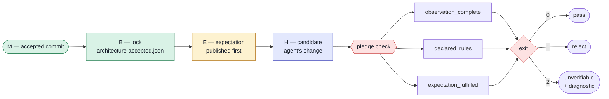

# Pledge

**The agent declares before it submits. The check is deterministic.**

  

Deterministic architecture checks for AI coding agents.

An AI agent can make every architecture guardrail go green while the code gets worse.
Pledge closes that gap in two ways:

1. **Precommitment.** The agent publishes *what should change* before it submits the change.
   Pledge proves the order from Git and host records, not from author dates.
2. **Extent, not identity.** Ratchets compare raw measurements, not just "is this a new finding?".
   A refactor that hides one call behind a dict fails, even if no new finding appears.



## Three verdicts, three exit codes

Pledge never folds everything into one score. Each question gets its own answer:

| Verdict | Question | Typical failure |
| --- | --- | --- |
| `observation_complete` | Did the scan see everything it claims to? | incomplete scan, empty scope, rule without subjects (exit 2) |
| `declared_rules` | Does the code obey the architecture contract? | forbidden import between components |
| `expectation_fulfilled` | Did the change match what was declared, without regressions? | ratchet regression, expectation published too late |

| Exit | Meaning |
| --- | --- |
| `0` | Complete report or successful check |
| `1` | Rejected: a verdict is `FAIL` |
| `2` | Unverifiable input. Always carries ≥1 diagnostic: `kind`, `subject`, `unknown_claim`, `remedy` |

An unverifiable input is never treated as a pass. A broken lock is exit 2, never an empty state.

## Why identity checks are not enough

Fixture A is a real refactor. It replaces two direct calls with a dict dispatch:

```diff
 def run(key: str) -> int:
-    return first() + second()
+    handlers = {"first": first, "second": second}
+    return handlers[key]()
```

The previous guardrails compared findings by identity and returned **PASS**.
No new violation, cycle or private import appeared. But the call graph got blinder:
2 of 2 calls were resolved before, 0 of 1 after.

Pledge measures extent and returns exit 1:

```text
expectation_fulfilled: FAIL
ratchet regression in calls_unresolved: 0->1
ratchet regression in unresolved_ratio: 0/2->1/1
```

The ratio check uses integer cross-multiplication, never rounded percentages:

```text
U_candidate × T_accepted  ≤  U_accepted × T_candidate      (when both T > 0)
```

## The protocol: M → B → E → H


| Commit | Rule Pledge enforces |
| --- | --- |
| **M** | The accepted state. Pledge re-observes it. |
| **B** | Lock-only child of M, tip of the accepted branch. Binds config, checker, observation digests. |
| **E** | Child of B that changes only the expectation file. Published before the first submission of H. |
| **H** | Descendant of E. Must not touch lock, config, contract or expectation. |

Fixture B writes the expectation *after* the change, from the delta. Every guardrail was green.
Pledge rejects it:

```text
host_order: FAIL
expectation_fulfilled: FAIL
expectation was not published before the first candidate submission
```

## Quickstart

Runtime requirements: Python 3.11+ and `packaging` for PEP 440 version constraints.

> **Prerequisite:** Pledge calls an external architecture scanner (the *producer*).
> Today that producer lives in the `datamimic-ee` repository under `script/architecture`.
> Pass its checkout with `--producer-root`. Without it, Pledge cannot observe anything.

```bash
uv sync --locked
```

Add a `pledge.toml` to the repository you want to check:

```toml
[scan]
roots = ["src/example"]          # directories, not globs
namespace = "example"
contract = "architecture-contract.json"
```

Observe the repository:

```bash
uv run pledge report --root /repo --producer-root /path/to/datamimic-ee --output architecture.json
```

Check a candidate against its declaration:

```bash
uv run pledge check --root /repo --producer-root /path/to/datamimic-ee \
  --baseline "$B" --expectation-commit "$E" --head "$H" \
  --expected expectation.json --expected-digest "$DIGEST" \
  --accepted-branch main --branch candidate
```

In GitLab CI, publication order comes from merge-request diff versions via `glab`.
Locally, replay host records with `--host-records records.json`.
A local replay does not prove host authenticity.

Run the Python version the scanned repository requires. A mismatch is reported as
`runtime_mismatch` (exit 2), not as a broken source file.

## Development

```bash
make check                                    # ruff, mypy --strict, pytest, D-self
make fixtures PRODUCER_ROOT=../datamimic-ee   # reproduce fixtures A, B, C
```

Pledge checks itself: `pledge.toml` and [architecture-contract.json](architecture-contract.json)
define its own boundaries. The latest self-scan is in [fixtures/D-self/result.json](fixtures/D-self/result.json).

```text
cli ──► check ──► ir
 │        ├──► producer
 │        └──► host
 └──► accept ──► ir          ir imports nothing from pledge
```

## Limits

- **Private crossings** cover import records only. `import pkg; pkg._member` is not detected.
- **Precommitment** proves "published before submission", not "decided before any private edit".
- **Producer Python** must be at least the target repository's Python.
- **`accept`** is a placeholder and returns exit 2.

## Status

Milestone 1: `report` and `check` work. Next: CI-only `accept`, a review page,
then agent commands (`propose`, `next`). See [docs/roadmap.md](docs/roadmap.md).

Exact rules for locks, host records, ratchets and schemas: [docs/reference.md](docs/reference.md).

---

MIT © 2026 rapiddweller
