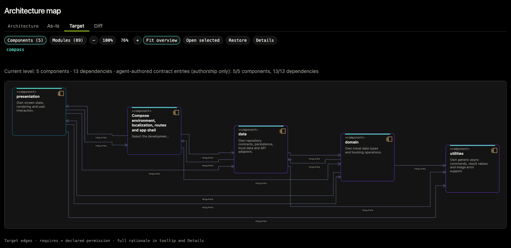
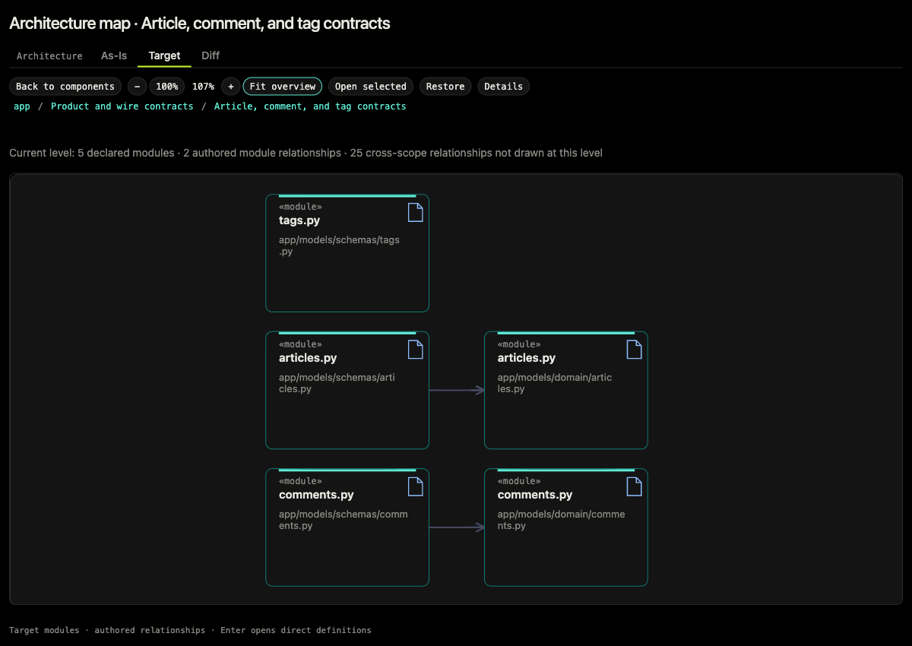

# Archkeel

**Architecture checks for coding agents.**


[](https://github.com/rapiddweller/archkeel/actions/workflows/ci.yml)
[](https://pypi.org/project/archkeel/)
[](https://github.com/rapiddweller/archkeel/blob/main/LICENSE)

Archkeel checks code against declared boundaries. It reports forbidden imports,
misplaced types and gaps in static analysis, with source evidence for review.

Use it in your coding-agent harness or CI. Checks run locally and deterministically,
without an LLM. They complement tests of runtime behavior.

<p>
  
</p>

Compass Flutter: declared components, responsibilities and dependencies.
[Explore this Target](https://rapiddweller.github.io/archkeel/demos/uml-compass-project/architecture.report.html?content=components&view=target&theme=dark).

Explore observed code, declared architecture and their differences in one offline report.
See [ArchKeel's current Main report](https://rapiddweller.github.io/archkeel/), updated by CI.
Browse the [Python, Dart and TypeScript demo reports](https://rapiddweller.github.io/archkeel/demos/),
including UML PASS, FAIL and UNKNOWN examples.

The gallery leads with three complete source projects: [Compass booking](https://github.com/flutter/samples/tree/5541c59ab8e9d7e74c1a35ef22bd43a487fc596c) (111 Dart files), [Python RealWorld](https://github.com/nsidnev/fastapi-realworld-example-app/tree/029eb7781c60d5f563ee8990a0cbfb79b244538c) (72 Python modules), and [Nest RealWorld](https://github.com/mikro-orm/nestjs-realworld-example-app/tree/a6818d84b6a019cf2df4ef391dc87cea7d02c6a9) (41 prepared TypeScript inputs). Each links its authored Target, baseline and three source-only variants. Coverage, rule findings and UML results remain separate; the smaller runnable Flutter shop stays a control.

## Start here

Requires Python 3.11+ and a Git repository with at least one commit.
Run Archkeel with a Python version that meets your project's requirements.

```bash
uv tool install archkeel
archkeel skill install codex    # or claude
```

Then ask your coding agent:

```text
Set up Archkeel for this repository. Read the architecture documents,
propose the boundaries, and let me decide which dependencies are allowed.
```

The skill guides the setup. `init` drafts components and interfaces;
you decide the target architecture. Existing imports are evidence, not permission.
You can delegate decisions to the agent, but its authorship is recorded separately.
See the [onboarding guide](docs/onboarding.md) for setup and plugin installation.

For an existing setup:

```bash
archkeel report      # inspect code and evidence
archkeel validate    # check the contract
```

`report` writes `architecture.json` and an offline `architecture.report.html`.
Read the verdicts: a report can exit `0` with failed or undecided rules.
`validate` checks the contract; `check` also compares a submitted change with its
published expectation. Use `archkeel <command> --help` for command options.
Validation diagnoses only absent responsibilities on components explicitly marked
`decided_by: "architect"`; non-empty prose is not proof that the stated responsibility is correct.

## Review the evidence

<p>
  
</p>

Python RealWorld: drill down from components to the article, comment and tag modules.
[Explore this Target](https://rapiddweller.github.io/archkeel/demos/uml-python-realworld-project/architecture.report.html?scope=Product%20and%20wire%20contracts%3Acontracts-publishing&content=modules&view=target&theme=dark).
Target shows declared intent; cross-scope relationships remain counted separately.

Use the report to inspect findings and source locations, then explore the components.
Filters narrow the view without changing the verdicts.

```bash
archkeel report --only violations --component store
archkeel report --only calls --component store
```

Agents start with a focused architecture summary, then query the recorded snapshot:

```bash
archkeel report --only architecture --json
archkeel report --input test-artifacts/architecture/architecture.json --only architecture --json
```

Use `--component` with an id or scope from the summary, and `--only violations` for findings.
Saved queries do not rescan or change the repository. See [focused agent reports](docs/reference.md#focused-agent-reports).

The explorer shows **As-Is** (observed code), **Target** (declared architecture),
and **Diff** (their differences). These are views of one snapshot, not two revisions.
Folders help navigation; they do not establish ownership or runtime behavior.

`PASS` means the required rules have complete evidence and no decided violation.
`UNKNOWN` means evidence is missing. A rule can fail and still have undecided positions.
A clean graph does not prove a good design.

## Start with a forbidden import

The runnable [Shop forbidden-pair fixture](fixtures/demo_catalog_dependencies.py) adds
`shop.render.text -> shop.store` at `shop/render/text.py:9`. It reports
`DEP-RENDER-NO-STORE`, `rule.violated` and `closed_world.observed_forbidden`:

```bash
make demo-architecture VARIANT=class-a-forbidden-dependency-pair OUTPUT=build/forbidden.json
```

The replay writes its report, then exits 2 because validation cannot accept the observed
whole-pair ban. Remove the crossing or revisit the declared boundary with its owner; do not
allow the forbidden pair just to make validation pass.

## Catch changes that finding diffs miss

The runnable [call coverage regression fixture](fixtures/reproduce_milestone1.py) shows a
change that adds no forbidden import or cycle but makes a call harder to resolve:

```diff
 def run(key: str) -> int:
-    return first() + second()
+    handlers = {"first": first, "second": second}
+    return handlers[key]()
```

`make demo` runs this fixture. Resolved calls drop from 2 of 2 to 0 of 1 while new finding
fingerprints stay at zero; Archkeel rejects the candidate because unresolved calls increase
from 0 to 1.

`check` compares the accepted and candidate commits, checks the contract, and verifies the
candidate against an expectation published before submission. Publication order needs trusted
host records. A local replay checks supplied records without authenticating them.
The [reference](docs/reference.md) explains the commit protocol and its limits.

## Keep a target the code has not reached

Record existing violations, review the file, then reject new ones in CI:

```bash
archkeel validate --baseline known-violations.json --write-baseline
archkeel validate --baseline known-violations.json
```

Known violations remain `FAIL`. After fixing them, rewrite the baseline in the same change.
New or increased violations require explicit `--accept-new`; do not use it to hide a regression.
See the [target-first guide](docs/target-first.md) for the full workflow.

## Try a reproducible example

```bash
git clone https://github.com/rapiddweller/archkeel.git
cd archkeel
make demo
make demo-onboarding
```

`make demo` rejects a coverage regression and a late expectation, then shows a passing candidate.
`make demo-onboarding` replays setup on a two-level shop using committed decision fixtures;
it performs no live approvals. More cases are in the [demo catalog](docs/architecture-demo.md).

## Scope and limits

Archkeel observes static source in configured roots. Python support covers imports, calls, and declared boundaries.
Dart records declarations, members, signatures and resolved static sites through the official Analyzer
(Dart SDK `>=3.9,<4`; run `make dart-setup` once before scanning).
TypeScript also records lexical UML declarations and statically bound relationships;
ambiguous bindings and unsupported constructs remain UNKNOWN. TypeScript roots may name files or directories.
Archkeel does not prove runtime behavior, performance, or the quality of every design decision.
Separate test trees need their own scan and contract.

Exit meanings are defined [per command](docs/reference.md#exit-codes).

Read the [docs](docs/README.md).

## Development

Install Dart SDK `>=3.9,<4` and run `make dart-setup` before Dart demos, checks or smoke tests.

```bash
make check              # lint, types, tests
make gate               # also build, isolated installs and self-validation
make browser-install
make report-browser OUTPUT=test-artifacts/report-browser
```

Archkeel checks its own [architecture contract](https://github.com/rapiddweller/archkeel/blob/main/architecture-contract.json) using fresh
observations on every test run. See [CONTRIBUTING.md](https://github.com/rapiddweller/archkeel/blob/main/CONTRIBUTING.md).

MIT © 2026 Rapiddweller Asia Co., Ltd. Maintained by [Alexander Kell](https://github.com/ake2l).
