# Archkeel

**The agent declares before it submits. The check is deterministic.**

<p>
  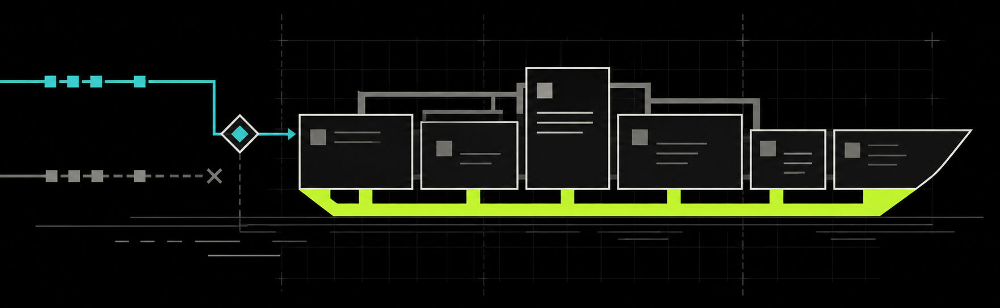
</p>


[](https://github.com/rapiddweller/archkeel/actions/workflows/ci.yml)
[](https://github.com/rapiddweller/archkeel/blob/main/LICENSE)
[](https://pypi.org/project/archkeel/)

Archkeel checks architecture boundaries, scan coverage, and declared changes in
AI-assisted code. It compares an accepted commit with a candidate, then checks
the candidate against the configured contract and an expectation published
before its first submission. Start with `archkeel report`; use `archkeel check`
to gate a candidate. See the [reference](docs/reference.md) for the protocol and
command details.

It catches two failure modes that finding-only diffs miss:

- the architecture changed without being declared;
- the scanner saw less of the program, so the result looks clean only because
  the graph became blinder.

<p>
  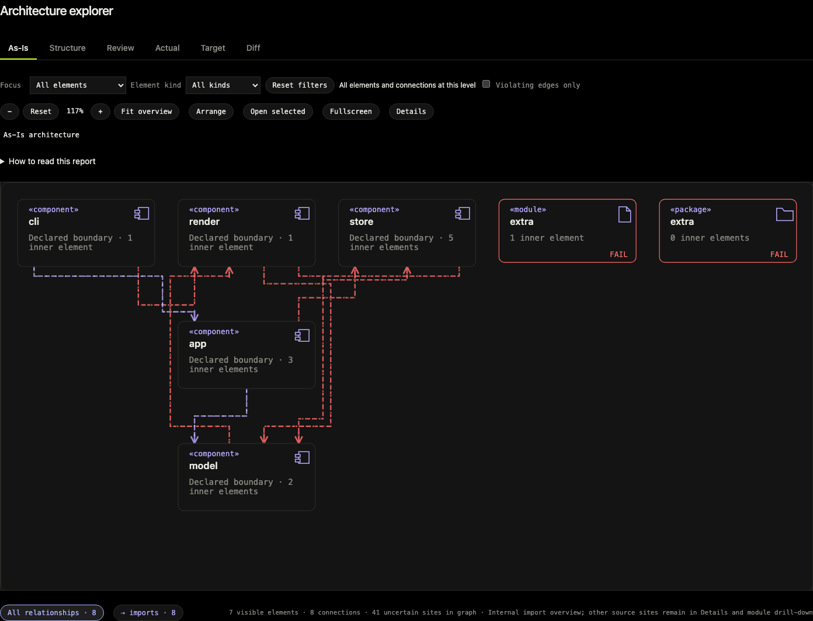
</p>

<sub>Negative case: <code>shop.store.repository</code> imports <code>Money</code>, breaking
<code>DEP-STORE-NO-MONEY</code>. Filters change the view, not verdicts or evidence. Select a
connection to inspect its rule evidence.</sub>

Unassigned modules remain visible in a navigation-only group. The group creates no boundary or
verdict.

<p>
  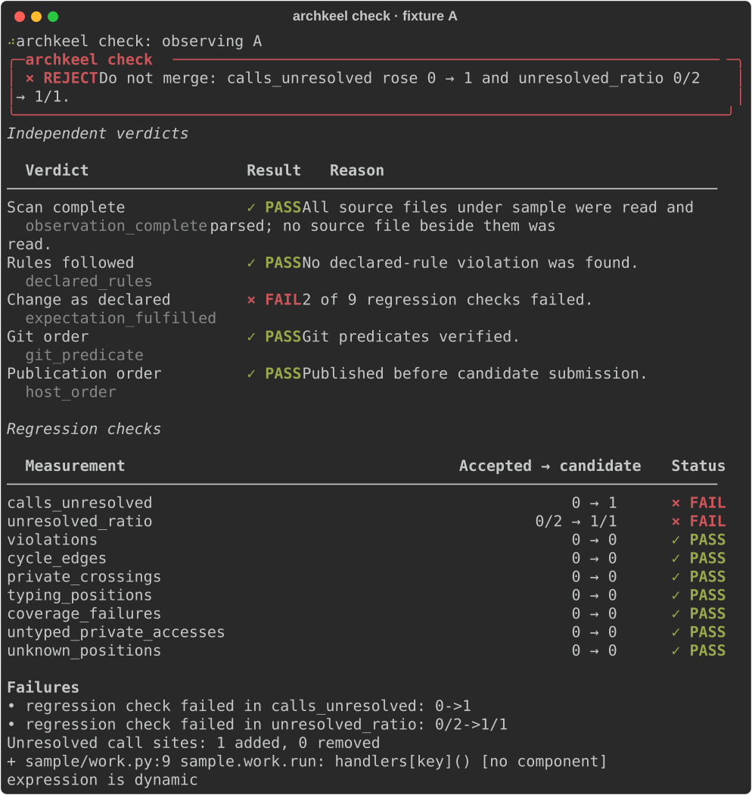
</p>

[Try the demo](#try-the-demo) · [Onboard your project](#onboard-your-project) · [How it works](#how-it-works) ·
[Reference](https://github.com/rapiddweller/archkeel/blob/main/docs/reference.md) · [Roadmap](https://github.com/rapiddweller/archkeel/blob/main/docs/roadmap.md)

Implemented and planned work is tracked in the [roadmap](https://github.com/rapiddweller/archkeel/blob/main/docs/roadmap.md).

## What it does, on one sample

The examples use `fixtures/F-architecture`, a shop with five components. `make demo-onboarding`
replays command implementations against committed decision fixtures; no live approvals occur.

### 1. The agent drafts; interview decisions come from the architect

`archkeel init` observes packages and imports, drafts one component per subpackage with its
`public` interface, and leaves dependency pairs open. `validate` refuses the draft. The replay
then checks a committed, architect-attributed fixture contract; it does not record a live
approval.

`decided_by` records who authored a rule, `requires` entry, or component `public` list. An
agent-authored decision is not evidence of human approval.

<p>
  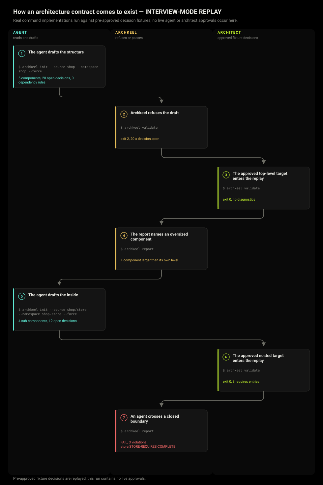
</p>

<sub>Generated from replay results. The committed fixtures stand in for earlier interview answers.</sub>

### 2. A component that outgrows its level gets one of its own

The report flags `store`: 7 modules at a level with 5 components. This is a review prompt, not an
automatic split. `init --source shop/store --namespace shop.store --force` drafts four nested
components and 12 open pairs. The replayed fixture maps `shop.store.sqlite` to `api` and records
three `requires` entries. `complete_requires` makes every other pair forbidden; these are fixture
decisions, not live approvals.

<p>
  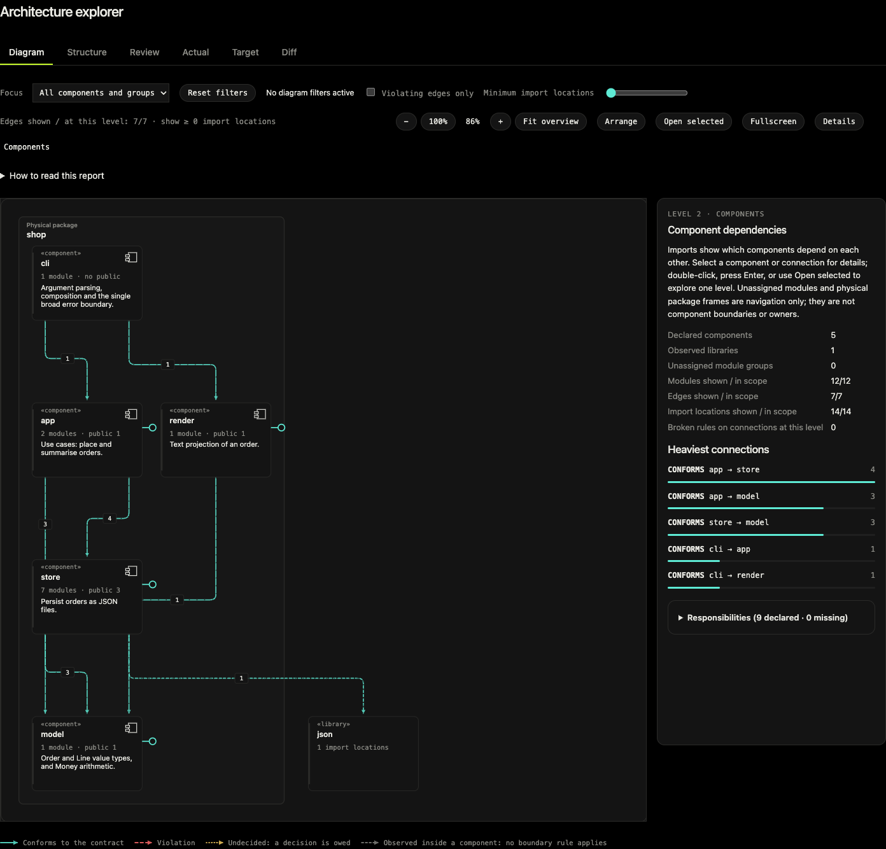
</p>

<sub>The diagram shows five components and their scoped <code>json</code> dependency. Teal means
the displayed imports were checked, with no violation or relevant UNKNOWN. <code>store</code> has
7 modules at a level with 5 components.</sub>

<p>
  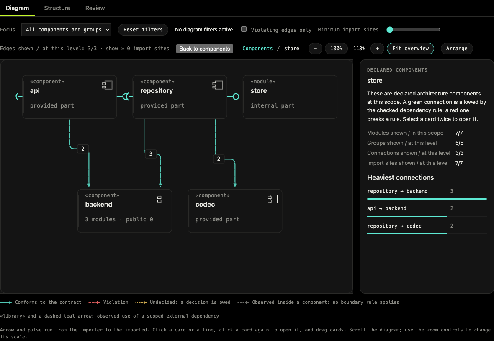
</p>

<sub>The declared <code>store</code> level contains four components and the unassigned
<code>shop.store</code> module.</sub>

### 3. Validation names the boundary, the level and the fix

This fixture removes a required dependency. Validation exits 2 with three
`rule.violated` diagnostics: repository imports backend without requiring it. The aggregate is
`NOT CHECKED`; exact import locations are in the HTML evidence.

<p>
  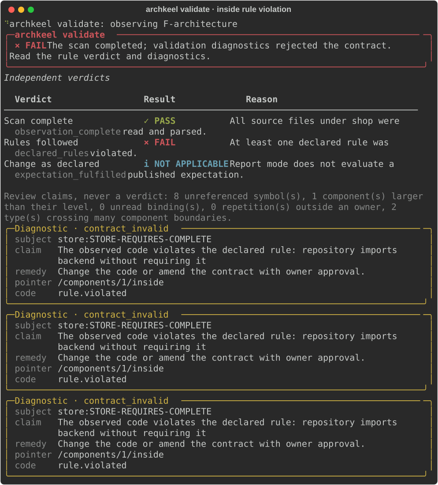
</p>

### What each side gets out of it

| | |
|---|---|
| **For the architect** | A target contract, measured against the code, with decision authorship recorded. |
| **For the agent** | A boundary to read before editing and diagnostics that name the rule, level, and importer. |
| **For review** | Checks for undeclared changes and reduced scan coverage, beyond finding diffs. |

## Why Archkeel

An agent can keep tests green and introduce no new architecture finding while
making the code harder to analyze. If the gate compares finding identities
only, that change passes.

Fixture A is the smallest example:

```diff
 def run(key: str) -> int:
-    return first() + second()
+    handlers = {"first": first, "second": second}
+    return handlers[key]()
```

The refactor introduces no new forbidden import, cycle, or private crossing.
But static call resolution gets worse:

| Observation | Accepted | Candidate |
| --- | ---: | ---: |
| Resolved calls | 2 of 2 | 0 of 1 |
| Unresolved calls | 0 | 1 |
| New finding fingerprints | 0 | 0 |
| Archkeel verdict | baseline | **FAIL** |

```text
expectation_fulfilled: FAIL
regression check failed in calls_unresolved: 0->1
regression check failed in unresolved_ratio: 0/2->1/1
```

The same result names the call behind the count in `unresolved_call_changes`: `handlers[key]`
in `sample.work.run` at `sample/work.py:9`, reason `expression is dynamic` (AD-100).

Archkeel compares raw measurements as well as finding counts and fingerprints.
The ratio check uses integer cross-multiplication, never rounded percentages:

```text
U_candidate × T_accepted <= U_accepted × T_candidate   (when both T > 0)
```

### What the gate adds

- **Precommitment with evidence.** The agent publishes the intended change
  before it submits the candidate. Git ancestry and trusted host records prove the
  order; author timestamps do not.
- **Coverage-aware regression checks.** A disappearing edge is not mistaken
  for an improvement just because a finding disappeared with it.
- **Explicit uncertainty.** An incomplete scan, broken lock, empty scope, or runtime mismatch
  returns exit `2` with a diagnostic. A complete report may instead exit `0` with
  `declared_rules: UNKNOWN` when a rule names positions it could not decide. Neither is `PASS`.
- **Verdict is not coverage.** `PASS` requires complete evaluator evidence for every required
  rule and no violation among decided positions. Missing scope proof stays `UNKNOWN`.

Archkeel complements tests, linters, and human review. It does not replace any
of them. Its job is narrower: keep architecture changes declared, observable,
and mechanically checkable.

## Review surface

<p>
  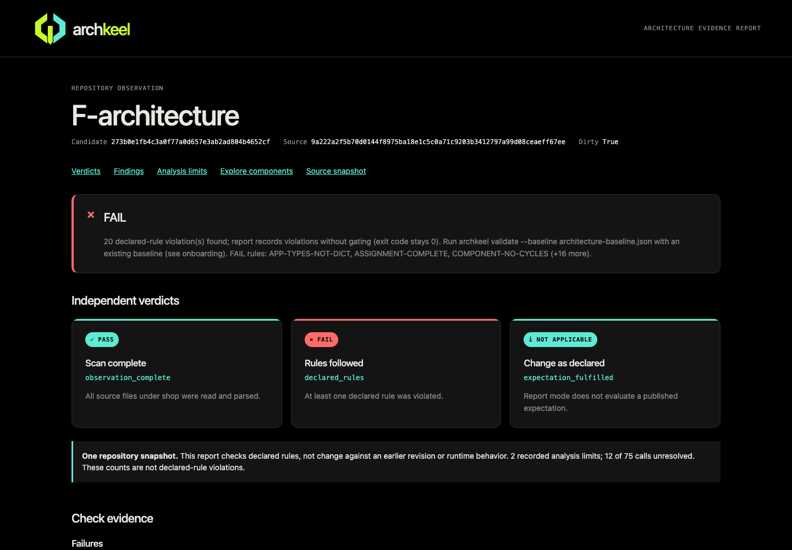
</p>

The HTML report keeps verdicts and evidence separate:

```bash
archkeel report --only violations
archkeel report --only violations --rule DEP-STORE-NO-MONEY
archkeel report --only violations --component store
archkeel report --only calls --component store   # unresolved and partial calls (AD-100)
archkeel report --baseline known-violations.json # read-only fingerprint comparison
```

- **Separate verdicts.** Scan completeness, declared rules, candidate expectations, Git order,
  and publication order stay separate. `PASS`, `FAIL`, `UNKNOWN`, and `NOT CHECKED` keep distinct
  meanings.
- **Evidence stays inspectable.** Counts, fingerprints, source locations, digests, and runtime
  provenance remain available. Each rule shows its result, reason, owner, and source; permissions
  are declarations, not proof of a passed check.
- **Baselines track findings.** Known findings keep a `FAIL` marker. New fingerprints are reported
  separately; missing rules or undecided evidence cannot make findings appear resolved.
- **The report stays navigable.** Filters do not change verdicts or evidence. The diagram, Actual,
  Target, and Diff views retain observed imports, declarations, and UNKNOWN evidence as distinct
  data. Folders are navigation, not contracts; Structure and Review work by keyboard.
- **Claims do not gate.** `report` and `validate` show five review claims, but they do not affect
  exit codes. Their limits and measured facade details are in the
  [reference](docs/reference.md).

<p>
  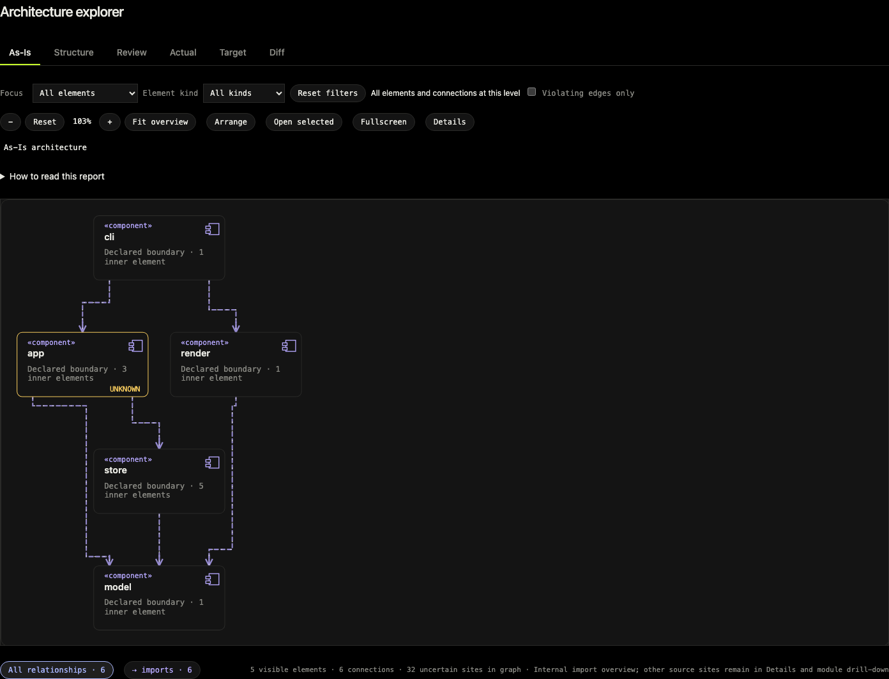
</p>

<sub>A rule can fail and still contain undecided evidence. The UNKNOWN filter keeps that
mixed result visible without relabelling its confirmed violation as uncertainty.</sub>

## Try the demo

The demo builds three small Git repositories and runs the real checks. Fixture A is rejected
because the call graph got blinder, Fixture B because its expectation was published too late,
and Fixture C passes.

```bash
git clone https://github.com/rapiddweller/archkeel.git
cd archkeel
make demo
```

`make demo-screenshots OUTPUT=<directory>` also captures each HTML report as PNG and each
terminal view as SVG.

`make demo-onboarding` replays the loop from [What it does, on one sample](#what-it-does-on-one-sample)
on the two-level shop: what `init` drafts, what `validate` refuses, what the architect decides,
and what the gate says when an agent crosses a boundary inside the level.

Replay a report-capable catalog row to a new JSON report and HTML sidecar:

```bash
make demo-architecture VARIANT=class-a-recursive-wide-package OUTPUT=demo-output/architecture.json
```

```bash
make demo-onboarding
archkeel validate --root fixtures/F-architecture   # exit 0, both levels
archkeel report   --root fixtures/F-architecture   # UNKNOWN: store:STORE-REQUIRES-COMPLETE
archkeel validate --root fixtures/F-architecture --config archkeel-tests.toml   # its tests' own scope
```

Every violation the tool can find has a catalogued variant that produces it, listed in
[docs/architecture-demo.md](https://github.com/rapiddweller/archkeel/blob/main/docs/architecture-demo.md).

## Onboard your project

Requirements: Python 3.11+ and a Git repository with at least one commit.

```bash
uvx archkeel skill install claude    # or codex
uvx archkeel init
uvx archkeel validate
```

`init` drafts one component per subpackage, proposes `public` interfaces, and leaves dependency
decisions open. The contract describes the target architecture; it does not copy the current code.
Choose interview mode to keep decisions with a human, or explicitly delegate them to auto mode.
`decided_by` records authorship; it does not prove human approval. The installed skill reviews
physical packages recursively, but a green rule does not certify the whole design.

The report separates observed modules (Actual), declared architecture (Target), and their
differences (Diff). Optional module responsibilities and physical package groups aid navigation;
they do not establish ownership. Select once for Details; use Enter, double-click, or Open selected
to explore. See the [onboarding guide](docs/onboarding.md) for the agent workflow and
[architecture rules](docs/rules.md) for rule semantics.

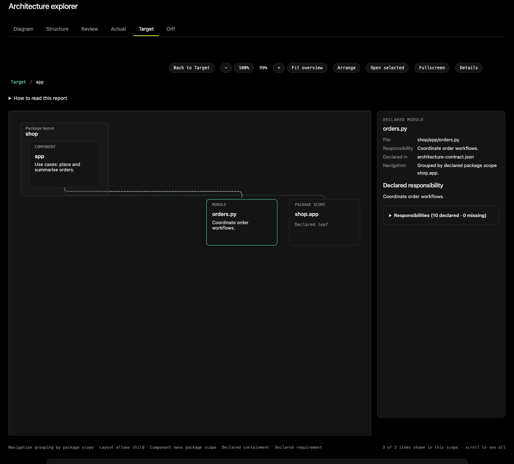

`archkeel validate --write-graph` can update a marked component graph after contract edits.

To track existing violations, write a baseline and gate on changes:

```bash
archkeel validate --baseline known-violations.json --write-baseline   # initial file, then review it
archkeel validate --baseline known-violations.json                    # in CI
archkeel validate --baseline known-violations.json --write-baseline   # resolved-only cleanup
archkeel validate --baseline known-violations.json --write-baseline --accept-new  # deliberate widening
archkeel validate --root mobile --baseline known-violations.json      # reads mobile/known-violations.json
```

An existing baseline rejects new or increased violations unless `--accept-new` is explicit.
Fingerprints use rules and subjects, not source lines. The [target-first guide](docs/target-first.md)
covers baseline maintenance; the [reference](docs/reference.md) documents measurement budgets,
historical comparisons, and baseline schemas.

To install it permanently instead, run `pip install archkeel`. Every command explains itself
with `archkeel <command> --help`.

## Quickstart

Observe the current repository:

```bash
archkeel report
```

The command writes the canonical `architecture.json` and a self-contained
`architecture.report.html` beside it. A terminal shows the decision and verdicts; pipes and
`--json` receive the JSON result.

The report separates observed imports (Diagram and Actual), declared architecture (Target), and
their differences (Diff). Target edges are declarations, not observed imports or execution order.
Selecting an item shows its declared responsibility only when its identity can be matched; this
does not describe observed behavior. Details keeps declarations and unresolved placement evidence
available. Use Enter, double-click, or Open selected to explore one level. Folders are navigation,
not ownership. Report controls and layout warnings do not change architecture verdicts; see
[known limits](docs/known-limits.md) for details.

### Checked on DATAMIMIC CE

The 1 October 2026 CE experiment (`b38899c9` plus local changes) parsed 491 modules and recorded
102 violations and 155 counted UNKNOWN positions. It shows that a nested repository can be scanned
and explored. It does not prove CE is finished, every boundary is well designed, or runtime behavior
matches imports. UNKNOWN remains unresolved work.

`--output X.json` writes the JSON report and `X.report.html`.

<p>
  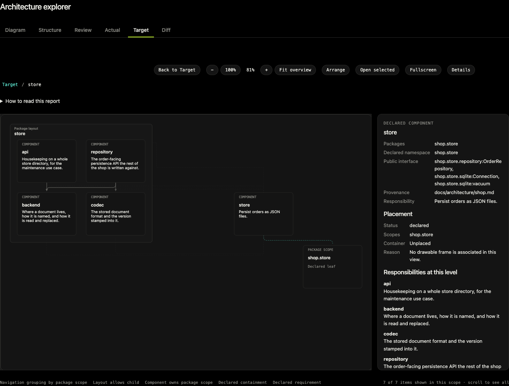
</p>

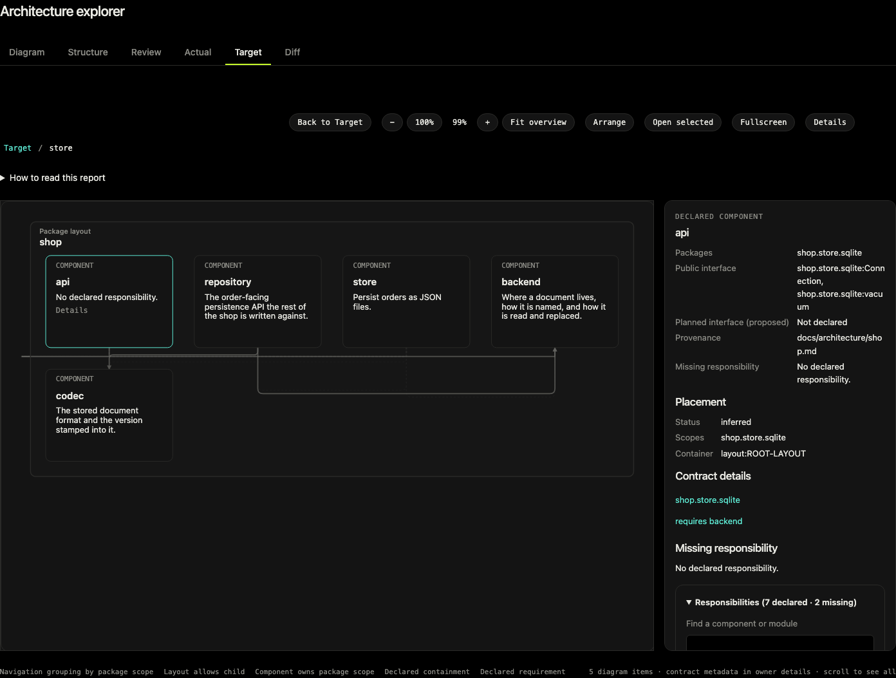

Check a candidate against its published expectation:

```bash
archkeel check \
  --root /repo \
  --baseline "$B" \
  --expectation-commit "$E" \
  --head "$H" \
  --expected expectation.json \
  --expected-digest "$DIGEST" \
  --accepted-branch main \
  --branch candidate
```

Run the Python version required by the repository being scanned. A mismatch is
reported as `runtime_mismatch` with exit `2`, not as broken source code.

## How it works

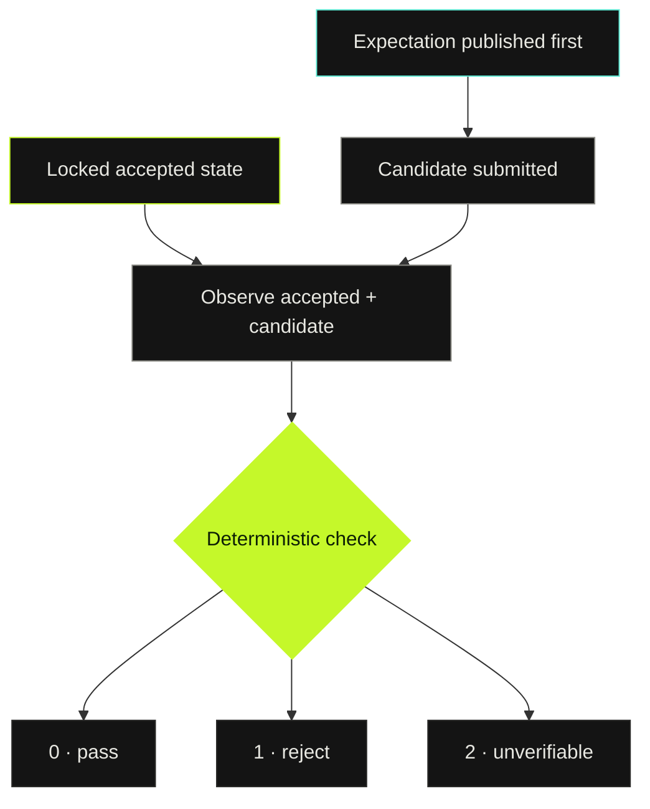
```mermaid
flowchart TB
    B["Locked accepted state"] --> O["Observe accepted + candidate"]
    E["Expectation published first"] --> H["Candidate submitted"]
    H --> O
    O --> C{"Deterministic check"}
    C --> P["0 · pass"]
    C --> R["1 · reject"]
    C --> U["2 · unverifiable"]

    classDef locked fill:#141414,stroke:#C5F82A,color:#E8E8E2
    classDef declared fill:#141414,stroke:#5EEAD4,color:#E8E8E2
    classDef candidate fill:#141414,stroke:#8A8A84,color:#E8E8E2
    classDef gate fill:#C5F82A,stroke:#C5F82A,color:#0D1F05
    classDef result fill:#141414,stroke:#2A2A28,color:#E8E8E2

    class B locked
    class E declared
    class H,O candidate
    class C gate
    class P,R,U result
```

A check answers three independent questions. It never compresses them into a
single score.

| Verdict | Question | Typical failure |
| --- | --- | --- |
| `observation_complete` | Did the scan see everything it claims to see? | Incomplete scan, empty scope, rule without subjects |
| `declared_rules` | Does the code obey the architecture contract? | Forbidden import between components |
| `expectation_fulfilled` | Did the candidate match the declaration without regressions? | Coverage regression, undeclared change, late expectation |

### Exit codes

| Exit | Meaning |
| ---: | --- |
| `0` | Complete report or successful check |
| `1` | Rejected because at least one verdict is `FAIL`, or `validate --baseline` found a violation the baseline does not state, or one it states that nobody violates any more |
| `2` | Unverifiable input, always with at least one diagnostic |

Every exit `2` diagnostic contains:

```text
kind · subject · unknown_claim · remedy
```

A broken lock is therefore not interpreted as an empty accepted state.

## The M → B → E → H protocol

Start at accepted commit **M**. Lock commit **B** binds the config, checker, and observation.
Expectation commit **E** follows B and must be published before the first submission of candidate
**H**. H must preserve the lock, config, contract, and expectation. `selected_changes: []` rejects
every observed semantic change. A non-empty list checks named changes plus fixed guardrails; other
undeclared changes can pass. With trusted host records, the check verifies publication order, not
private editing history. A local replay checks supplied records; it does not authenticate them.
See the [reference](docs/reference.md) for commit rules and host evidence.

## Development

Run the complete project gate, including Archkeel's own contract validation:

```bash
make gate
```

This runs the locked release checks (Ruff, strict mypy, pytest, builds and smoke tests) and then
`archkeel validate --root . --baseline architecture-baseline.json --json`. CI uses this same
Make entry point. `make check` remains the faster source, type and test loop.

CI also runs the interactive report checks with pinned Playwright and Chromium:

```bash
make browser-install
make report-browser OUTPUT=test-artifacts/report-browser
```

The browser lane uses only synthetic demo fixtures and checks deep/wide navigation,
filters, status labels, narrow screens and the no-JavaScript fallback. Screenshots and
traces are written under the chosen output directory; use a new directory for each run.

A change to Python code under `src/` or to an architecture contract moves the saved
self-observation that check compares against; regenerate it with `make self-observation`. The
[contributing guide](https://github.com/rapiddweller/archkeel/blob/main/CONTRIBUTING.md) lists what a
pull request needs.

Run the full release check, build both distributions, and install each one in isolation:

```bash
make release-check
```

Reproduce the protocol fixtures:

```bash
make fixtures
```

## Archkeel checks itself

[architecture-contract.json](https://github.com/rapiddweller/archkeel/blob/main/architecture-contract.json)
holds Archkeel to its own rules. Seven components cover all 42 ordered pairs; all 19 rules have
rationales, and deliberate violations exercise them. The deterministic core has no adapter or
presentation imports. The nested `check` component has its own contract. See the
[architecture guide](docs/architecture/archkeel.md) for the declared boundaries.

`make check` compares a fresh observation with
[fixtures/D-self](https://github.com/rapiddweller/archkeel/tree/main/fixtures/D-self), including
the canonical model, provenance digests, and verdicts. `make gate` also validates the contract.

## Current boundaries

Archkeel observes static source within the configured roots and namespace. It does not observe
runtime behavior, data flow, or performance. Incomplete evidence remains UNKNOWN, and a green scan
does not establish that every design choice is sound. A separate test tree needs its own scan and
contract. Archkeel's Python version must meet the target repository's requirement.

Baselines are compared, not authenticated; `validate --against` checks contract widening when a
reviewer or CI runs it. See
[known limits](docs/known-limits.md) and the [reference](docs/reference.md) for details.

## Roadmap

Completed work and the ordered UI, CI and release plan live in
[docs/roadmap.md](https://github.com/rapiddweller/archkeel/blob/main/docs/roadmap.md).
Items remain planned until their listed evidence exists.

## License

MIT © 2026 Rapiddweller Asia Co., Ltd.

Maintained by [Alexander Kell](https://github.com/ake2l).
