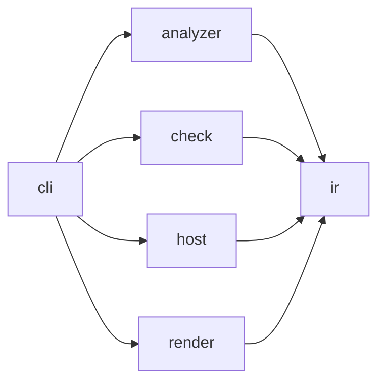

# Archkeel architecture

[The contract](../../architecture-contract.json) owns component boundaries. Within-component
imports remain allowed. Every cross-component pair is either observed or forbidden.

## Layers

| Layer | Components | Responsibility | Quality goal (AD-17) |
|---|---|---|---|
| Core | `ir`, `check` | Stable evidence values and deterministic policy evaluation | Deterministic and stable |
| Adapters | `analyzer`, `host` | Python source observations and GitLab host records | `analyzer` isolated behind its digest; `host` replaceable |
| Edge | `cli`, `render` | Composition and presentation | `cli` a thin composition root; `render` replaceable |

The CLI is the composition root. It selects concrete analyzer and host adapters, invokes the
core, writes artifacts and delegates HTML and terminal projection to `render`. Core modules
never select adapters or write presentation files.

Third-party imports are confined by `external_dependency_scope` rules: `packaging` to the
analyzer runtime gate, `rich` to `archkeel.render.terminal` and `rich_argparse` to `archkeel.cli`.

The analyzer may import only `archkeel.ir.model` and `archkeel.ir.codec`. This keeps raw AST
records inside the analyzer and exposes typed `ObservationResult` values at its boundary.

## Decisions

Each decision names its reason and the check that holds it. Code follows the decision; a change
to a decision is recorded here before the code changes.

**AD-1 Analyzer modules are flat and single-purpose.** `archkeel/analyzer/embedded/` holds only
top-level modules, one responsibility each:

| Module | Responsibility |
|---|---|
| `scanner` | Discover and parse sources, run the collectors, return `ScanResult` |
| `source` | Parsed modules, module names, evidence locations |
| `imports` | Import bindings and `__all__` exports |
| `symbols` | Classes, functions and their signatures |
| `calls` | Call sites and their resolution |
| `typing_signals` | Weak typing signals such as `Any`, `object` and `type: ignore` |
| `constructs` | Statement constructs: assert statements and broad except handlers |
| `dependencies` | Package and module topology, dependency edges, cycles, declared paths and component scopes |
| `contexts` | Context and state evidence |
| `violations` | Contract rule evaluation |
| `graph` | Graph algorithms: components, ranks, transitive paths |
| `records` | Record envelope, stable ids, analyzer version and digest |
| `contract` | Contract loading and declarations |
| `report` | Observation assembly |

Reason: `analyzer_code_digest` hashes top-level `*.py` files, so code in a subpackage would
change analyzer behavior without changing the digest. Check: `tests/test_analyzer.py`.

**AD-2 JSON has one type.** Decoded or emitted JSON is `RawJson`; untrusted input is narrowed with
`isinstance` at the boundary. Analyzer records are `RawRecord` and `RawEvidence`; their per-kind
payload is `RecordData`, the analyzer's single declared `Any`. The other `Any` positions are the
named `CoveragePayload` and the places where those records enter canonical encoding, each with a
one-line reason. Check: `mypy --strict` and the typing measurements in `fixtures/D-self/`.

**AD-3 The analyzer digest decides comparability; the version names it.** Two observations are
comparable only with equal `analyzer.code_digest`. `ANALYZER_VERSION` is the human label: its minor
number rises when the same input yields different records, such as new rule kinds or signals.
Check: `check/delta.py` compares digests; the version is reviewed with the D-self fixture.

**AD-4 Module length alone does not justify a split.** A split needs a responsibility seam. The
analyzer's public IR API is exactly `ir.model` and `ir.codec`, so splitting either is a contract
change. Check: `tests/test_self.py`.

**AD-5 Invariants live where values are built.** A value whose fields depend on each other
checks that dependency in `__post_init__`, for example `ObservationResult` (no diagnostics means
a complete observation) and `RatchetObservations` (measurements exist exactly when the status
is `SUPPORTED`). Consumers narrow with ordinary control flow. Reason: `assert` disappears
under `python -O` and hides the invariant from its owner. Check: the `CONSTRUCT-NO-ASSERT`
rule in `architecture-contract.json`.

**AD-6 A function has one responsibility.** A function longer than 80 lines, counted from `def`
to its last line with nested functions included, needs a named reason. Reasons live in
`ALLOWED_LONG_FUNCTIONS` in `tests/test_repository_hygiene.py`, keyed `path::qualified.name`. A
helper with one caller must name a real phase; splitting for length alone is not allowed.
Reason: 80 lines is what a reviewer can hold at once, and an explicit list keeps declarative
functions visible instead of exempting them silently. Check: the test fails on an unlisted long
function and on a listed function that is no longer long, so the list only shrinks.

**AD-7 Determinism is measured, not assumed.** The inputs of one observation are source bytes at a
commit, contract bytes, the installed Archkeel (analyzer and checker digests), `archkeel.toml`,
the Python version and the repository directory name. Everything else is environment, and the
emitted bytes must not depend on it. Three `report` runs on two clones with different parent
paths, working directories, `PYTHONHASHSEED`, `TZ` and `LC_ALL`, plus one verbatim repeat, must
produce byte-identical `architecture.json`, HTML report and stdout JSON without normalization. A
field that would need normalization is a violation of this decision, not a probe adjustment.
Reason: determinism is Archkeel's core promise, so it needs evidence like any other claim. Limit:
equal bytes on one machine and Python build do not prove equality across Python versions,
operating systems or inputs the probe does not vary. Check: `tests/test_determinism.py`, proven
by an unsorted record subject list and an absolute source path, each of which fails it.

**AD-8 Statement constructs are Class A rules.** `forbidden_construct` gains the constructs
`assert` and `broad_except` and an optional `allowed_sources` list with prefix scope, as in
`external_dependency_scope`. A broad handler is a bare `except:` or one that catches `Exception` or
`BaseException`, alone, in a tuple or as `builtins.Exception`; `except Exception: raise` counts,
because re-raising is intent and belongs to review, while a justified boundary is named in
`allowed_sources`. Aliases and shadowed names are blind spots. The records live in their own
`constructs` section, not in `typing_signals`, because every typing signal counts as a typing
position in the regression checks. Contract `schema_version` stays 2.0.0: a wider enum and an
optional key make no valid contract invalid, and older Archkeel versions fail closed with exit 2.
Reason: both constructs are facts of one observation, so a person should not have to judge them.
Check: one violation probe per construct in `tests/test_analyzer.py`, and Archkeel's own contract
forbids both with the CLI error boundary as the single allowed broad handler.

**AD-9 Components declare their interface.** A component lists its interface in `public`: an
entry `pkg.module` makes every non-underscore top-level name of that module public, or its
`__all__` when present, and `pkg.module:Name` makes exactly one name public. The Class A rule
`interface_boundary` accepts a cross-component import only when it reaches a declared name of the
target component, directly or through its re-export chain; underscore names never qualify, and
`TYPE_CHECKING` imports count unless `include_type_checking` is false. When an
`interface_boundary` rule exists, validation reports a component with inbound imports but no
`public`, and a `public` entry that no other component uses.
`init` proposes a module entry when the module defines `__all__` or other components use at least
half of its public names, and symbol entries otherwise, so a module entry admits at most twice the
names in use. `declarations.public_api` stays valid but is superseded. The report derives a
communication table per component edge: the used names with their parameter and return
annotations, and `UNKNOWN` where an annotation is missing. Protocol conformance, labeled graphs
and new regression measures are out of scope. Reason: Archkeel already checks which components
talk; the interface states through what, so reaching into another component's internals requires
a visible contract change. Check: violation probes in `tests/test_analyzer.py`, drift tests in
`tests/test_validation.py`, Archkeel's own contract, and the measured profile in `docs/evidence/`.

**AD-11 Every checkable item has a catalogued demo.** `fixtures/F-architecture/` is a committed
five-component sample repository with a closed contract, `public` interfaces, a marked Mermaid
graph and every Class A rule kind declared; `validate` and `report` on it are clean. One catalog
in `fixtures/architecture_demo.py` lists named variants, each a mapping of repository-relative
files to new content applied over a copy of the clean tree, together with the exact violations and
diagnostic codes it must produce. The catalog opens with a showcase section: its `tour` variant
makes every Class A rule kind fire in one run and is the default demo view. Variants live in flat
modules grouped by rule family. Regression checks and the check protocol get demos of their own,
in which `check` compares the clean sample as accepted baseline with a violating candidate. A check
demo asserts typed results only: exit code, verdicts, and the measurement or delta dimension that
regressed; it never matches the prose in `failures`. Items that cannot be demonstrated, such as
`coverage_failures`, are marked as tested only, and the generated table in
`docs/architecture-demo.md` names each row's demo type and is compared with the catalog. Reason: a user must be able to see
each rule fire on one readable repository, not only in unit tests. Check:
`tests/test_architecture_demo.py` enumerates rule kinds, construct values, diagnostic codes and
regression measurements from code, and fails when one has no catalog entry, when a variant's
findings differ from the catalog, or when the clean sample reports anything.

**AD-12 Validation diagnostics carry a code.** Every `contract_invalid` diagnostic has a stable
`code` from one `DiagnosticCode` literal, such as `decision.open`, `interface.unused` or
`rule.violated`; the constructor rejects a `contract_invalid` diagnostic without one, and result
JSON emits the code next to the pointer. Diagnostics the analyzer reports before validation, such
as `rule_without_subjects`, keep their kind without a code, and a code no path can produce is
removed. Reason: sixteen different findings shared one kind and
differed only in prose, so tests and agents had to match free text. Check: the constructor, and
the catalog test in AD-11 compares codes instead of messages.

**AD-13 Mermaid diagrams are checked before GitHub renders them.** One tool extracts every fenced
Mermaid block in tracked Markdown; a repository test rejects node labels with unquoted characters
that break the parser, and CI renders every block with the official Mermaid command-line renderer
at one pinned version. Reason: GitHub showed a parse error instead of the onboarding flow, and no
local check noticed. Check: `tests/test_mermaid.py` and the CI render step.

**AD-14 The report headline follows its verdicts, never the exit code alone.** `report` exits 0
whenever its observation is complete, so the exit code cannot say whether rules hold. The terminal
and HTML headline come from one summary: NOT CHECKED on exit 2, FAIL when `declared_rules` is
FAIL, otherwise PASS; `check`, `validate` and `init` keep their headlines, and no exit code or
result field changes. Reason: the shop tour with 11 violations opened with a green PASS above a
failing rules verdict. Check: the render tests for report, check and init headlines.

**AD-10 The report draws component flow as intent against observation.** The HTML report of
`report` embeds an interactive flow view: component cards, observed edges drawn at one width and
labelled with the import sites crossing them, edges that break a rule drawn dashed with the rule
id, a threshold that hides weak edges, and an inspector for modules and interface names. It is
derived from the canonical observation alone, so the report stays one self-contained file; the
script is a packaged asset with no external library, and its data, ordering and output bytes are
deterministic. The existing communication table stays as
the fallback without script. Reason: on the internal service the graph showed the seven edges that
break its documented intent faster than any table, and a prototype on the shop sample did the same
for every rule kind. Width encoded the weight until two costs showed: an arrow head scales with the
line it ends, so a heavy edge grew a head that read as weight where it should read as direction,
and inside a component, where every edge is observed and the label spots are crowded, the number
that would have said so was the first thing dropped. Check: the HTML report tests,
`tests/test_determinism.py`, and the shop tour report drawing every violated edge; the one width
and the label on every edge are drawn by `flow.js` at runtime and measured on the self report, not
asserted by a test.

**AD-15 Onboarding is a decision interview: the code proposes, the architect decides.** Observed
code yields facts and questions, never intent. `init` proposes components and `public` interfaces
and returns a deterministic list of open decisions ordered by import sites; it writes no dependency
rule. Every ordered component pair must be decided exactly once in the contract: an
`allowed_dependency` rule or a `forbidden_dependency` rule, each with the architect's rationale.
One function in `ir` derives the undecided pairs from the observation alone, from the projected
dependency decisions and the observed component edges, so validation and the report, including a
report rendered later from `architecture.json`, share one derivation; `decision.open` replaces
`closed_world.missing` and names whether the pair is observed and at how many import sites. Each open
decision in the `init --json` and `validate --json` output carries the exact rule for every option,
so the id scheme has one owner and only the architect's reason is written by hand. The report draws
undecided observed edges as their own edge state from the same derivation. The skill makes the agent
an interviewer: it asks the architect multiple-choice questions with a custom answer, heaviest edges
first, offers a single decision for all unobserved pairs of a component, marks anything read from
documentation as a hypothesis with its source, and never answers itself. Contract 2.1.0 adds the rule
kind and replaces 2.0.0 without a decode path, because breaking changes are allowed before 1.0. Reason: `init`
wrote the complement of the observed graph, so the first report passed by construction, while rules
taken from the internal service's own architecture document made 7 observed edges fail at 200 import
sites. Check: `init` drafts no dependency rule, every undecided pair yields `decision.open`, a
forbidden observed edge is a violation on the first report, and Archkeel's own contract and the shop
sample decide every pair.

**AD-16 Onboarding defines a target architecture in two agent modes, and every decision records who
made it.** The contract is the target: its components, interfaces and decided dependencies state
where the system should be, and the report measures the code's distance from it as violations; it
never describes the code as it is. The architect owns that target; the agent supports the architect
with best practice, evidence from the repository and the stated quality goals, such as which
components must scale, which must stay easy to change and where performance matters, and asks the
architect for a goal whenever it is unknown and would change a recommendation. Quality goals live in
the recommendation and in the rule's rationale; the contract gains no field for them until a rule
evaluates one. The CLI stays deterministic and never decides a dependency. The packaged skill runs
onboarding in one of two modes. In interview mode the agent first reads the repository's ADRs and
architecture documents, proposes the overall picture (components, layers and allowed directions)
with its evidence, and asks the architect to confirm it once; afterwards it asks only where code and
documents disagree or the documents are silent, each question with a recommended option and its
source (`path:line`). When the architect chooses against the recommendation, the agent asks why
before writing the rule, always when the choice contradicts a document, an earlier decision or
observed code, and records that answer as the rationale. In auto mode the agent decides every open
decision itself, in this order of evidence: documents, then the layer principles the architect
confirmed or the documents state, and never "observed means allowed". Every rule carries
`decided_by`, `architect` or `agent`, so validation and the report count agent decisions that still
await the architect, and a later interview asks only those. The architect chooses the depth: auto
mode for a first target, interview mode for the conflicts they care about, and a later interview on
agent decisions. Reason: the architect is accountable for the architecture, and a recommendation
without the quality goals behind it cannot be judged; the first interview on the internal service
asked 20 rounds of unranked questions about 156 pairs and overwhelmed the architect, while an
agent-only draft without a marker made 122 agent rationales indistinguishable from intent. Check:
the contract schema requires `decided_by`, the report shows the number of agent decisions, the skill
asks why on every deviation from a recommendation, and an auto-mode run on the internal service is
compared pair by pair with the architect's 156 interview decisions.

**AD-17 Archkeel's own target names its quality goals, and `ir` holds pure derivations.** The
architect confirmed these goals for Archkeel: `ir` and `check` are deterministic and stable,
`analyzer` is isolated and changes independently behind its digest, `render` and `host` are
replaceable, and `cli` stays a thin composition root. The goals are written into each component's
responsibilities and into the reasons of the allowed dependencies. `ir` holds the shared evidence
model, its codecs and the pure derivations over them that more than one component needs, such as
interface edges and open decisions; a derivation in `ir` performs no I/O and imports nothing outside
`ir`. The placeholder `accept` command and component are removed until acceptance is implemented,
which leaves six components and 30 ordered pairs. `ir/codec.py` splits along its contract,
observation, delta, result and lock seams after 0.3.0, as its own decision, because the split
changes the analyzer's public IR. Reason: the self-observation at `7b2502a` showed a component whose
only command always exits 2 but carries 12 pair decisions, derivations in `ir` that its stated
responsibility did not cover, and a 1,278-line codec with five responsibilities. Check: the contract
has no `accept` component, every component responsibility names its quality goal, `validate` and
`report` on Archkeel stay clean, and D-self records six components.

**AD-18 A forbidden dependency supersedes the interface boundary on the same import.** An import
that already violates a `forbidden_dependency` rule is reported once, as that violation;
`interface_boundary` evaluates only imports that no forbidden rule rejects, because a forbidden edge
has no legitimate interface to reach. The `violations` measurement therefore counts each rejected
import once, and the analyzer version rises because the same input yields fewer records. Reason: on
the internal service most of the 149 interface violations were the same imports as the 148 forbidden
use-case-to-persistence imports, so the first report counted them twice and inflated its headline.
Check: a probe whose import breaks both rules yields exactly one violation, the forbidden
dependency; an import on an allowed pair that misses the declared interface still violates
`interface_boundary`; and the internal service evidence reports each import once.

**AD-19 Words for people are plain; identifiers for machines stay stable.** The verdict word on
exit 2 is `NOT CHECKED`, not `UNVERIFIABLE`, and its sentence says that nothing was checked and
what is missing. Each unknown verdict names the step that could not run. `decision.open` states in
one sentence how many import sites use the pair and that no rule decides it. Exit codes, verdict
values, diagnostic codes and every JSON key stay as they are, so scripts, the skill and the schema
do not move. Reason: on a first run the tool's opening sentences were "Required evidence is missing
or invalid; no pass decision was made" and "The component pair is not observed at 0 import site(s)
and is undecided", which a reader takes as a judgment about the code instead of a missing
precondition. Check: the render and validation tests assert the new sentences, while the result and
contract tests keep asserting the unchanged keys and codes. Two wording findings stay open and are
tracked in the roadmap: every validation panel is titled `contract_invalid` although its code is
specific, and the HTML report labels sections with internal vocabulary such as `ArchitectureIR`.

**AD-20 A level is its own contract, never a nesting inside one contract.** Depth is unlimited and
always optional: a component's inside is described by its own `archkeel.toml` with its own scan
scope and its own contract, and the component model gains no parent or child field. Levels are tied
together by four things only: a contract field that names the contract describing a component's
inside, one measured number reported upward for that component, two checks, namely that both
levels declare the same `public` interface for it and that nothing inside imports what the level
above forbids, and the record of a declared inside in the observation, so the report can draw the
inside without opening a second contract while rendering (AD-34). `init` never opens a second level by itself. Reason: a second level on `check` drafted
12 sub-components and asked for 132 decisions, four times the 30 pairs of the whole top level,
because closed-world coverage applies per level; nesting inside one contract would multiply that set
and would need a precedence rule between levels. The mechanics already work without a model change:
the same commands run on a scope of `src/archkeel/check`, where sibling components appear as external
packages. Check: the shop sample declares an inside for `store` and passes on both levels;
`inside.public_mismatch` and `inside.forbidden_import` are each catalogued with an overlay that
replaces that contract, a third row deletes it and reads `contract.invalid` at
`/components/1/inside`, and a test holds `init` to drafting no component carrying `inside`.
An `external_dependency_scope` declared inside is not yet compared against the level above.

**AD-21 Structure measurements are derivations, never gates.** `ir` derives, from modules and
module-level edges alone, the module count, inner edges, fan-in, fan-out and unresolved-call share
per component and per package; `report` shows them. No verdict, no rule and no exit code depends on
them, and the same holds for any number a view computes about its own drawing. Reason: the global
unresolved ratio hides a local blind spot. Across 50 self-reports since 0.2.0 the global ratio
improved four times while one component got worse, and the spread at 0.3.0 runs from 8.4% in `ir` to
41.8% in `cli` around a global 19.1%. Making such a number a gate would contradict the roadmap's own
exclusion of a total score and would invite refactoring for the sake of a figure. Check: the derived
numbers sum to the observation's totals, and `ir` stays free of I/O (AD-17).

**AD-22 The analyzer is a process port with a language profile.** The analyzer is chosen by
configuration and may be any executable that writes a canonical observation to stdout; the core
validates it against `schema/architecture-ir-common.schema.json` plus the profile of its language.
Language-specific constructs leave the contract's fixed enum and become capabilities the analyzer
declares, `python_version` becomes a general runtime field, and the Python core stays as it is.
Reason: the boundary already exists as the `Analyzer` protocol and as two schemas, one common and one
named a Python profile; only six places still assume Python, namely the import in the CLI, the
namespace pattern in the configuration, the `public` and dependency patterns in the schema, the
construct enum and the runtime gate. Comparability keeps hanging on the analyzer digest (AD-3), which
is per analyzer and needs no change. Check: a second analyzer produces a valid observation and its
own self-fixture, and contract validation rejects a construct the analyzer does not declare.

**AD-23 The report headline follows open decisions as well.** A `report` whose contract still has
open decisions must not read PASS: the headline names them, the way AD-14 makes it name violated
rules. Reason: on a freshly drafted second level, `report` exited 0 with zero violations and said
nothing about 132 undecided pairs, so a contract that decides nothing looked finished. Check: a
render test for a report whose contract leaves one pair undecided.

**AD-31 Deciding inside a component is opt-in, and only for pairs that exist.** Superseded by
AD-33; the rule kind it introduced never left this repository. AD-24 leaves the
inside of a component undecided by design, which is right until an architect wants to govern it.
`complete_inner_decisions` names one component and demands that every observed module pair inside
it be decided; without the rule nothing changes, so no repository inherits the work by upgrading.
The expected set is the pairs the analyzer observed, never the product of the modules: `analyzer`
holds 21 modules, so the product is 420 pairs and the observation is 46. A pair nobody imports
needs no decision, and demanding 374 of them would bury the 46 that matter. Inside the rule's
component an undecided pair becomes `undecided` rather than `observed` (AD-24b), because there a
decision is owed again. `init` writes neither the opt-in rule nor the pairs it opens: AD-15 holds
here too, and an opt-in the draft hands out is no longer one. The architect adds the rule, and
`validate` then lists the pairs inside that component the same way it lists the pairs between
components, from the same derivation in `ir`.
Check: five of Archkeel's six components hold 90 observed inner pairs between them, no contract
opts in, and `validate` reports no inner decision.

**AD-24b Observed is not undecided.** At component level `undecided` means a decision is owed:
`validate` reports the pair and the report can fail on it (AD-15). Inside a component none is
owed, and validate demands none, so an inner edge that no rule names is `observed` and carries its
own neutral colour. Sharing the warning colour of `undecided` made this repository's 90 inner
edges look like 90 open decisions, of which it has zero. The state is a rendering distinction with
no verdict behind it: a rule scoped below a component still turns its pair into a violation, which
is what makes `sibling_isolation` visible at all. Check: `open_decisions` names no inner pair,
while the tour's peer import stays red.

**AD-24a A module opens the same way, and its interface is what crosses its edge.** The third
level shows the functions and classes one module declares and the calls and references between
them, with methods listed inside the class that owns them rather than as cards of their own. What
counts as the module's external interface is the one genuinely new question here, and the answer is
already in the observation: the names other modules import from it, and the names it imports from
elsewhere. Neither is a decision, so no rule and no contract field appears; the level is read the
way the component level is read. Cards, edges and the selection model keep the shape `level()`
already returns, because layout, ranking, routing and the inspector all consume that shape and a
third level that invented its own would rewrite them. Check: opening `archkeel.ir.codec` shows 71
symbols and the 165 edges between them.

**AD-24 The report opens a component without requiring a decision.** The flow view may open a
component and show its modules and the imports between them, derived from the same observation and
from no contract field. Where the component declares no inside, nothing there is decided, so those
edges are drawn as observed, never as conforming; a declared inside is recorded in that same
observation and decides the pairs that cross its sub-components (AD-34). Reason: the data is already measured and never shown: 142 module edges, 74 of
them inside a single component, with full module names. Looking inside costs nothing, while deciding
inside is AD-20 and costs a contract of its own. Limit: a further step into a module can only use
`symbols` and `calls`, and about one call in five stays unresolved, so such a view would show
structure without proving relations. Check: the opened view renders from `architecture.json` alone.

**AD-25 Peers are isolated by one rule, not by n·(n-1) prohibitions.** The rule kind
`sibling_isolation` names a set of modules or packages as peers: they may reach shared modules and
may be reached from outside, but no member may import another member. Archkeel declares every one
of its analyzer collectors as such a set, and a hygiene test fails when a collector module exists
that the set does not name, because a peer nobody declared is a peer nobody isolates. Reason: AD-1 keeps the collectors flat and single-purpose behind
one orchestrator, and the measurement confirms the intended shape, with `records` imported twelve
times and importing nothing, `source` imported eight times, `scanner` importing ten modules, and no
import at all between two collectors. Nothing held that invariant, and expressing it with the
existing means would have taken 56 `forbidden_dependency` rules between eight peers. The kind is
general: plugins, adapters, feature slices and strategy implementations all share the constraint
that siblings communicate through shared foundations instead of through each other. Contract
`schema_version` stays 2.1.0, because a new rule kind makes no valid contract invalid and older
Archkeel versions fail closed (AD-8); the analyzer version rises because the same input can now
yield new records (AD-3). Check: a probe where one peer imports another yields exactly one
violation while an import of a shared module yields none, and Archkeel's own contract carries the
rule.

**AD-26 A quality claim is a signal, a derivation and a claim, and never guesses.** Every quality
claim has three parts: a signal the analyzer records and declares as a capability, a pure derivation
in `ir`, and a Class D claim the report shows without a verdict. When the signal is missing, the
derivation reports UNKNOWN and shows no candidates, the way regression measurements exist exactly
when the comparison is SUPPORTED (AD-5). Reason: deriving unreferenced symbols from call and import
records alone produced 41 candidates on Archkeel itself; after exempting dunder names, `__all__`
entries and methods of subclasses, 13 remained, and every one of them was wrong, because a function
used as a value (`_RULE_PARSERS`, `type=_sha`), a property read as an attribute and a consumer
outside the scan scope are all invisible to a call graph. The same run listed 8 modules nobody
imports, and all 8 were package `__init__` files, an entry point or a subprocess target. A claim
whose candidates are wrong every time teaches readers to skip the section, which costs more than the
missing claim. Check: a derivation without its signal returns UNKNOWN, and a probe whose function is
referenced only as a value yields no candidate. The claim set grows the same way: `unread
binding` is the second claim, and its signal is the `bindings` section, which records a parameter
or local no expression in its own function reads. That question is settled inside one scope, so
the claim is supported wherever the analyzer ran; what it cannot observe is how many bindings the
collector set aside, so it reports the functions it examined as its denominator instead of
inventing that number. On Archkeel itself it names nothing, because `ARG` and `RUF059` reject such
a binding at lint time: a claim that stays empty on a clean repository is working, not missing.

**AD-27 A type escape hatch is decided, not merely observed.** The analyzer has recorded `Any` in
an annotation as a typing signal since the first release, but no rule kind named it, so the
strongest way to hide what crosses a boundary was the one thing a contract could not forbid.
`any_annotation` therefore joins `ForbiddenConstructKind` and reuses the path `type_ignore`
already takes: a typing signal that `_construct_violations` reads exactly like an `assert`
statement, so no new machinery appears. Adding a kind to a rule kind leaves `schema_version` at
2.1.0 (AD-8). The escape hatch stays legitimate where a program decodes foreign data, so a
contract that needs it scopes it with `allowed_sources` and records why, rather than dropping the
rule. Check: the shop sample declares no `Any` and passes; the tour overlay declares one and
fails with `CONSTRUCT-NO-ANY`.

**AD-30 A declared owner is worth nothing until something can contradict it.** `spot_owners` has
been a class-C declaration since the first contract: the architect names who owns a piece of
knowledge, the analyzer records it, and nothing ever looked. The claim `repeated logic` gives it a
reader. Its signal is a `shape` on every function and method symbol: the node types of the body in
walk order, hashed, with names and literal values dropped, so a copy survives renaming. Two
functions with one shape are structural twins, and the claim names those that sit outside an owner
whose twin sits inside it.

The shape is an exact digest rather than a similarity score. The prior art compares
thirty-dimension node histograms by Jensen-Shannon divergence under a float threshold, which would
put a platform-dependent comparison inside a report that must stay byte-identical (AD-7), and buys
a cloud of near-matches where AD-26 already warns that wrong candidates teach readers to skip the
section. An exact hash finds only true twins, and that is the trade this claim accepts. It lives
as a field on `symbols`, not as a new section, because a shape is a property of a declaration and
an added field breaks no older artifact, while an added section does (AD-3). The size below which a
shape says nothing is decided in the derivation, not in the collector: the signal records every
shape, the claim decides what is too common to mean anything. Ten nodes, measured. Across 431
functions Archkeel shares nineteen shapes, and the three groups below ten nodes are shapes the
language forces rather than copies: eight functions are the
`visit_FunctionDef`/`visit_AsyncFunctionDef` pair that `ast.NodeVisitor` makes every collector
write twice, and a pair of empty `Protocol` methods measures zero. A docstring is not part of the
shape, for the reason `body_is_empty` already ignores it — one sentence of prose must not disguise
a copy. Above the threshold every group is a real repetition, several of them owed to this
repository's own agent: two collectors whose `__init__` and `visit_ClassDef` match line for line,
two rule parsers that differ only in the kind they name, and one record-field reader standing three
times in `ir`, since merged into `ir.model.text_value`. A claim that names its author is working,
and what it names gets fixed. Check: the shop sample declares
`shop.model` the owner of order arithmetic, and the tour places a copy of `Order.total` in
`shop.app`, which the claim names at 29 nodes.

**AD-29 A function that does nothing is a claim, not a stub.** An agent that writes a function
whose body is `pass`, `...` or a lone `raise NotImplementedError` has reported progress it did not
make, and every caller downstream is written against a promise. `placeholder_body` joins
`ForbiddenConstructKind` as one kind rather than three, because the three spellings state the same
thing and the spelling belongs in the record, not in the contract. Emptiness is legitimate exactly
where it is the interface: a method carrying `@abstractmethod` or `@overload`, and a method of a
class that has a base, where a protocol declares the shape and an override may deliberately do
nothing. The predicate that decides emptiness now lives in `source.py`, which both collectors
already import, instead of being written twice — collectors are peers that never import each other
(AD-25), and a third module for six lines would be machinery for its own sake. Check: Archkeel
declares the rule for itself and stays green, because its only two empty bodies are `Protocol`
methods; a probe with a bare `pass` fails.

**AD-28 An undeclared external dependency is a hole, not a detail.** `external_dependency_scope`
limits a dependency the contract already names, so nothing ever decided an import the contract
never mentions: a module importing `helpers`, or a package that does not exist at all, passed with
exit 0 and an empty diagnostic list. The rule kind `complete_external_scope` closes that world the
way `complete_assignment` closes it for modules — an import whose target is neither a scanned
module nor part of the standard library must be covered by an `external_dependency_scope` rule,
and is otherwise a violation naming the importing module. The standard library is recognised
through `sys.stdlib_module_names`, which ties the verdict to the Python version; that version is
already part of what makes an observation comparable (AD-3), so a report stays reproducible for a
given version while a version change can move a module in or out of the set. The alternative,
declaring every standard-library module in the contract, would add two hundred rules that record
no decision an architect ever made. Check: a probe importing an invented package fails, and the
shop sample, whose externals are declared, passes.

**AD-32 A component names what it requires; what it does not name is forbidden.** AD-15 makes every
ordered component pair a decision, so n components cost n·(n-1) rules: Archkeel's six components
carry exactly 30 of them, 22 prohibitions and 8 permissions, for the 8 edges the analyzer actually
observes. The cost is not this level but the next one. A second level on `check` drafted 12
sub-components and asked for 132 decisions (AD-20), four times the whole top level, which is why a
component's inside has never been described by its own contract: the file split is not blocked by
the split, it is blocked by the pair model. A component therefore declares `requires`, the
components it may import, beside the `public` it already offers, and each entry carries the
architect's reason. A pair absent from that list is decided, not open, forbidden by the same closed
world `complete_assignment` uses for modules; so the two lists compose the way AD-20 already
requires, one naming what crosses outward and one what crosses in. The rule kind `complete_requires`
makes the list checkable the way `interface_boundary` makes `public` checkable: a cross-component
import no `requires` entry covers is a violation naming the importing module, and without the rule
nothing changes: the rule is the gate, so no repository inherits this work by upgrading (AD-31).
Under the rule no pair is ever open, because absence decides; open means only that a component
named by the rule has no list at all. `init` writes neither the rule nor a list, because a list it
wrote would decide the pairs AD-15 reserves for the architect, so a freshly drafted contract is
unchanged. AD-20 ties two levels together partly by checking that nothing inside a component
imports what the level above forbids; under this decision that term is the complement of a
`requires` list rather than an enumeration of prohibitions, and AD-20 is to be built against that
reading. Archkeel's own 30 pair rules become 8 entries, one per
observed edge and no more, because its permissions and its observation already agree exactly.
Limit: `requires` speaks about components, so the 11 rules that narrow a pair below package level, a
forbidden target module or a `target_symbol` or `allowed_sources`, survive unchanged; and
`decided_by` moves from the edge to the rule, so the report counts one decision where it counted
eight. Contract `schema_version` stays 2.1.0, because `requires` is an optional property on a
component that forbids no existing one and a new rule kind makes no valid contract invalid, while
older Archkeel versions fail closed (AD-8). Check: a shop probe whose `render` component imports
`model` without requiring it yields exactly one violation, the contract corpus pins both the rule
and a malformed `requires` entry, and `init` on a fresh repository drafts no `requires` list.
Archkeel's own contract adopted the rule in a step of its own: it now carries the 8 entries above,
one `complete_requires` rule and 25 rules in total, where the 30 pair rules used to be.

**AD-33 A component's inside is a level, not a list of pairs.** AD-31 governed the inside by
demanding a decision for every observed module pair there, which is the enumerate-every-pair model
AD-32 abolished one level up. It is retired and `complete_inner_decisions` is removed rather than
deprecated, because it was drafted and released in no version: the tags stop at 0.3.0 and no
contract outside this repository can carry it. One thing survives it, and the log is the only place
that argument lives: the expected set is the pairs the analyzer observed, never the product of the
modules, since `analyzer` holds 21 modules whose product is 420 pairs against 46 observed ones.
`requires` inherits that principle. The inside is governed instead the way AD-20 already decided, by
its own scan scope and its own contract, with its own components, their own `requires`, and one
`public` both levels declare alike. That became affordable only with AD-32: a second level on
`check` drafts 12 sub-components, which is 132 ordered pairs under AD-15 but 23 `requires` entries,
and on `ir` 13 sub-components, 156 pairs against 15 entries. An inside can outgrow the whole top
level, which holds 6 components and 8 edges, so leaving it ungoverned by default hides the larger
half of the system. The report therefore names a component holding more modules than the contract
has components, or more edges among those modules than it has component edges. Both quantities are
already in the observation, which is what makes the trigger legal: AD-10 binds the view to one
observation, and what a second level *would* draft is not derivable from it, because drafting needs
a second scan at a narrower scope. Which of the two quantities is chosen does not matter, because
on this repository they agree on every component: `analyzer` at 21 and 47, `check` at 13 and 23 and
`ir` at 15 and 22 stand against 6 and 8, while `cli` at 4 and 3, `render` at 5 and 3 and `host` at
2 and 0 stay below. The draft-based reading would have called `analyzer` small on the strength of
3 drafted sub-components, which measures how a package happens to be cut rather than what it holds.
Depth itself stays optional (AD-20): the report states that an inside is large, and the architect
decides whether to open it, because naming a size is evidence while opening a level is intent.
Check: no schema or model carries `complete_inner_decisions`, and the report names `analyzer`,
`check` and `ir` as larger than the top level while staying silent about `cli`, `render` and `host`.

**AD-34 A declared inside is recorded, so the report draws it without reading a second contract.**
The observation carries a declared inside as a record kind of its own: one record per sub-component
with its packages, its `requires` and the `parent_id` of the component holding it, and the inside
contract's digest folded into the contract digest, so an edit inside changes what `delta` compares.
`ir` derives every inner verdict from those records alone, and the flow view opens a component that
declares an inside into its sub-components first and into its modules one level deeper, in the shape
`level()` already returns (AD-24a). A module no sub-component owns keeps a card of its own. No inner
pair is ever `undecided`: under `complete_requires` absence forbids (AD-32), so a crossing pair is
covered or violated, which leaves AD-24b standing as written. Reason: `check` declares three
sub-components, yet all 23 of its inner edges were drawn grey although the inside contract decides
14 of them, `entry` → `foundation` at 21 import sites, `entry` → `policy` at 6 and `policy` →
`foundation` at 2. Three cheaper ways to colour them were rejected. Reading the inside contract
while rendering breaks AD-10 and makes the picture depend on a file that need not be present.
Reusing the kind `component_responsibility` makes `check` and `entry` both claim every module below
`archkeel.check`, so `owner_of` finds two owners, returns `None`, and the five callers of
`component_owners` degrade in silence. Letting the state fall through to `conforms` the way the top
level does, violation else undecided else conforms, would make green mean unopposed rather than
covered, so a `foundation` → `entry` edge added later would still draw green; the verdict is derived,
never defaulted. Limit: one level down is recorded, so an inside declared within an inside is not
drawn and the report says nothing about it; a third level needs a pass of its own, and until it
exists a deeper contract is silently unused rather than silently wrong. Check: opening `check`
shows three sub-components, its three crossing edges carry
21, 6 and 2 and are green because `requires` names them, the 9 edges inside one sub-component stay
observed, `archkeel.check` appears owned by none, and `component_owners` still returns exactly the
six top-level components.

**AD-35 Every review claim is counted on the run result, so the terminal and the JSON name what
the page shows.** `ir.decisions` derives one count set from the observation, the four AD-26 and
AD-33 claims together, and `report` and `validate` carry it on `RunResult` beside `agent_decisions`
and `open_decisions`, which are already derived counts rather than evidence. The terminal prints one
line of counts, the HTML keeps its tables, and the result JSON gains the same counts, so an agent
reading the result sees a claim without parsing `architecture.json`. A claim stays a claim: no
verdict row, no exit code, no gate (AD-26). Reason: Archkeel named
`archkeel.check.expectation.load_expectation` unreferenced in its own report, and it was acted on
only after a hand-written script recomputed what the page already displayed; `validate` writes no
HTML at all, so there a claim had no surface whatsoever, and `report` shows it only to whoever opens
the file. Two cheaper ways were rejected. Carrying the observation itself on the result reads well
until `codec.result_payload` serializes `observation` whenever it is set, which grows
`archkeel report --json` from a few hundred bytes to the whole artifact. Printing the claim tables
in the terminal buries the three verdicts the command exists to deliver under four tables of
candidates. Limit: counts only, so the terminal never names a symbol; a named list reads like a
worklist, and the detail belongs where the evidence is. Consumers of the result JSON see one new
field, which no schema version announces because the result payload carries none. Check:
`archkeel report` on Archkeel prints 1 unreferenced, 3 oversized, 0 unread and 0 repeated, the
verdict table and the exit code are unchanged, and `archkeel validate --json` carries the same four
counts.

**AD-36 A rule the inside declares is recorded and carried, so the verdict it produces survives
every command.** Three things follow from it. An inside contract is renamed once as it is loaded,
each of its rules under `<parent>:<rule id>` the way a sub-component already is, so the projected
declaration, the violation and the id that violation is filed under are all built from the name
they will be read by, rather than corrected afterwards. A projected rule carries the
`parent_id` of the component holding it, and the derivations that decide *this* level's pairs,
`requires_declared` and `_decided_component_pairs`, skip a record that carries one, while
`agent_decisions` counts it: whose decision a rule is and which level it governs are two different
questions. And `declaration_paths` names each component's `inside`, so a `check` snapshot
materialises the contracts the lock was written over. A violated inside rule points at
`/components/<n>/inside` rather than at a `rules` array it is not in. Reason: the inside's verdict
was recorded and then silently lost, in two independent places.
`requires_violations` wrote `rule_ids: ["STORE-REQUIRES-COMPLETE"]` while the observation carried no
record under that id, so `trace_valid_violations` dropped the violation from the report and
`validate` answered `observation.incomplete` naming an internal record id instead of the import that
crossed the boundary: an inside whose rule fires reported less than an inside with no rule at all.
AD-34 claims that verdict reaches both the view and the exit code through the records every other
verdict travels in; it did not, and `check` never saw the level at all, because
`materialize_declarations` copied the contract and its provenance documents and nothing else, so
both snapshots observed the level above while the lock had been written over both and could never
be verified again. Neither showed, because the only declared inside in existence was Archkeel's own
`check`, which satisfies its `complete_requires` and whose lock no demo rebuilds. Four cheaper ways
were rejected. Projecting the inner rules under their bare ids renames nothing, but an inner rule
named like an outer one then becomes a duplicate record id, which fails the whole observation
instead of the contract that caused it. Renaming the ids on the records and the violations after
they are built leaves the one fact in two places to be kept in step, and the violation's own
`stable_id` still collides. Splitting the parent off the rule id where a derivation
needs to know the level decides behaviour from a name, which is what `parent_id` exists to avoid.
Letting `trace_valid_violations` accept a violation whose rule is missing would silence every broken
evidence chain, which is the only thing that check is for. Limit: every inner rule is recorded,
while only `complete_requires` is evaluated inside (AD-20), so a record can state a decision the
level does not yet enforce; projecting only the evaluated kind would hide the others from the reader
as well as from the gate. An inside contract's own provenance documents are still not carried, for
the same reason no command reads them. Check: the shop sample declares an inside for `store` whose
four sub-components cross at three edges, the catalogued `class-a-complete-requires-inside` row
drops one `requires` entry and reads three `rule.violated` findings under
`store:STORE-REQUIRES-COMPLETE` at `/components/1/inside`, `class-a-decision-open` still reports
its open pair with an inside declared, and every `check` protocol row verifies its lock over both
levels.

**AD-38 A drafted component carries the size `structure_metrics` already measures, so the
architect sees what a per-child draft hides before deciding whether to consolidate.**
`draft_contract` maps every in-scope module to the child directory `init` would name a
component, the same grouping it already builds to name the components themselves, and
passes that grouping to `ir.structure.scope_metrics`: the aggregation `structure_metrics`
uses for a declared component, generalized to any caller-supplied scope so a draft measures
the same way a contract does once it exists. No second scan runs; the modules and edges were
already in the one observation `init` made (AD-10). The two numbers travel to the three
places an architect or agent reads a draft: the generated table gains Modules and Inner
edges columns next to each component, `init --json` gains `draft_sizes`, and the terminal
prints one line naming the drafted component whose module count uniquely leads, or that none
does. Reason: measured on this repository, `init --source src/archkeel/analyzer --namespace
archkeel.analyzer` drafts 3 components — `bridge`, `embedded`, `runtime` — while `embedded`
alone holds 18 of the scope's modules, a fact the three bare names do not carry; `init` on
`src/archkeel/ir` drafts 14 components and 182 open decisions; `init` on `src/archkeel/check`
drafts 12 components and 132 open decisions, where the architect settled on the 3 named in
`src/archkeel/check/architecture-contract.json`. An agent consolidating a draft into a few
sub-components had to reread the source tree to find which child was worth folding into
which; the draft itself said nothing about size. Two cheaper ways were rejected. Recomputing
size from the drafted contract once it is written asks `validate` or `report` to do it, but by
then the draft is already committed to a directory-per-component shape with no size signal to
question it against. Naming every drafted component's size in the terminal, the way the open
decisions list does for pairs, buries the one number worth reading under as many lines as
there are components; one line naming the largest keeps the summary the length of the other
onboarding lines. Limit: `init` still proposes one component per direct child directory, not
by import connectivity between modules; a large, well-connected child still becomes one
draft component and a directory split across two unrelated purposes still becomes two,
because grouping by directory is what makes the draft reproducible from names alone. Whether
a sub-root draft should instead group modules by which ones import each other, so a size
outlier could also be a cut point instead of only a number, is open. Check:
`tests/test_onboarding.py::test_init_drafts_component_sizes_and_names_the_largest`,
`tests/test_terminal.py::test_terminal_view_names_the_largest_drafted_component` and
`test_terminal_view_says_no_drafted_component_stands_out_on_a_tie`, and
`tests/test_self.py::test_self_contract_public_matches_drafted_proposal`, which still passes
with `draft_contract` returning a third value.
**AD-39 An empty `selected_changes` declares that nothing architectural changed.**
`parse_expectation` no longer rejects `"selected_changes": []`; it only requires a list, so the
field still means exactly what it always meant, a set of semantic changes the agent selects, and
an empty set is simply the smallest legal one. `evaluate_expectation` reads that emptiness as a
positive claim rather than an omission: with a non-empty declaration it keeps checking exactly what
it checked before, the named fingerprints against the observed delta plus the five fixed guardrail
dimensions (`violations`, `cycles`, `private_crossings`, `typing_signals`, `unknowns`) for
regressions and new entries; with an empty declaration it instead fails on every entry in
`delta_model.semantic_changes`, in any of the eight delta dimensions, naming the dimension, the
change kind and the fingerprint. The function was decomposed into six named phases,
`_require_matching_provenance`, `_require_dimension_counts`, `_index_semantic_changes`,
`_match_selected_changes`, `_guardrail_failures` and `_undeclared_change_failures`, so the new
branch reads as one call rather than more inline logic on top of an already-long function (AD-6).
Reason: the M → B → E → H protocol has no other way to submit a change with an empty semantic
delta. A candidate that adds one pure function to `src/archkeel/ir/digest.py`, calling nothing and
called by nothing, observably changes no dimension at all, yet `parse_expectation` answered
`selected_changes must be a non-empty list`: an agent required to declare every submission had no
legal declaration for a refactor that changes nothing. Two cheaper ways were rejected. A dedicated
boolean field such as `no_semantic_change: true` says the same thing a second way, and doing so
changes the required key set, so it costs a schema bump for no reading `selected_changes` does not
already give for free. Reusing the existing guardrail-only comparison for an empty list, so an
empty declaration silently meant "no fixed-dimension regression" the way a non-empty one already
does for its unselected dimensions, was rejected because it would make `selected_changes: []` a
standing exemption for every non-guardrail dimension, available to any candidate regardless of
what it actually changed, rather than the narrow claim "nothing changed" it is meant to be. Contract
`EXPECTATION_SCHEMA_VERSION` stays 1.2.0: the required field set is unchanged and a JSON array was
always a legal `selected_changes` value, so no previously valid expectation becomes invalid, while
an older checker already fails closed on the empty list with `selected_changes must be a
non-empty list` (AD-8) instead of silently accepting it under the old, narrower meaning. Limit: the
probe that motivated this decision also showed that a *non-empty* declaration still lets an
undeclared change in a dimension that is neither selected nor one of the five guardrail dimensions,
for example a new `dependency_edges` entry, pass with no failure at all; this decision does not
touch that gap; it closes the equivalent question only for the empty-declaration case, where every
dimension is now checked. Check: `tests/test_expectation.py`'s
`test_empty_declaration_of_no_change_passes_against_an_empty_delta`,
`test_empty_declaration_fails_on_a_guardrail_dimension_change` and
`test_empty_declaration_fails_on_a_non_guardrail_dimension_change`, and the catalogued
`protocol-empty-declaration` row in `fixtures/demo_catalog_check.py`, whose comment-only overlay
produces a genuinely empty delta and passes every verdict.

## Allowed dependencies

| Edge | Reason |
|---|---|
| `cli` → `analyzer` | Supply the concrete, replaceable source analyzer to report and check workflows; `cli` composes, it does not analyze. |
| `cli` → `check` | Invoke deterministic and stable report and check services from the composition root. |
| `cli` → `host` | Supply the concrete, replaceable host-record loader to checks; `cli` composes, it does not fetch. |
| `cli` → `render` | Project typed results through the replaceable render adapter, keeping `cli` a thin composition root. |
| `analyzer` → `ir` | Publish observations through the common model and codec boundary, so `analyzer` stays isolated behind its digest. |
| `check` → `ir` | Compare observations and return typed results without losing determinism or stability. |
| `host` → `ir` | Construct validated host-record values through the stable evidence model, so `host` stays replaceable behind it. |
| `render` → `ir` | Render typed evidence without importing policy implementations, so `render` stays replaceable behind the stable model. |

<!-- archkeel-component-graph -->

