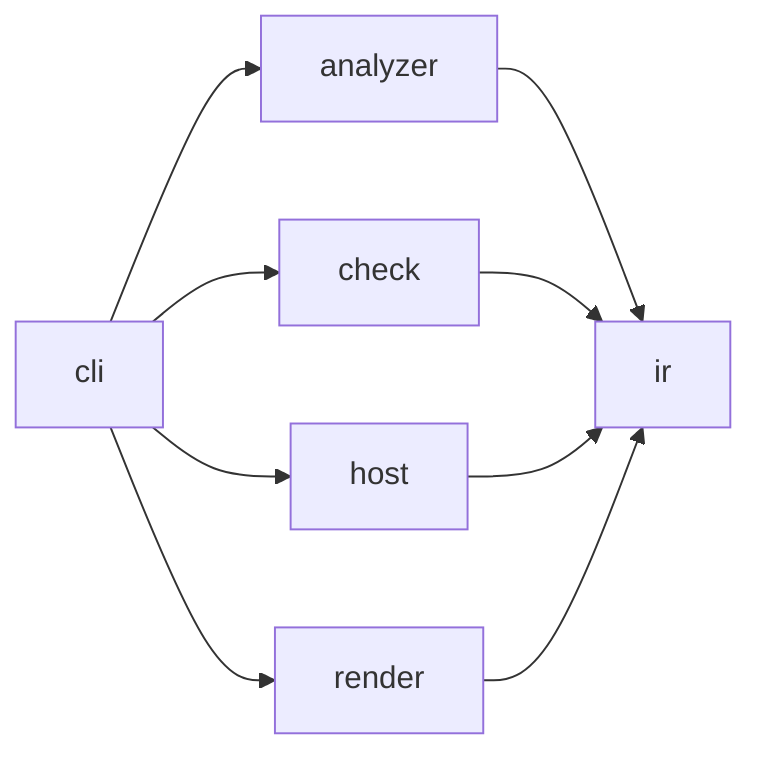

# Archkeel architecture

[The contract](../../architecture-contract.json) owns component boundaries. Within-component
imports remain allowed. Every cross-component pair is either observed or forbidden.

## Layers

| Layer | Components | Responsibility | Quality goal (AD-17) |
|---|---|---|---|
| Core | `ir`, `check` | Stable evidence values and deterministic policy evaluation | Deterministic and stable |
| Adapters | `analyzer`, `host` | Python source observations and GitLab host records | `analyzer` isolated behind its digest; `host` replaceable |
| Edge | `cli`, `render` | Composition and presentation | `cli` a thin composition root; `render` replaceable |

The CLI is the composition root. It selects concrete analyzer and host adapters, invokes the
core, writes artifacts and delegates HTML and terminal projection to `render`. Core modules
never select adapters or write presentation files.

Third-party imports are confined by `external_dependency_scope` rules: `packaging` to the
analyzer runtime gate, `rich` to `archkeel.render.terminal` and `rich_argparse` to `archkeel.cli`.

The analyzer may import only `archkeel.ir.model` and `archkeel.ir.codec`. This keeps raw AST
records inside the analyzer and exposes typed `ObservationResult` values at its boundary.

## Decisions

Each decision names its reason and the check that holds it. Code follows the decision; a change
to a decision is recorded here before the code changes.

**AD-1 Analyzer modules are flat and single-purpose.** `archkeel/analyzer/embedded/` holds only
top-level modules, one responsibility each:

| Module | Responsibility |
|---|---|
| `scanner` | Discover and parse sources, run the collectors, return `ScanResult` |
| `source` | Parsed modules, module names, evidence locations |
| `imports` | Import bindings and `__all__` exports |
| `symbols` | Classes, functions and their signatures |
| `calls` | Call sites and their resolution |
| `typing_signals` | Weak typing signals such as `Any`, `object` and `type: ignore` |
| `constructs` | Statement constructs: assert statements and broad except handlers |
| `dependencies` | Package and module topology, dependency edges, cycles, declared paths and component scopes |
| `contexts` | Context and state evidence |
| `violations` | Contract rule evaluation |
| `graph` | Graph algorithms: components, ranks, transitive paths |
| `records` | Record envelope, stable ids, analyzer version and digest |
| `contract` | Contract loading and declarations |
| `report` | Observation assembly |

Reason: `analyzer_code_digest` hashes top-level `*.py` files, so code in a subpackage would
change analyzer behavior without changing the digest. Check: `tests/test_analyzer.py`.

**AD-2 JSON has one type.** Decoded or emitted JSON is `RawJson`; untrusted input is narrowed with
`isinstance` at the boundary. Analyzer records are `RawRecord` and `RawEvidence`; their per-kind
payload is `RecordData`, the analyzer's single declared `Any`. The other `Any` positions are the
named `CoveragePayload` and the places where those records enter canonical encoding, each with a
one-line reason. Check: `mypy --strict` and the typing measurements in `fixtures/D-self/`.

**AD-3 The analyzer digest decides comparability; the version names it.** Two observations are
comparable only with equal `analyzer.code_digest`. `ANALYZER_VERSION` is the human label: its minor
number rises when the same input yields different records, such as new rule kinds or signals.
Check: `check/delta.py` compares digests; the version is reviewed with the D-self fixture.

**AD-4 Module length alone does not justify a split.** A split needs a responsibility seam. The
analyzer's public IR API is exactly `ir.model` and `ir.codec`, so splitting either is a contract
change. Check: `tests/test_self.py`.

**AD-5 Invariants live where values are built.** A value whose fields depend on each other
checks that dependency in `__post_init__`, for example `ObservationResult` (no diagnostics means
a complete observation) and `RatchetObservations` (measurements exist exactly when the status
is `SUPPORTED`). Consumers narrow with ordinary control flow. Reason: `assert` disappears
under `python -O` and hides the invariant from its owner. Check: the `CONSTRUCT-NO-ASSERT`
rule in `architecture-contract.json`.

**AD-6 A function has one responsibility.** A function longer than 80 lines, counted from `def`
to its last line with nested functions included, needs a named reason. Reasons live in
`ALLOWED_LONG_FUNCTIONS` in `tests/test_repository_hygiene.py`, keyed `path::qualified.name`. A
helper with one caller must name a real phase; splitting for length alone is not allowed.
Reason: 80 lines is what a reviewer can hold at once, and an explicit list keeps declarative
functions visible instead of exempting them silently. Check: the test fails on an unlisted long
function and on a listed function that is no longer long, so the list only shrinks.

**AD-7 Determinism is measured, not assumed.** The inputs of one observation are source bytes at a
commit, contract bytes, the installed Archkeel (analyzer and checker digests), `archkeel.toml`,
the Python version and the repository directory name. Everything else is environment, and the
emitted bytes must not depend on it. Three `report` runs on two clones with different parent
paths, working directories, `PYTHONHASHSEED`, `TZ` and `LC_ALL`, plus one verbatim repeat, must
produce byte-identical `architecture.json`, HTML report and stdout JSON without normalization. A
field that would need normalization is a violation of this decision, not a probe adjustment.
Reason: determinism is Archkeel's core promise, so it needs evidence like any other claim. Limit:
equal bytes on one machine and Python build do not prove equality across Python versions,
operating systems or inputs the probe does not vary. Check: `tests/test_determinism.py`, proven
by an unsorted record subject list and an absolute source path, each of which fails it.

**AD-8 Statement constructs are Class A rules.** `forbidden_construct` gains the constructs
`assert` and `broad_except` and an optional `allowed_sources` list with prefix scope, as in
`external_dependency_scope`. A broad handler is a bare `except:` or one that catches `Exception` or
`BaseException`, alone, in a tuple or as `builtins.Exception`; `except Exception: raise` counts,
because re-raising is intent and belongs to review, while a justified boundary is named in
`allowed_sources`. Aliases and shadowed names are blind spots. The records live in their own
`constructs` section, not in `typing_signals`, because every typing signal counts as a typing
position in the regression checks. Contract `schema_version` stays 2.0.0: a wider enum and an
optional key make no valid contract invalid, and older Archkeel versions fail closed with exit 2.
Reason: both constructs are facts of one observation, so a person should not have to judge them.
Check: one violation probe per construct in `tests/test_analyzer.py`, and Archkeel's own contract
forbids both with the CLI error boundary as the single allowed broad handler.

**AD-9 Components declare their interface.** A component lists its interface in `public`: an
entry `pkg.module` makes every non-underscore top-level name of that module public, or its
`__all__` when present, and `pkg.module:Name` makes exactly one name public. The Class A rule
`interface_boundary` accepts a cross-component import only when it reaches a declared name of the
target component, directly or through its re-export chain; underscore names never qualify, and
`TYPE_CHECKING` imports count unless `include_type_checking` is false. When an
`interface_boundary` rule exists, validation reports a component with inbound imports but no
`public`, and a `public` entry that no other component uses.
`init` proposes a module entry when the module defines `__all__` or other components use at least
half of its public names, and symbol entries otherwise, so a module entry admits at most twice the
names in use. `declarations.public_api` stays valid but is superseded. The report derives a
communication table per component edge: the used names with their parameter and return
annotations, and `UNKNOWN` where an annotation is missing. Protocol conformance, labeled graphs
and new regression measures are out of scope. Reason: Archkeel already checks which components
talk; the interface states through what, so reaching into another component's internals requires
a visible contract change. Check: violation probes in `tests/test_analyzer.py`, drift tests in
`tests/test_validation.py`, Archkeel's own contract, and the measured profile in `docs/evidence/`.

**AD-11 Every checkable item has a catalogued demo.** `fixtures/F-architecture/` is a committed
five-component sample repository with a closed contract, `public` interfaces, a marked Mermaid
graph and every Class A rule kind declared; `validate` and `report` on it are clean. One catalog
in `fixtures/architecture_demo.py` lists named variants, each a mapping of repository-relative
files to new content applied over a copy of the clean tree, together with the exact violations and
diagnostic codes it must produce. The catalog opens with a showcase section: its `tour` variant
makes every Class A rule kind fire in one run and is the default demo view. Variants live in flat
modules grouped by rule family. Regression checks and the check protocol get demos of their own,
in which `check` compares the clean sample as accepted baseline with a violating candidate. A check
demo asserts typed results only: exit code, verdicts, and the measurement or delta dimension that
regressed; it never matches the prose in `failures`. Items that cannot be demonstrated, such as
`coverage_failures`, are marked as tested only, and the generated table in
`docs/architecture-demo.md` names each row's demo type and is compared with the catalog. Reason: a user must be able to see
each rule fire on one readable repository, not only in unit tests. Check:
`tests/test_architecture_demo.py` enumerates rule kinds, construct values, diagnostic codes and
regression measurements from code, and fails when one has no catalog entry, when a variant's
findings differ from the catalog, or when the clean sample reports anything.

**AD-12 Validation diagnostics carry a code.** Every `contract_invalid` diagnostic has a stable
`code` from one `DiagnosticCode` literal, such as `decision.open`, `interface.unused` or
`rule.violated`; the constructor rejects a `contract_invalid` diagnostic without one, and result
JSON emits the code next to the pointer. Diagnostics the analyzer reports before validation, such
as `rule_without_subjects`, keep their kind without a code, and a code no path can produce is
removed. Reason: sixteen different findings shared one kind and
differed only in prose, so tests and agents had to match free text. Check: the constructor, and
the catalog test in AD-11 compares codes instead of messages.

**AD-13 Mermaid diagrams are checked before GitHub renders them.** One tool extracts every fenced
Mermaid block in tracked Markdown; a repository test rejects node labels with unquoted characters
that break the parser, and CI renders every block with the official Mermaid command-line renderer
at one pinned version. Reason: GitHub showed a parse error instead of the onboarding flow, and no
local check noticed. Check: `tests/test_mermaid.py` and the CI render step.

**AD-14 The report headline follows its verdicts, never the exit code alone.** `report` exits 0
whenever its observation is complete, so the exit code cannot say whether rules hold. The terminal
and HTML headline come from one summary: NOT CHECKED on exit 2, FAIL when `declared_rules` is
FAIL, otherwise PASS; `check`, `validate` and `init` keep their headlines, and no exit code or
result field changes. Reason: the shop tour with 11 violations opened with a green PASS above a
failing rules verdict. Check: the render tests for report, check and init headlines.

**AD-10 The report draws component flow as intent against observation.** The HTML report of
`report` embeds an interactive flow view: component cards, observed edges weighted by import sites,
edges that break a rule drawn dashed with the rule id, a threshold that hides weak edges, and an
inspector for modules and interface names. It is derived from the canonical observation alone, so
the report stays one self-contained file; the script is a packaged asset with no external library,
and its data, ordering and output bytes are deterministic. The existing communication table stays as
the fallback without script. Reason: on the internal service the graph showed the seven edges that
break its documented intent faster than any table, and a prototype on the shop sample did the same
for every rule kind. Check: the HTML report tests, `tests/test_determinism.py`, and the shop tour
report drawing every violated edge.

**AD-15 Onboarding is a decision interview: the code proposes, the architect decides.** Observed
code yields facts and questions, never intent. `init` proposes components and `public` interfaces
and returns a deterministic list of open decisions ordered by import sites; it writes no dependency
rule. Every ordered component pair must be decided exactly once in the contract: an
`allowed_dependency` rule or a `forbidden_dependency` rule, each with the architect's rationale.
One function in `ir` derives the undecided pairs from the observation alone, from the projected
dependency decisions and the observed component edges, so validation and the report, including a
report rendered later from `architecture.json`, share one derivation; `decision.open` replaces
`closed_world.missing` and names whether the pair is observed and at how many import sites. Each open
decision in the `init --json` and `validate --json` output carries the exact rule for every option,
so the id scheme has one owner and only the architect's reason is written by hand. The report draws
undecided observed edges as their own edge state from the same derivation. The skill makes the agent
an interviewer: it asks the architect multiple-choice questions with a custom answer, heaviest edges
first, offers a single decision for all unobserved pairs of a component, marks anything read from
documentation as a hypothesis with its source, and never answers itself. Contract 2.1.0 adds the rule
kind and replaces 2.0.0 without a decode path, because breaking changes are allowed before 1.0. Reason: `init`
wrote the complement of the observed graph, so the first report passed by construction, while rules
taken from the internal service's own architecture document made 7 observed edges fail at 200 import
sites. Check: `init` drafts no dependency rule, every undecided pair yields `decision.open`, a
forbidden observed edge is a violation on the first report, and Archkeel's own contract and the shop
sample decide every pair.

**AD-16 Onboarding defines a target architecture in two agent modes, and every decision records who
made it.** The contract is the target: its components, interfaces and decided dependencies state
where the system should be, and the report measures the code's distance from it as violations; it
never describes the code as it is. The architect owns that target; the agent supports the architect
with best practice, evidence from the repository and the stated quality goals, such as which
components must scale, which must stay easy to change and where performance matters, and asks the
architect for a goal whenever it is unknown and would change a recommendation. Quality goals live in
the recommendation and in the rule's rationale; the contract gains no field for them until a rule
evaluates one. The CLI stays deterministic and never decides a dependency. The packaged skill runs
onboarding in one of two modes. In interview mode the agent first reads the repository's ADRs and
architecture documents, proposes the overall picture (components, layers and allowed directions)
with its evidence, and asks the architect to confirm it once; afterwards it asks only where code and
documents disagree or the documents are silent, each question with a recommended option and its
source (`path:line`). When the architect chooses against the recommendation, the agent asks why
before writing the rule, always when the choice contradicts a document, an earlier decision or
observed code, and records that answer as the rationale. In auto mode the agent decides every open
decision itself, in this order of evidence: documents, then the layer principles the architect
confirmed or the documents state, and never "observed means allowed". Every rule carries
`decided_by`, `architect` or `agent`, so validation and the report count agent decisions that still
await the architect, and a later interview asks only those. The architect chooses the depth: auto
mode for a first target, interview mode for the conflicts they care about, and a later interview on
agent decisions. Reason: the architect is accountable for the architecture, and a recommendation
without the quality goals behind it cannot be judged; the first interview on the internal service
asked 20 rounds of unranked questions about 156 pairs and overwhelmed the architect, while an
agent-only draft without a marker made 122 agent rationales indistinguishable from intent. Check:
the contract schema requires `decided_by`, the report shows the number of agent decisions, the skill
asks why on every deviation from a recommendation, and an auto-mode run on the internal service is
compared pair by pair with the architect's 156 interview decisions.

**AD-17 Archkeel's own target names its quality goals, and `ir` holds pure derivations.** The
architect confirmed these goals for Archkeel: `ir` and `check` are deterministic and stable,
`analyzer` is isolated and changes independently behind its digest, `render` and `host` are
replaceable, and `cli` stays a thin composition root. The goals are written into each component's
responsibilities and into the reasons of the allowed dependencies. `ir` holds the shared evidence
model, its codecs and the pure derivations over them that more than one component needs, such as
interface edges and open decisions; a derivation in `ir` performs no I/O and imports nothing outside
`ir`. The placeholder `accept` command and component are removed until acceptance is implemented,
which leaves six components and 30 ordered pairs. `ir/codec.py` splits along its contract,
observation, delta, result and lock seams after 0.3.0, as its own decision, because the split
changes the analyzer's public IR. Reason: the self-observation at `7b2502a` showed a component whose
only command always exits 2 but carries 12 pair decisions, derivations in `ir` that its stated
responsibility did not cover, and a 1,278-line codec with five responsibilities. Check: the contract
has no `accept` component, every component responsibility names its quality goal, `validate` and
`report` on Archkeel stay clean, and D-self records six components.

**AD-18 A forbidden dependency supersedes the interface boundary on the same import.** An import
that already violates a `forbidden_dependency` rule is reported once, as that violation;
`interface_boundary` evaluates only imports that no forbidden rule rejects, because a forbidden edge
has no legitimate interface to reach. The `violations` measurement therefore counts each rejected
import once, and the analyzer version rises because the same input yields fewer records. Reason: on
the internal service most of the 149 interface violations were the same imports as the 148 forbidden
use-case-to-persistence imports, so the first report counted them twice and inflated its headline.
Check: a probe whose import breaks both rules yields exactly one violation, the forbidden
dependency; an import on an allowed pair that misses the declared interface still violates
`interface_boundary`; and the internal service evidence reports each import once.

**AD-19 Words for people are plain; identifiers for machines stay stable.** The verdict word on
exit 2 is `NOT CHECKED`, not `UNVERIFIABLE`, and its sentence says that nothing was checked and
what is missing. Each unknown verdict names the step that could not run. `decision.open` states in
one sentence how many import sites use the pair and that no rule decides it. Exit codes, verdict
values, diagnostic codes and every JSON key stay as they are, so scripts, the skill and the schema
do not move. Reason: on a first run the tool's opening sentences were "Required evidence is missing
or invalid; no pass decision was made" and "The component pair is not observed at 0 import site(s)
and is undecided", which a reader takes as a judgment about the code instead of a missing
precondition. Check: the render and validation tests assert the new sentences, while the result and
contract tests keep asserting the unchanged keys and codes. Two wording findings stay open and are
tracked in the roadmap: every validation panel is titled `contract_invalid` although its code is
specific, and the HTML report labels sections with internal vocabulary such as `ArchitectureIR`.

**AD-20 A level is its own contract, never a nesting inside one contract.** Depth is unlimited and
always optional: a component's inside is described by its own `archkeel.toml` with its own scan
scope and its own contract, and the component model gains no parent or child field. Levels are tied
together by three things only: a contract field that names the contract describing a component's
inside, one measured number reported upward for that component, and two checks, namely that both
levels declare the same `public` interface for it and that nothing inside imports what the level
above forbids. `init` never opens a second level by itself. Reason: a second level on `check` drafted
12 sub-components and asked for 132 decisions, four times the 30 pairs of the whole top level,
because closed-world coverage applies per level; nesting inside one contract would multiply that set
and would need a precedence rule between levels. The mechanics already work without a model change:
the same commands run on a scope of `src/archkeel/check`, where sibling components appear as external
packages. Check: the two consistency checks, and a test that `init` on a repository with a contract
proposes no second level.

**AD-21 Structure measurements are derivations, never gates.** `ir` derives, from modules and
module-level edges alone, the module count, inner edges, fan-in, fan-out and unresolved-call share
per component and per package; `report` shows them. No verdict, no rule and no exit code depends on
them, and the same holds for any number a view computes about its own drawing. Reason: the global
unresolved ratio hides a local blind spot. Across 50 self-reports since 0.2.0 the global ratio
improved four times while one component got worse, and the spread at 0.3.0 runs from 8.4% in `ir` to
41.8% in `cli` around a global 19.1%. Making such a number a gate would contradict the roadmap's own
exclusion of a total score and would invite refactoring for the sake of a figure. Check: the derived
numbers sum to the observation's totals, and `ir` stays free of I/O (AD-17).

**AD-22 The analyzer is a process port with a language profile.** The analyzer is chosen by
configuration and may be any executable that writes a canonical observation to stdout; the core
validates it against `schema/architecture-ir-common.schema.json` plus the profile of its language.
Language-specific constructs leave the contract's fixed enum and become capabilities the analyzer
declares, `python_version` becomes a general runtime field, and the Python core stays as it is.
Reason: the boundary already exists as the `Analyzer` protocol and as two schemas, one common and one
named a Python profile; only six places still assume Python, namely the import in the CLI, the
namespace pattern in the configuration, the `public` and dependency patterns in the schema, the
construct enum and the runtime gate. Comparability keeps hanging on the analyzer digest (AD-3), which
is per analyzer and needs no change. Check: a second analyzer produces a valid observation and its
own self-fixture, and contract validation rejects a construct the analyzer does not declare.

**AD-23 The report headline follows open decisions as well.** A `report` whose contract still has
open decisions must not read PASS: the headline names them, the way AD-14 makes it name violated
rules. Reason: on a freshly drafted second level, `report` exited 0 with zero violations and said
nothing about 132 undecided pairs, so a contract that decides nothing looked finished. Check: a
render test for a report whose contract leaves one pair undecided.

**AD-24 The report opens a component without requiring a decision.** The flow view may open a
component and show its modules and the imports between them, derived from the same observation and
from no contract field. Inside a component nothing is decided, so those edges are drawn as observed,
never as conforming. Reason: the data is already measured and never shown: 142 module edges, 74 of
them inside a single component, with full module names. Looking inside costs nothing, while deciding
inside is AD-20 and costs a contract of its own. Limit: a further step into a module can only use
`symbols` and `calls`, and about one call in five stays unresolved, so such a view would show
structure without proving relations. Check: the opened view renders from `architecture.json` alone.

**AD-25 Peers are isolated by one rule, not by n·(n-1) prohibitions.** The rule kind
`sibling_isolation` names a set of modules or packages as peers: they may reach shared modules and
may be reached from outside, but no member may import another member. Archkeel declares every one
of its analyzer collectors as such a set, and a hygiene test fails when a collector module exists
that the set does not name, because a peer nobody declared is a peer nobody isolates. Reason: AD-1 keeps the collectors flat and single-purpose behind
one orchestrator, and the measurement confirms the intended shape, with `records` imported twelve
times and importing nothing, `source` imported eight times, `scanner` importing ten modules, and no
import at all between two collectors. Nothing held that invariant, and expressing it with the
existing means would have taken 56 `forbidden_dependency` rules between eight peers. The kind is
general: plugins, adapters, feature slices and strategy implementations all share the constraint
that siblings communicate through shared foundations instead of through each other. Contract
`schema_version` stays 2.1.0, because a new rule kind makes no valid contract invalid and older
Archkeel versions fail closed (AD-8); the analyzer version rises because the same input can now
yield new records (AD-3). Check: a probe where one peer imports another yields exactly one
violation while an import of a shared module yields none, and Archkeel's own contract carries the
rule.

**AD-26 A quality claim is a signal, a derivation and a claim, and never guesses.** Every quality
claim has three parts: a signal the analyzer records and declares as a capability, a pure derivation
in `ir`, and a Class D claim the report shows without a verdict. When the signal is missing, the
derivation reports UNKNOWN and shows no candidates, the way regression measurements exist exactly
when the comparison is SUPPORTED (AD-5). Reason: deriving unreferenced symbols from call and import
records alone produced 41 candidates on Archkeel itself; after exempting dunder names, `__all__`
entries and methods of subclasses, 13 remained, and every one of them was wrong, because a function
used as a value (`_RULE_PARSERS`, `type=_sha`), a property read as an attribute and a consumer
outside the scan scope are all invisible to a call graph. The same run listed 8 modules nobody
imports, and all 8 were package `__init__` files, an entry point or a subprocess target. A claim
whose candidates are wrong every time teaches readers to skip the section, which costs more than the
missing claim. Check: a derivation without its signal returns UNKNOWN, and a probe whose function is
referenced only as a value yields no candidate. The claim set grows the same way: `unread
binding` is the second claim, and its signal is the `bindings` section, which records a parameter
or local no expression in its own function reads. That question is settled inside one scope, so
the claim is supported wherever the analyzer ran; what it cannot observe is how many bindings the
collector set aside, so it reports the functions it examined as its denominator instead of
inventing that number. On Archkeel itself it names nothing, because `ARG` and `RUF059` reject such
a binding at lint time: a claim that stays empty on a clean repository is working, not missing.

**AD-27 A type escape hatch is decided, not merely observed.** The analyzer has recorded `Any` in
an annotation as a typing signal since the first release, but no rule kind named it, so the
strongest way to hide what crosses a boundary was the one thing a contract could not forbid.
`any_annotation` therefore joins `ForbiddenConstructKind` and reuses the path `type_ignore`
already takes: a typing signal that `_construct_violations` reads exactly like an `assert`
statement, so no new machinery appears. Adding a kind to a rule kind leaves `schema_version` at
2.1.0 (AD-8). The escape hatch stays legitimate where a program decodes foreign data, so a
contract that needs it scopes it with `allowed_sources` and records why, rather than dropping the
rule. Check: the shop sample declares no `Any` and passes; the tour overlay declares one and
fails with `CONSTRUCT-NO-ANY`.

**AD-28 An undeclared external dependency is a hole, not a detail.** `external_dependency_scope`
limits a dependency the contract already names, so nothing ever decided an import the contract
never mentions: a module importing `helpers`, or a package that does not exist at all, passed with
exit 0 and an empty diagnostic list. The rule kind `complete_external_scope` closes that world the
way `complete_assignment` closes it for modules — an import whose target is neither a scanned
module nor part of the standard library must be covered by an `external_dependency_scope` rule,
and is otherwise a violation naming the importing module. The standard library is recognised
through `sys.stdlib_module_names`, which ties the verdict to the Python version; that version is
already part of what makes an observation comparable (AD-3), so a report stays reproducible for a
given version while a version change can move a module in or out of the set. The alternative,
declaring every standard-library module in the contract, would add two hundred rules that record
no decision an architect ever made. Check: a probe importing an invented package fails, and the
shop sample, whose externals are declared, passes.

## Allowed dependencies

| Edge | Reason |
|---|---|
| `cli` → `analyzer` | Supply the concrete, replaceable source analyzer to report and check workflows; `cli` composes, it does not analyze. |
| `cli` → `check` | Invoke deterministic and stable report and check services from the composition root. |
| `cli` → `host` | Supply the concrete, replaceable host-record loader to checks; `cli` composes, it does not fetch. |
| `cli` → `render` | Project typed results through the replaceable render adapter, keeping `cli` a thin composition root. |
| `analyzer` → `ir` | Publish observations through the common model and codec boundary, so `analyzer` stays isolated behind its digest. |
| `check` → `ir` | Compare observations and return typed results without losing determinism or stability. |
| `host` → `ir` | Construct validated host-record values through the stable evidence model, so `host` stays replaceable behind it. |
| `render` → `ir` | Render typed evidence without importing policy implementations, so `render` stays replaceable behind the stable model. |

<!-- archkeel-component-graph -->

