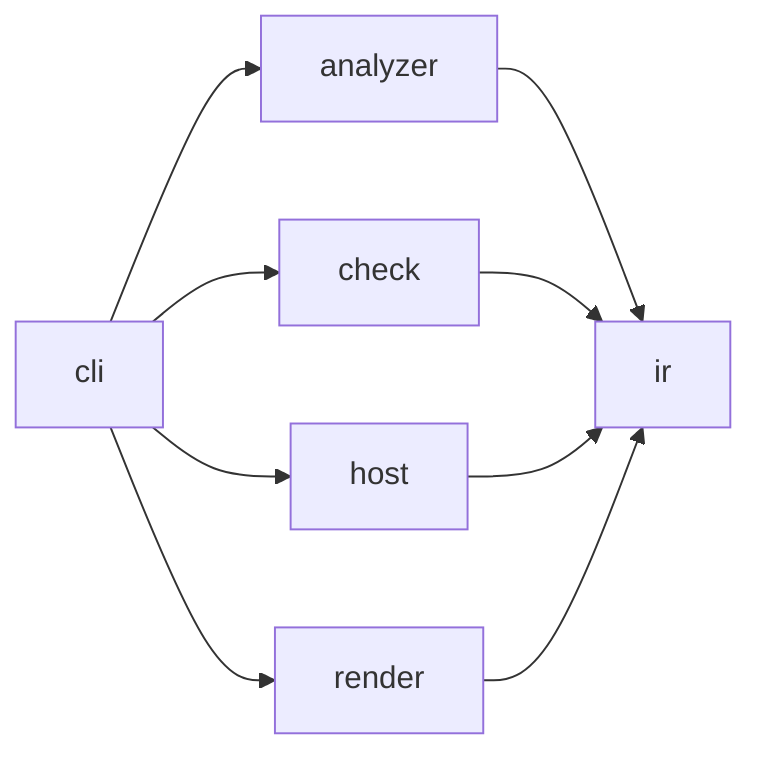

# Archkeel architecture

[The contract](../../architecture-contract.json) owns component boundaries. Within-component
imports remain allowed. Every cross-component pair is either observed or forbidden.

## Layers

| Layer | Components | Responsibility |
|---|---|---|
| Core | `ir`, `check` | Stable evidence values and deterministic policy evaluation |
| Adapters | `analyzer`, `host` | Python source observations and GitLab host records |
| Edge | `cli`, `render` | Composition and presentation |

The CLI is the composition root. It selects concrete analyzer and host adapters, invokes the
core, writes artifacts and delegates HTML and terminal projection to `render`. Core modules
never select adapters or write presentation files.

Third-party imports are confined by `external_dependency_scope` rules: `packaging` to the
analyzer runtime gate, `rich` to `archkeel.render.terminal` and `rich_argparse` to `archkeel.cli`.

The analyzer may import only `archkeel.ir.model` and `archkeel.ir.codec`. This keeps raw AST
records inside the analyzer and exposes typed `ObservationResult` values at its boundary.

## Decisions

Each decision names its reason and the check that holds it. Code follows the decision; a change
to a decision is recorded here before the code changes.

**AD-1 Analyzer modules are flat and single-purpose.** `archkeel/analyzer/embedded/` holds only
top-level modules, one responsibility each:

| Module | Responsibility |
|---|---|
| `scanner` | Discover and parse sources, run the collectors, return `ScanResult` |
| `source` | Parsed modules, module names, evidence locations |
| `imports` | Import bindings and `__all__` exports |
| `symbols` | Classes, functions and their signatures |
| `calls` | Call sites and their resolution |
| `typing_signals` | Weak typing signals such as `Any`, `object` and `type: ignore` |
| `constructs` | Statement constructs: assert statements and broad except handlers |
| `dependencies` | Package and module topology, dependency edges, cycles, declared paths and component scopes |
| `contexts` | Context and state evidence |
| `violations` | Contract rule evaluation |
| `graph` | Graph algorithms: components, ranks, transitive paths |
| `records` | Record envelope, stable ids, analyzer version and digest |
| `contract` | Contract loading and declarations |
| `report` | Observation assembly |

Reason: `analyzer_code_digest` hashes top-level `*.py` files, so code in a subpackage would
change analyzer behavior without changing the digest. Check: `tests/test_analyzer.py`.

**AD-2 JSON has one type.** Decoded or emitted JSON is `RawJson`; untrusted input is narrowed with
`isinstance` at the boundary. Analyzer records are `RawRecord` and `RawEvidence`; their per-kind
payload is `RecordData`, the analyzer's single declared `Any`. The other `Any` positions are the
named `CoveragePayload` and the places where those records enter canonical encoding, each with a
one-line reason. Check: `mypy --strict` and the typing measurements in `fixtures/D-self/`.

**AD-3 The analyzer digest decides comparability; the version names it.** Two observations are
comparable only with equal `analyzer.code_digest`. `ANALYZER_VERSION` is the human label: its minor
number rises when the same input yields different records, such as new rule kinds or signals.
Check: `check/delta.py` compares digests; the version is reviewed with the D-self fixture.

**AD-4 Module length alone does not justify a split.** A split needs a responsibility seam. The
analyzer's public IR API is exactly `ir.model` and `ir.codec`, so splitting either is a contract
change. Check: `tests/test_self.py`.

**AD-5 Invariants live where values are built.** A value whose fields depend on each other
checks that dependency in `__post_init__`, for example `ObservationResult` (no diagnostics means
a complete observation) and `RatchetObservations` (measurements exist exactly when the status
is `SUPPORTED`). Consumers narrow with ordinary control flow. Reason: `assert` disappears
under `python -O` and hides the invariant from its owner. Check: the `CONSTRUCT-NO-ASSERT`
rule in `architecture-contract.json`.

**AD-6 A function has one responsibility.** A function longer than 80 lines, counted from `def`
to its last line with nested functions included, needs a named reason. Reasons live in
`ALLOWED_LONG_FUNCTIONS` in `tests/test_repository_hygiene.py`, keyed `path::qualified.name`. A
helper with one caller must name a real phase; splitting for length alone is not allowed.
Reason: 80 lines is what a reviewer can hold at once, and an explicit list keeps declarative
functions visible instead of exempting them silently. Check: the test fails on an unlisted long
function and on a listed function that is no longer long, so the list only shrinks.

**AD-7 Determinism is measured, not assumed.** The inputs of one observation are source bytes at a
commit, contract bytes, the installed Archkeel (analyzer and checker digests), `archkeel.toml`,
the Python version and the repository directory name. Everything else is environment, and the
emitted bytes must not depend on it. Three `report` runs on two clones with different parent
paths, working directories, `PYTHONHASHSEED`, `TZ` and `LC_ALL`, plus one verbatim repeat, must
produce byte-identical `architecture.json`, HTML report and stdout JSON without normalization. A
field that would need normalization is a violation of this decision, not a probe adjustment.
Reason: determinism is Archkeel's core promise, so it needs evidence like any other claim. Limit:
equal bytes on one machine and Python build do not prove equality across Python versions,
operating systems or inputs the probe does not vary. Check: `tests/test_determinism.py`, proven
by an unsorted record subject list and an absolute source path, each of which fails it.

**AD-8 Statement constructs are Class A rules.** `forbidden_construct` gains the constructs
`assert` and `broad_except` and an optional `allowed_sources` list with prefix scope, as in
`external_dependency_scope`. A broad handler is a bare `except:` or one that catches `Exception` or
`BaseException`, alone, in a tuple or as `builtins.Exception`; `except Exception: raise` counts,
because re-raising is intent and belongs to review, while a justified boundary is named in
`allowed_sources`. Aliases and shadowed names are blind spots. The records live in their own
`constructs` section, not in `typing_signals`, because every typing signal counts as a typing
position in the regression checks. Contract `schema_version` stays 2.0.0: a wider enum and an
optional key make no valid contract invalid, and older Archkeel versions fail closed with exit 2.
Reason: both constructs are facts of one observation, so a person should not have to judge them.
Check: one violation probe per construct in `tests/test_analyzer.py`, and Archkeel's own contract
forbids both with the CLI error boundary as the single allowed broad handler.

**AD-9 Components declare their interface.** A component lists its interface in `public`: an
entry `pkg.module` makes every non-underscore top-level name of that module public, or its
`__all__` when present, and `pkg.module:Name` makes exactly one name public. The Class A rule
`interface_boundary` accepts a cross-component import only when it reaches a declared name of the
target component, directly or through its re-export chain; underscore names never qualify, and
`TYPE_CHECKING` imports count unless `include_type_checking` is false. When an
`interface_boundary` rule exists, validation reports a component with inbound imports but no
`public`, and a `public` entry that no other component uses.
`init` proposes a module entry when the module defines `__all__` or other components use at least
half of its public names, and symbol entries otherwise, so a module entry admits at most twice the
names in use. `declarations.public_api` stays valid but is superseded. The report derives a
communication table per component edge: the used names with their parameter and return
annotations, and `UNKNOWN` where an annotation is missing. Protocol conformance, labeled graphs
and new regression measures are out of scope. Reason: Archkeel already checks which components
talk; the interface states through what, so reaching into another component's internals requires
a visible contract change. Check: violation probes in `tests/test_analyzer.py`, drift tests in
`tests/test_validation.py`, Archkeel's own contract, and the measured profile in `docs/evidence/`.

**AD-11 Every checkable item has a catalogued demo.** `fixtures/F-architecture/` is a committed
five-component sample repository with a closed contract, `public` interfaces, a marked Mermaid
graph and every Class A rule kind declared; `validate` and `report` on it are clean. One catalog
in `fixtures/architecture_demo.py` lists named variants, each a mapping of repository-relative
files to new content applied over a copy of the clean tree, together with the exact violations and
diagnostic codes it must produce. The catalog opens with a showcase section: its `tour` variant
makes every Class A rule kind fire in one run and is the default demo view. Variants live in flat
modules grouped by rule family. Regression checks and the check protocol get demos of their own,
in which `check` compares the clean sample as accepted baseline with a violating candidate. A check
demo asserts typed results only: exit code, verdicts, and the measurement or delta dimension that
regressed; it never matches the prose in `failures`. Items that cannot be demonstrated, such as
`coverage_failures`, are marked as tested only, and the generated table in
`docs/architecture-demo.md` names each row's demo type and is compared with the catalog. Reason: a user must be able to see
each rule fire on one readable repository, not only in unit tests. Check:
`tests/test_architecture_demo.py` enumerates rule kinds, construct values, diagnostic codes and
regression measurements from code, and fails when one has no catalog entry, when a variant's
findings differ from the catalog, or when the clean sample reports anything.

**AD-12 Validation diagnostics carry a code.** Every `contract_invalid` diagnostic has a stable
`code` from one `DiagnosticCode` literal, such as `decision.open`, `interface.unused` or
`rule.violated`; the constructor rejects a `contract_invalid` diagnostic without one, and result
JSON emits the code next to the pointer. Diagnostics the analyzer reports before validation, such
as `rule_without_subjects`, keep their kind without a code, and a code no path can produce is
removed. Reason: sixteen different findings shared one kind and
differed only in prose, so tests and agents had to match free text. Check: the constructor, and
the catalog test in AD-11 compares codes instead of messages.

**AD-13 Mermaid diagrams are checked before GitHub renders them.** One tool extracts every fenced
Mermaid block in tracked Markdown; a repository test rejects node labels with unquoted characters
that break the parser, and CI renders every block with the official Mermaid command-line renderer
at one pinned version. Reason: GitHub showed a parse error instead of the onboarding flow, and no
local check noticed. Check: `tests/test_mermaid.py` and the CI render step.

**AD-14 The report headline follows its verdicts, never the exit code alone.** `report` exits 0
whenever its observation is complete, so the exit code cannot say whether rules hold. The terminal
and HTML headline come from one summary: UNVERIFIABLE on exit 2, FAIL when `declared_rules` is
FAIL, otherwise PASS; `check`, `validate` and `init` keep their headlines, and no exit code or
result field changes. Reason: the shop tour with 11 violations opened with a green PASS above a
failing rules verdict. Check: the render tests for report, check and init headlines.

**AD-10 The report draws component flow as intent against observation.** The HTML report of
`report` embeds an interactive flow view: component cards, observed edges weighted by import sites,
edges that break a rule drawn dashed with the rule id, a threshold that hides weak edges, and an
inspector for modules and interface names. It is derived from the canonical observation alone, so
the report stays one self-contained file; the script is a packaged asset with no external library,
and its data, ordering and output bytes are deterministic. The existing communication table stays as
the fallback without script. Reason: on the internal service the graph showed the seven edges that
break its documented intent faster than any table, and a prototype on the shop sample did the same
for every rule kind. Check: the HTML report tests, `tests/test_determinism.py`, and the shop tour
report drawing every violated edge.

**AD-15 Onboarding is a decision interview: the code proposes, the architect decides.** Observed
code yields facts and questions, never intent. `init` proposes components and `public` interfaces
and returns a deterministic list of open decisions ordered by import sites; it writes no dependency
rule. Every ordered component pair must be decided exactly once in the contract: an
`allowed_dependency` rule or a `forbidden_dependency` rule, each with the architect's rationale.
One function in `ir` derives the undecided pairs from the observation alone, from the projected
dependency decisions and the observed component edges, so validation and the report, including a
report rendered later from `architecture.json`, share one derivation; `decision.open` replaces
`closed_world.missing` and names whether the pair is observed and at how many import sites. Each open
decision in the `init --json` and `validate --json` output carries the exact rule for every option,
so the id scheme has one owner and only the architect's reason is written by hand. The report draws
undecided observed edges as their own edge state from the same derivation. The skill makes the agent
an interviewer: it asks the architect multiple-choice questions with a custom answer, heaviest edges
first, offers a single decision for all unobserved pairs of a component, marks anything read from
documentation as a hypothesis with its source, and never answers itself. Contract 2.1.0 adds the rule
kind and replaces 2.0.0 without a decode path, because breaking changes are allowed before 1.0. Reason: `init`
wrote the complement of the observed graph, so the first report passed by construction, while rules
taken from the internal service's own architecture document made 7 observed edges fail at 200 import
sites. Check: `init` drafts no dependency rule, every undecided pair yields `decision.open`, a
forbidden observed edge is a violation on the first report, and Archkeel's own contract and the shop
sample decide every pair.

**AD-16 Onboarding defines a target architecture in two agent modes, and every decision records who
made it.** The contract is the target: its components, interfaces and decided dependencies state
where the system should be, and the report measures the code's distance from it as violations; it
never describes the code as it is. The architect owns that target; the agent supports the architect
with best practice, evidence from the repository and the stated quality goals, such as which
components must scale, which must stay easy to change and where performance matters, and asks the
architect for a goal whenever it is unknown and would change a recommendation. Quality goals live in
the recommendation and in the rule's rationale; the contract gains no field for them until a rule
evaluates one. The CLI stays deterministic and never decides a dependency. The packaged skill runs
onboarding in one of two modes. In interview mode the agent first reads the repository's ADRs and
architecture documents, proposes the overall picture (components, layers and allowed directions)
with its evidence, and asks the architect to confirm it once; afterwards it asks only where code and
documents disagree or the documents are silent, each question with a recommended option and its
source (`path:line`). When the architect chooses against the recommendation, the agent asks why
before writing the rule, always when the choice contradicts a document, an earlier decision or
observed code, and records that answer as the rationale. In auto mode the agent decides every open
decision itself, in this order of evidence: documents, then the layer principles the architect
confirmed or the documents state, and never "observed means allowed". Every rule carries
`decided_by`, `architect` or `agent`, so validation and the report count agent decisions that still
await the architect, and a later interview asks only those. The architect chooses the depth: auto
mode for a first target, interview mode for the conflicts they care about, and a later interview on
agent decisions. Reason: the architect is accountable for the architecture, and a recommendation
without the quality goals behind it cannot be judged; the first interview on the internal service
asked 20 rounds of unranked questions about 156 pairs and overwhelmed the architect, while an
agent-only draft without a marker made 122 agent rationales indistinguishable from intent. Check:
the contract schema requires `decided_by`, the report shows the number of agent decisions, the skill
asks why on every deviation from a recommendation, and an auto-mode run on the internal service is
compared pair by pair with the architect's 156 interview decisions.

**AD-17 Archkeel's own target names its quality goals, and `ir` holds pure derivations.** The
architect confirmed these goals for Archkeel: `ir` and `check` are deterministic and stable,
`analyzer` is isolated and changes independently behind its digest, `render` and `host` are
replaceable, and `cli` stays a thin composition root. The goals are written into each component's
responsibilities and into the reasons of the allowed dependencies. `ir` holds the shared evidence
model, its codecs and the pure derivations over them that more than one component needs, such as
interface edges and open decisions; a derivation in `ir` performs no I/O and imports nothing outside
`ir`. The placeholder `accept` command and component are removed until acceptance is implemented,
which leaves six components and 30 ordered pairs. `ir/codec.py` splits along its contract,
observation, delta, result and lock seams after 0.3.0, as its own decision, because the split
changes the analyzer's public IR. Reason: the self-observation at `7b2502a` showed a component whose
only command always exits 2 but carries 12 pair decisions, derivations in `ir` that its stated
responsibility did not cover, and a 1,278-line codec with five responsibilities. Check: the contract
has no `accept` component, every component responsibility names its quality goal, `validate` and
`report` on Archkeel stay clean, and D-self records six components.

## Allowed dependencies

| Edge | Reason |
|---|---|
| `cli` → `analyzer` | Supply the concrete source analyzer to report and check workflows. |
| `cli` → `check` | Invoke deterministic report and check services. |
| `cli` → `host` | Supply the concrete host-record loader to checks. |
| `cli` → `render` | Project typed results and write presentation artifacts. |
| `analyzer` → `ir` | Publish observations through the common model and codec boundary. |
| `check` → `ir` | Compare observations and return typed results. |
| `host` → `ir` | Construct validated host-record values. |
| `render` → `ir` | Render typed evidence without importing policy implementations. |

<!-- archkeel-component-graph -->

