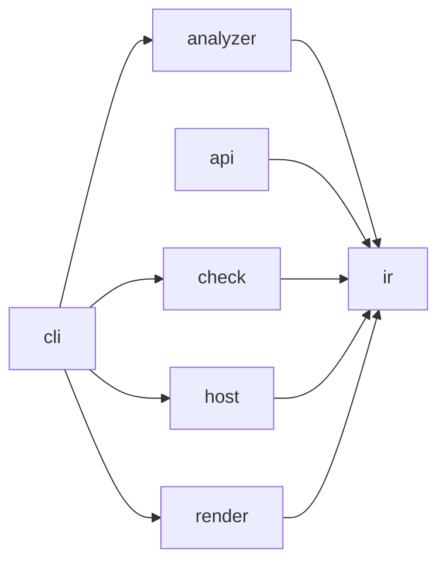

# Archkeel architecture

[The contract](../../architecture-contract.json) owns component boundaries. Within-component
imports remain allowed. Every cross-component pair is either observed or forbidden.

## Layers

| Layer | Components | Responsibility | Quality goal (AD-17) |
|---|---|---|---|
| Core | `ir`, `check` | Stable evidence values and deterministic policy evaluation | Deterministic and stable |
| Adapters | `analyzer`, `host` | Python source observations and GitLab host records | `analyzer` isolated behind its digest; `host` replaceable |
| Edge | `cli`, `render` | Composition and presentation | `cli` a thin composition root; `render` replaceable |
| External | `api` | The declared external read contract for a consumer outside this repository (AD-64) | Stable across every internal `ir` refactor |

The CLI is the composition root. It selects concrete analyzer and host adapters, invokes the
core, writes artifacts and delegates HTML and terminal projection to `render`. Core modules
never select adapters or write presentation files.

Third-party imports are confined by `external_dependency_scope` rules: `packaging` to the
analyzer runtime gate, `rich` to `archkeel.render.terminal` and `rich_argparse` to `archkeel.cli`.

The analyzer may import only `archkeel.ir.model` and `archkeel.ir.codec`. This keeps raw AST
records inside the analyzer and exposes typed `ObservationResult` values at its boundary.

Compatibility shims are declared at the contract top level, not inferred as a generic facade:
`declarations.compat` owns the old module, target and lifetime (AD-87).

## Decisions

Each decision names its reason and the check that holds it. Code follows the decision; a change
to a decision is recorded here before the code changes. Each decision now lives in its own file
under `decisions/`, in the order the architecture record was written, because a later decision
often explains an earlier one; the index below keeps that order.

| Decision | Title |
|---|---|
| AD-1 | [Analyzer modules are flat and single-purpose](decisions/ad-01-analyzer-modules-are-flat-and-singlepurpose.md) |
| AD-2 | [JSON has one type](decisions/ad-02-json-has-one-type.md) |
| AD-3 | [The analyzer digest decides comparability; the version names it](decisions/ad-03-the-analyzer-digest-decides-comparability-the-version-names.md) |
| AD-4 | [Module length alone does not justify a split](decisions/ad-04-module-length-alone-does-not-justify-a-split.md) |
| AD-5 | [Invariants live where values are built](decisions/ad-05-invariants-live-where-values-are-built.md) |
| AD-6 | [A function has one responsibility](decisions/ad-06-a-function-has-one-responsibility.md) |
| AD-7 | [Determinism is measured, not assumed](decisions/ad-07-determinism-is-measured-not-assumed.md) |
| AD-8 | [Statement constructs are Class A rules](decisions/ad-08-statement-constructs-are-class-a-rules.md) |
| AD-9 | [Components declare their interface](decisions/ad-09-components-declare-their-interface.md) |
| AD-11 | [Every checkable item has a catalogued demo](decisions/ad-11-every-checkable-item-has-a-catalogued-demo.md) |
| AD-12 | [Validation diagnostics carry a code](decisions/ad-12-validation-diagnostics-carry-a-code.md) |
| AD-13 | [Mermaid diagrams are checked before GitHub renders them](decisions/ad-13-mermaid-diagrams-are-checked-before-github-renders-them.md) |
| AD-14 | [The report headline follows its verdicts, never the exit code alone](decisions/ad-14-the-report-headline-follows-its-verdicts-never-the-exit.md) |
| AD-10 | [The report draws component flow as intent against observation](decisions/ad-10-the-report-draws-component-flow-as-intent-against.md) |
| AD-15 | [Onboarding is a decision interview: the code proposes, the architect decides](decisions/ad-15-onboarding-is-a-decision-interview-the-code-proposes-the.md) |
| AD-16 | [Onboarding defines a target architecture in two agent modes, and every decision records who made it](decisions/ad-16-onboarding-defines-a-target-architecture-in-two-agent-modes.md) |
| AD-17 | [Archkeel's own target names its quality goals, and `ir` holds pure derivations](decisions/ad-17-archkeels-own-target-names-its-quality-goals-and-ir-holds.md) |
| AD-18 | [A forbidden dependency supersedes the interface boundary on the same import](decisions/ad-18-a-forbidden-dependency-supersedes-the-interface-boundary-on.md) |
| AD-19 | [Words for people are plain; identifiers for machines stay stable](decisions/ad-19-words-for-people-are-plain-identifiers-for-machines-stay.md) |
| AD-20 | [A level is its own contract, never a nesting inside one contract](decisions/ad-20-a-level-is-its-own-contract-never-a-nesting-inside-one.md) |
| AD-21 | [Structure measurements are derivations, never gates](decisions/ad-21-structure-measurements-are-derivations-never-gates.md) |
| AD-22 | [The analyzer is a process port with a language profile](decisions/ad-22-the-analyzer-is-a-process-port-with-a-language-profile.md) |
| AD-23 | [The report headline follows open decisions as well](decisions/ad-23-the-report-headline-follows-open-decisions-as-well.md) |
| AD-31 | [Deciding inside a component is opt-in, and only for pairs that exist](decisions/ad-31-deciding-inside-a-component-is-optin-and-only-for-pairs.md) |
| AD-24b | [Observed is not undecided](decisions/ad-24b-observed-is-not-undecided.md) |
| AD-24a | [A module opens the same way, and its interface is what crosses its edge](decisions/ad-24a-a-module-opens-the-same-way-and-its-interface-is-what.md) |
| AD-24 | [The report opens a component without requiring a decision](decisions/ad-24-the-report-opens-a-component-without-requiring-a-decision.md) |
| AD-25 | [Peers are isolated by one rule, not by n·(n-1) prohibitions](decisions/ad-25-peers-are-isolated-by-one-rule-not-by-nn1-prohibitions.md) |
| AD-26 | [A quality claim is a signal, a derivation and a claim, and never guesses](decisions/ad-26-a-quality-claim-is-a-signal-a-derivation-and-a-claim-and.md) |
| AD-27 | [A type escape hatch is decided, not merely observed](decisions/ad-27-a-type-escape-hatch-is-decided-not-merely-observed.md) |
| AD-30 | [A declared owner is worth nothing until something can contradict it](decisions/ad-30-a-declared-owner-is-worth-nothing-until-something-can.md) |
| AD-29 | [A function that does nothing is a claim, not a stub](decisions/ad-29-a-function-that-does-nothing-is-a-claim-not-a-stub.md) |
| AD-28 | [An undeclared external dependency is a hole, not a detail](decisions/ad-28-an-undeclared-external-dependency-is-a-hole-not-a-detail.md) |
| AD-32 | [A component names what it requires; what it does not name is forbidden](decisions/ad-32-a-component-names-what-it-requires-what-it-does-not-name-is.md) |
| AD-33 | [A component's inside is a level, not a list of pairs](decisions/ad-33-a-components-inside-is-a-level-not-a-list-of-pairs.md) |
| AD-34 | [A declared inside is recorded, so the report draws it without reading a second contract](decisions/ad-34-a-declared-inside-is-recorded-so-the-report-draws-it.md) |
| AD-35 | [Every review claim is counted on the run result, so the terminal and the JSON name what the page shows](decisions/ad-35-every-review-claim-is-counted-on-the-run-result-so-the.md) |
| AD-36 | [A rule the inside declares is recorded and carried, so the verdict it produces survives every command](decisions/ad-36-a-rule-the-inside-declares-is-recorded-and-carried-so-the.md) |
| AD-37 | [A receiver whose type is statically obvious resolves the stdlib method it calls](decisions/ad-37-a-receiver-whose-type-is-statically-obvious-resolves-the.md) |
| AD-38 | [A drafted component carries the size `structure_metrics` already measures, so the architect sees what a per-child draft hides before deciding whether to consolidate](decisions/ad-38-a-drafted-component-carries-the-size-structuremetrics.md) |
| AD-39 | [An empty `selected_changes` declares that nothing architectural changed](decisions/ad-39-an-empty-selectedchanges-declares-that-nothing.md) |
| AD-40 | [A call whose callee the import binding proves, or whose receiver is already typed, types its result from a documented table](decisions/ad-40-a-call-whose-callee-the-import-binding-proves-or-whose.md) |
| AD-41 | [Where `Any` may appear is a contract rule, not a test](decisions/ad-41-where-any-may-appear-is-a-contract-rule-not-a-test.md) |
| AD-42 | [A `requires` entry may name the modules it goes through, and twelve prohibitions become that one permission](decisions/ad-42-a-requires-entry-may-name-the-modules-it-goes-through-and.md) |
| AD-43 | [A candidate declares what it changed, not what the scanner counted or what every module already carries](decisions/ad-43-a-candidate-declares-what-it-changed-not-what-the-scanner.md) |
| AD-44 | [An undeclared added dependency edge is a guardrail failure, closing the AD-39 Limit](decisions/ad-44-an-undeclared-added-dependency-edge-is-a-guardrail-failure.md) |
| AD-45 | [`analyzer` declares a three-part inside, the way `check` already does (AD-20)](decisions/ad-45-analyzer-declares-a-threepart-inside-the-way-check-already.md) |
| AD-46 | [`validate --write-graph` regenerates the marked component graph after a contract edit](decisions/ad-46-validate-writegraph-regenerates-the-marked-component-graph.md) |
| AD-47 | [`init` breaks a tie between top-level packages with `pyproject.toml`'s `[project] name`, and with nothing else](decisions/ad-47-init-breaks-a-tie-between-toplevel-packages-with.md) |
| AD-48 | [Reflection that writes, and a value compared with a string literal, are decided, not only reviewed](decisions/ad-48-reflection-that-writes-and-a-value-compared-with-a-string.md) |
| AD-49 | [An allowance may name its module exactly, so a package root is scoped on its own](decisions/ad-49-an-allowance-may-name-its-module-exactly-so-a-package-root.md) |
| AD-50 | [An edge and an interface record who decided them, and the agent-decision count counts them](decisions/ad-50-an-edge-and-an-interface-record-who-decided-them-and-the.md) |
| AD-51 | [A result carries its violations grouped by rule and by crossed component pair](decisions/ad-51-a-result-carries-its-violations-grouped-by-rule-and-by.md) |
| AD-52 | [A violation is named by what it is, and a baseline may hold the ones already there](decisions/ad-52-a-violation-is-named-by-what-it-is-and-a-baseline-may-hold.md) |
| AD-53 | [`from pkg import name` follows `pkg/__init__.py`'s own binding before a same-named submodule](decisions/ad-53-from-pkg-import-name-follows-pkginitpys-own-binding-before.md) |
| AD-54 | [A typed violation row is the one supported way to read a report's violations, and `ir.baseline` derives it once for everything that groups them](decisions/ad-54-a-typed-violation-row-is-the-one-supported-way-to-read-a.md) |
| AD-55 | [The decision record splits into one file per decision, indexed in document order](decisions/ad-55-the-decision-record-splits-into-one-file-per-decision.md) |
| AD-56 | [A public entry the scan never saw is missing, and planned exempts it until built](decisions/ad-56-a-public-entry-the-scan-never-saw-is-missing-and-planned.md) |
| AD-57 | [A target graph marker draws the edges the contract permits](decisions/ad-57-a-target-graph-marker-draws-the-edges-the-contract-permits.md) |
| AD-58 | [A class lives where its symbol_placement rule allows, and a facade's dict or object is all boundary_types decides](decisions/ad-58-a-class-lives-where-its-symbolplacement-rule-allows-and-a.md) |
| AD-59 | [A type crossing many component boundaries is a review claim, not a verdict](decisions/ad-59-a-type-crossing-many-component-boundaries-is-a-review-claim.md) |
| AD-60 | [report --only, --rule and --component narrow what a rendered report shows, never what it judged](decisions/ad-60-report-only-rule-and-component-narrow-what-a-rendered.md) |
| AD-61 | [A widening fails unless an amendment binds its exact before and after digest](decisions/ad-61-a-widening-fails-unless-an-amendment-binds-its-exact-before.md) |
| AD-62 | [An annotated variable's owner is the scope it is written in, not its bare name](decisions/ad-62-an-annotated-variables-owner-is-the-scope-it-is-written-in.md) |
| AD-63 | [boundary_types reads a component's declared public list, not a naming convention](decisions/ad-63-boundarytypes-reads-a-components-declared-public-list-not-a.md) |
| AD-64 | [`archkeel.api` is the declared external contract, and `ir` performs no I/O](decisions/ad-64-archkeelapi-is-the-declared-external-contract-and-ir.md) |
| AD-67 | [An undecidable boundary position is UNKNOWN, not silence](decisions/ad-67-an-undecidable-boundary-position-is-unknown-not-silence.md) |
| AD-69 | [One annotation is read once, for both readers](decisions/ad-69-one-annotation-is-read-once-for-both-readers.md) |
| AD-72 | [A rule that could not decide everything reports UNKNOWN](decisions/ad-72-a-rule-that-could-not-decide-everything-reports-unknown.md) |
| AD-73 | [The external surface is judged by the same walk](decisions/ad-73-the-external-surface-is-judged-by-the-same-walk.md) |
| AD-74 | [A name bound twice is unresolvable, not a coin flip](decisions/ad-74-a-name-bound-twice-is-unresolvable-not-a-coin-flip.md) |
| AD-65 | [A type a declared facade signature exposes is a used public entry](decisions/ad-65-a-type-a-declared-facade-signature-exposes-is-a-used.md) |
| AD-66 | [`declarations.public_api` names a consumer outside the package, narrowing AD-9](decisions/ad-66-declarationspublicapi-names-a-consumer-outside-the-package.md) |
| AD-68 | [`check` and `render` declare boundary_types, and the ten findings are declarations](decisions/ad-68-check-and-render-declare-boundarytypes-and-the-ten.md) |
| AD-70 | [The external promise declares every type it hands out](decisions/ad-70-the-external-promise-declares-every-type-it-hands-out.md) |
| AD-71 | [A promised name is checked against the module's own `__all__`](decisions/ad-71-a-promised-name-is-checked-against-the-modules-own-all.md) |
| AD-75 | [An open report can focus on violations without changing evidence](decisions/ad-75-an-open-report-can-focus-on-violations-without-changing.md) |
| AD-76 | [`boundary_types` and `symbol_placement` are restrictions in `--against`](decisions/ad-76-boundary-rules-are-restrictions-in-against.md) |
| AD-77 | [An existing baseline is compared before it is written](decisions/ad-77-an-existing-baseline-is-compared-before-it-is-written.md) |
| AD-78 | [Baseline fingerprints keep identity and record direction roles](decisions/ad-78-baseline-fingerprints-keep-identity-and-record-direction-roles.md) |
| AD-79 | [A planned entry is target work until code reaches it](decisions/ad-79-planned-entry-is-target-work-until-reached.md) |
| AD-80 | [`string_literal_compare` follows proven local string constants](decisions/ad-80-string-constant-comparisons-are-statically-resolved.md) |
| AD-81 | [The project owns one fail-closed Make gate](decisions/ad-81-the-project-owns-one-fail-closed-make-gate.md) |
| AD-82 | [A component namespace restricts placement, not ownership](decisions/ad-82-component-namespace-is-placement-not-ownership.md) |
| AD-83 | [Private attribute access without owner evidence is UNKNOWN](decisions/ad-83-private-attribute-access-without-owner-evidence-is-unknown.md) |
| AD-84 | [`boundary_types` follows declared facade re-exports and one field level](decisions/ad-84-boundary-types-follow-declared-facade-reexports.md) |
| AD-85 | [A resolved importer reports the public-interface narrowing it proves](decisions/ad-85-a-resolved-importer-reports-interface-narrowing.md) |
| AD-86 | [`root_layout` allows only declared immediate children](decisions/ad-86-root-layout-allows-only-declared-immediate-children.md) |
| AD-87 | [Compatibility shims are declared, logic-free and time-bounded](decisions/ad-87-compatibility-shims-are-declared-logic-free-and-timebounded.md) |
| AD-88 | [Declared facade measurements are observations, not budgets](decisions/ad-88-declared-facade-measurements-are-observations-not-budgets.md) |
| AD-89 | [Selected measurements share the validation baseline](decisions/ad-89-selected-measurements-share-the-validation-baseline.md) |
| AD-90 | [Decision-relevant evidence is never neutral metadata](decisions/ad-90-decision-relevant-evidence-is-never-neutral-metadata.md) |
| AD-91 | [Top-level owner resolution decides private ownership UNKNOWN](decisions/ad-91-only-top-level-any-makes-private-owner-unknown.md) |
| AD-92 | [Undecided declared evidence is UNKNOWN by default and measured](decisions/ad-92-undecided-declared-evidence-is-unknown-by-default.md) |
| AD-93 | [`boundary_types` follows owned declared DTO fields](decisions/ad-93-boundary-types-follow-owned-dto-fields.md) |
| AD-94 | [Boundary types resolve statically recognized aliases](decisions/ad-94-boundary-types-resolve-static-aliases.md) |
| AD-95 | [A boundary type allowance names one nested field finding](decisions/ad-95-boundary-type-allowances-match-one-nested-field.md) |
| AD-96 | [Boundary types resolve proven enum members in Literal](decisions/ad-96-boundary-types-resolve-enum-literals.md) |
| AD-98 | [A cycle rule names the level and the components it holds acyclic](decisions/ad-98-a-cycle-rule-names-the-level-and-scope-it-holds-acyclic.md) |

## Allowed dependencies

| Edge | Reason |
|---|---|
| `api` → `ir` | Read one `architecture.json` report from disk and hand its bytes to `ir`'s codec and baseline derivations; `api` decodes nothing itself (AD-64). |
| `cli` → `analyzer` | Supply the concrete, replaceable source analyzer to report and check workflows; `cli` composes, it does not analyze. |
| `cli` → `check` | Invoke deterministic and stable report and check services from the composition root. |
| `cli` → `host` | Supply the concrete, replaceable host-record loader to checks; `cli` composes, it does not fetch. |
| `cli` → `render` | Project typed results through the replaceable render adapter, keeping `cli` a thin composition root. |
| `analyzer` → `ir` | Publish observations through the common model and codec boundary, so `analyzer` stays isolated behind its digest. |
| `check` → `ir` | Compare observations and return typed results without losing determinism or stability. |
| `host` → `ir` | Construct validated host-record values through the stable evidence model, so `host` stays replaceable behind it. |
| `render` → `ir` | Render typed evidence without importing policy implementations, so `render` stays replaceable behind the stable model. |

<!-- archkeel-component-graph -->

Every edge above is also a `requires` entry in the contract, so the graph the code observes and
the graph the contract permits are the same set today ([AD-57](decisions/ad-57-a-target-graph-marker-draws-the-edges-the-contract-permits.md)).
The block below is generated from `target_component_edges`, not hand-written; it will diverge from
the graph above the day this repository takes on debt its own contract has not yet granted.

<!-- archkeel-target-graph -->

