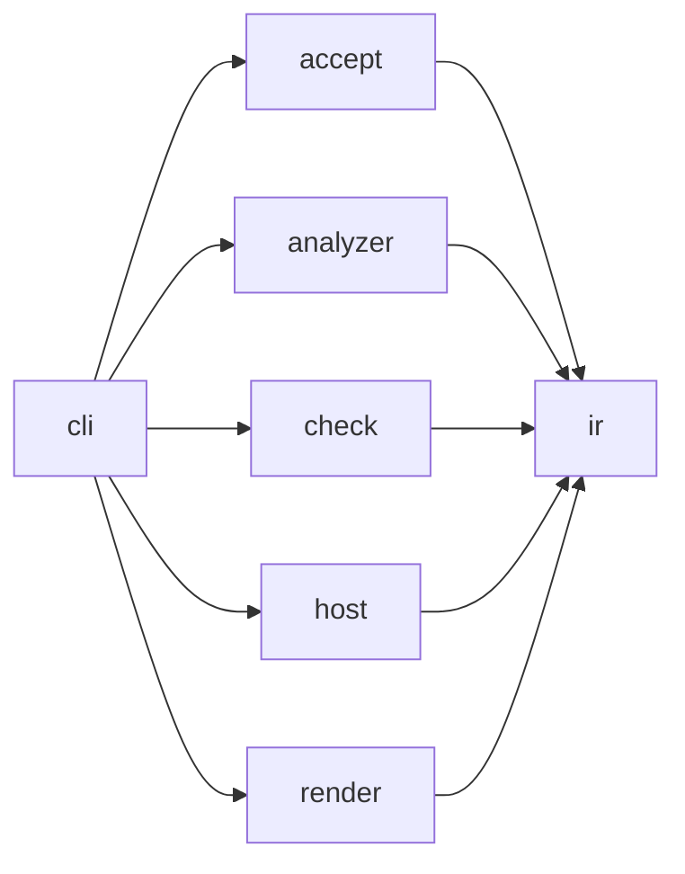

# Archkeel architecture

[The contract](../../architecture-contract.json) owns component boundaries. Within-component
imports remain allowed. Every cross-component pair is either observed or forbidden.

## Layers

| Layer | Components | Responsibility |
|---|---|---|
| Core | `ir`, `check` | Stable evidence values and deterministic policy evaluation |
| Adapters | `analyzer`, `host` | Python source observations and GitLab host records |
| Edge | `cli`, `render`, `accept` | Composition, presentation and accepted-state entry points |

The CLI is the composition root. It selects concrete analyzer and host adapters, invokes the
core, writes artifacts and delegates HTML and terminal projection to `render`. Core modules
never select adapters or write presentation files.

Third-party imports are confined by `external_dependency_scope` rules: `packaging` to the
analyzer runtime gate, `rich` to `archkeel.render.terminal` and `rich_argparse` to `archkeel.cli`.

The analyzer may import only `archkeel.ir.model` and `archkeel.ir.codec`. This keeps raw AST
records inside the analyzer and exposes typed `ObservationResult` values at its boundary.

## Decisions

Each decision names its reason and the check that holds it. Code follows the decision; a change
to a decision is recorded here before the code changes.

**AD-1 Analyzer modules are flat and single-purpose.** `archkeel/analyzer/embedded/` holds only
top-level modules, one responsibility each:

| Module | Responsibility |
|---|---|
| `scanner` | Discover and parse sources, run the collectors, return `ScanResult` |
| `source` | Parsed modules, module names, evidence locations |
| `imports` | Import bindings and `__all__` exports |
| `symbols` | Classes, functions and their signatures |
| `calls` | Call sites and their resolution |
| `typing_signals` | Weak typing signals such as `Any`, `object` and `type: ignore` |
| `dependencies` | Package and module topology, dependency edges, cycles, declared paths and component scopes |
| `contexts` | Context and state evidence |
| `violations` | Contract rule evaluation |
| `graph` | Graph algorithms: components, ranks, transitive paths |
| `records` | Record envelope, stable ids, analyzer version and digest |
| `contract` | Contract loading and declarations |
| `report` | Observation assembly |

 Reason:
`analyzer_code_digest` hashes top-level `*.py` files, so code in a subpackage would change
analyzer behavior without changing the digest. Check: `tests/test_analyzer.py`.

**AD-2 JSON has one type.** Decoded or emitted JSON is `RawJson`; untrusted input is narrowed with
`isinstance` at the boundary. Analyzer records are `RawRecord` and `RawEvidence`; their per-kind
payload is `RecordData`, the analyzer's single declared `Any`. The only other `Any` is where those
records enter canonical encoding, with a one-line reason. Check: `mypy --strict` and the typing measurements in
`fixtures/D-self/`.

**AD-3 The analyzer digest decides comparability; the version names it.** Two observations are
comparable only with equal `analyzer.code_digest`. `ANALYZER_VERSION` is the human label: its minor
number rises when the same input yields different records, such as new rule kinds or signals.
Check: `check/delta.py` compares digests; the version is reviewed with the D-self fixture.

**AD-4 Module length alone does not justify a split.** A split needs a responsibility seam. The
analyzer's public IR API is exactly `ir.model` and `ir.codec`, so splitting either is a contract
change. Check: `tests/test_self.py`.

**AD-5 Invariants live where values are built.** A value whose fields depend on each other
checks that dependency in `__post_init__`, for example `ObservationResult` (no diagnostics means
a complete observation) and `RatchetObservations` (measurements exist exactly when the status is `SUPPORTED`).
Consumers narrow with ordinary control flow. Reason: `assert` disappears under `python -O` and
hides the invariant from its owner. Check: `tests/test_repository_hygiene.py` rejects `assert`
statements in `src/`.

**AD-6 A function has one responsibility.** A function longer than 80 lines, counted from `def`
to its last line with nested functions included, needs a named reason. Reasons live in
`ALLOWED_LONG_FUNCTIONS` in `tests/test_repository_hygiene.py`, keyed `path::qualified.name`. A
helper with one caller must name a real phase; splitting for length alone is not allowed.
Reason: 80 lines is what a reviewer can hold at once, and an explicit list keeps declarative
functions visible instead of exempting them silently. Check: the test fails on an unlisted long
function and on a listed function that is no longer long, so the list only shrinks.

## Allowed dependencies

| Edge | Reason |
|---|---|
| `cli` → `accept` | Dispatch the acceptance command from the composition root. |
| `cli` → `analyzer` | Supply the concrete source analyzer to report and check workflows. |
| `cli` → `check` | Invoke deterministic report and check services. |
| `cli` → `host` | Supply the concrete host-record loader to checks. |
| `cli` → `render` | Project typed results and write presentation artifacts. |
| `accept` → `ir` | Return typed command results through shared IR values. |
| `analyzer` → `ir` | Publish observations through the common model and codec boundary. |
| `check` → `ir` | Compare observations and return typed results. |
| `host` → `ir` | Construct validated host-record values. |
| `render` → `ir` | Render typed evidence without importing policy implementations. |

<!-- archkeel-component-graph -->

