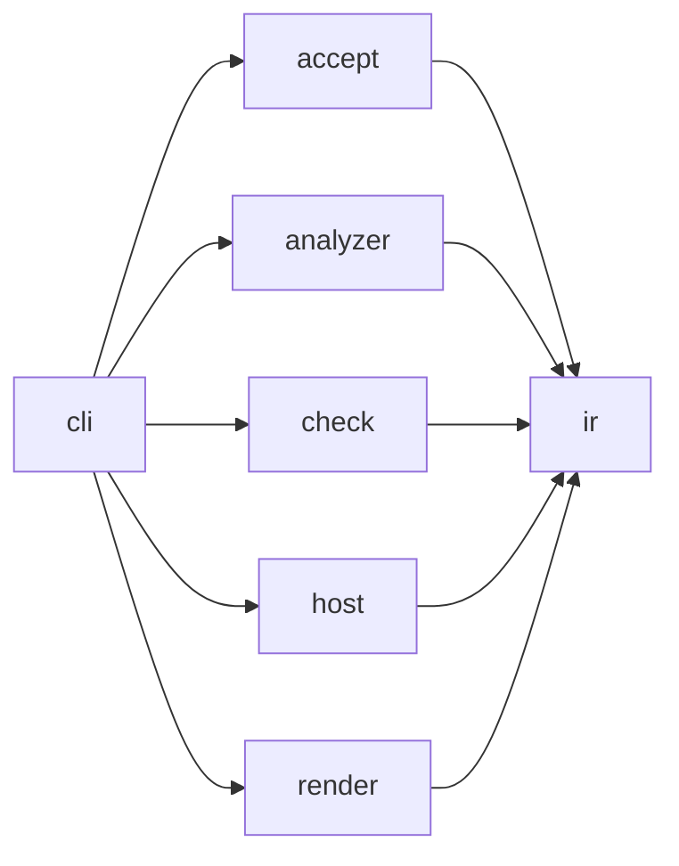

# Archkeel architecture

[The contract](../../architecture-contract.json) owns component boundaries. Within-component
imports remain allowed. Every cross-component pair is either observed or forbidden.

## Layers

| Layer | Components | Responsibility |
|---|---|---|
| Core | `ir`, `check` | Stable evidence values and deterministic policy evaluation |
| Adapters | `analyzer`, `host` | Python source observations and GitLab host records |
| Edge | `cli`, `render`, `accept` | Composition, presentation and accepted-state entry points |

The CLI is the composition root. It selects concrete analyzer and host adapters, invokes the
core, writes artifacts and delegates HTML projection to `render`. Core modules never select
adapters or write presentation files.

The analyzer may import only `archkeel.ir.model` and `archkeel.ir.codec`. This keeps raw AST
records inside the analyzer and exposes typed `ObservationResult` values at its boundary.

## Allowed dependencies

| Edge | Reason |
|---|---|
| `cli` → `accept` | Dispatch the acceptance command from the composition root. |
| `cli` → `analyzer` | Supply the concrete source analyzer to report and check workflows. |
| `cli` → `check` | Invoke deterministic report and check services. |
| `cli` → `host` | Supply the concrete host-record loader to checks. |
| `cli` → `render` | Project typed results and write presentation artifacts. |
| `accept` → `ir` | Return typed command results through shared IR values. |
| `analyzer` → `ir` | Publish observations through the common model and codec boundary. |
| `check` → `ir` | Compare observations and return typed results. |
| `host` → `ir` | Construct validated host-record values. |
| `render` → `ir` | Render typed evidence without importing policy implementations. |

<!-- archkeel-component-graph -->

