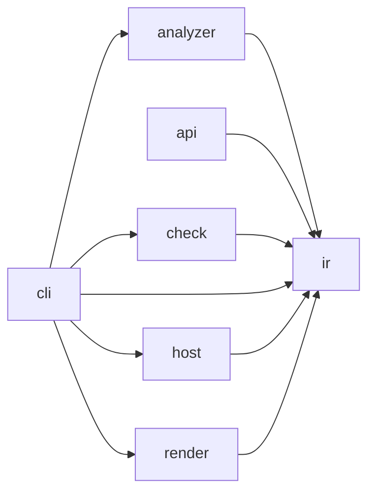

# Archkeel architecture

The [contract](../../architecture-contract.json) owns boundaries, interfaces and permissions.
[Source](../../src/archkeel) and [tests](../../tests/test_self.py) show the implementation.

## Layers

The CLI injects adapters and runs workflows. Core assembles and evaluates evidence;
render projects typed results. Collectors report source facts, not policy.
Layer labels do not grant dependencies. Nested [contracts](contracts/) govern inner boundaries.

## Allowed dependencies

Observed imports:

<!-- archkeel-component-graph -->

```mermaid
flowchart LR
    analyzer --> ir
    api --> ir
    check --> ir
    cli --> analyzer
    cli --> check
    cli --> host
    cli --> ir
    cli --> render
    host --> ir
    render --> ir
```

Declared permissions:

<!-- archkeel-target-graph -->

```mermaid
flowchart LR
    analyzer --> ir
    api --> ir
    check --> ir
    cli --> analyzer
    cli --> check
    cli --> host
    cli --> ir
    cli --> render
    host --> ir
    render --> ir
```

Graphs do not prove complete Target conformance. Read the native report's coverage and UNKNOWNs.

## Host evidence

The packaged CLI injects the GitLab [Host adapter](../../src/archkeel/host/gitlab.py).
GitHub collection is repository CI tooling: [`make github-pr-report`](../../tools/github_pr_report.py)
runs through `gh` in this repository's workflow. It is not a packaged GitHub Host adapter.
Recent events remain UNKNOWN; only an authenticated initial-PR receipt can prove
the scoped ordering described in [AD-143](decisions/ad-143-initial-pr-head-proves-scoped-order.md).
Caller-supplied `--host-records` require caller authentication.

## Evidence boundaries

Component `layer` values are contract intent; `layer_order` checks declared permissions
([AD-201](decisions/ad-201-layers-assess-declared-permissions.md)). A `requires` permission
does not prove structural Protocol conformance.
The TypeScript frontend is packaged in Python at
[`archkeel.analyzer.typescript`](../../src/archkeel/analyzer/typescript/); it remains a
process collector and does not execute project code. Missing source evidence remains UNKNOWN.
Proposed contract extensions are tracked in [#356](https://github.com/rapiddweller/archkeel/issues/356).

## Decisions

[Internal decision archive](decisions/README.md). Read individual records when reviewing a specific change.
