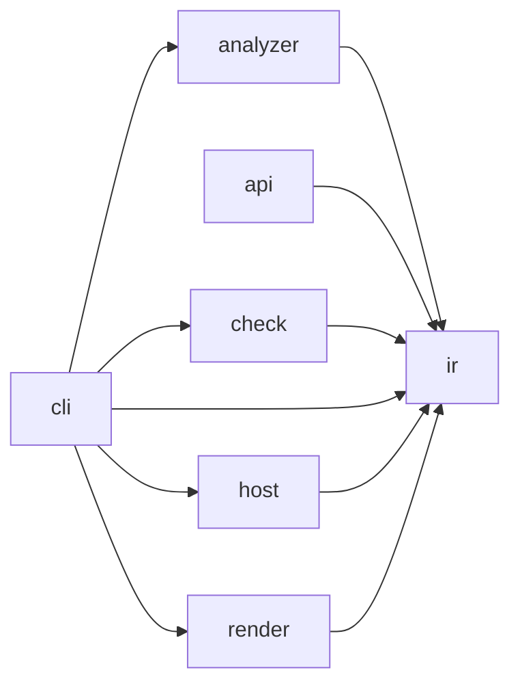

# Archkeel architecture

[The UML target](uml-model-target.md) defines shared entities, relationships,
codecs and coverage. Core compares recorded source facts with independent,
authenticated Target intent. One `ArchitectureReport` carries both graphs,
comparison receipts, findings and ownership references (AD-179).

[The render target](render-target.md) defines the shared As-Is, Target and Diff
renderer. Missing authenticated Target data cannot produce a Target diagram.
Python exposes richer static facts; Dart and TypeScript expose imports.
Own inner Target coverage and source capabilities remain partial.

[The contract](../../architecture-contract.json) owns component boundaries. Within-component
imports remain allowed. Every cross-component pair is either observed or forbidden. Neither
components nor modules import in a cycle (AD-98).

## Layers

Layer names live on components in `architecture-contract.json` and appear in report Details.
Responsibilities and quality goals stay with those components (AD-17). Layer metadata does
not change ownership or infer dependency permissions.

The CLI is the composition root. It selects concrete analyzer and host adapters, invokes the
core, writes artifacts and delegates HTML and terminal projection to `render`. Core modules
never select adapters or write presentation files.

Third-party imports are confined by `external_dependency_scope` rules: `packaging` to the
`archkeel.check.runtime` gate, `rich` to `archkeel.render.terminal` and `rich_argparse` to `archkeel.cli`.

`analyzer` imports shared source facts, record builders, protocol and language fact
values through the root contract's explicit IR whitelist. It does not import
governance models or policy. `check` owns validation, observation assembly and
evaluation; it has no dependency on `analyzer`. Python and Dart source modules live
in separate nested contracts. `ir` keeps source facts, protocol and governance
values in distinct internal groups.

### Language adapter boundary (AD-22)

The process port, Python/Dart collectors and Core evaluation split are implemented,
with active nested contracts under `contracts/`. The contracts describe ownership
and interfaces. Acceptance requires semantic parity, configured replacement,
integrated local gates, independent review and cross-platform CI.
TypeScript uses a separate pinned npm collector described in
[the foundation proposal](typescript-foundation-proposal.md); it is not included
in the Python source contract. See
[AD-22](decisions/ad-22-the-analyzer-is-a-process-port-with-a-language-profile.md)
and [the target](language-adapter-target.md).

Future HTTP/queue interactions have distinct contract identities and declaration,
source and runtime evidence. They are not imports; observers and rules remain
outside the current implementation scope.

Compatibility shims are declared at the contract top level, not inferred as a generic facade:
`declarations.compat` owns the old module, target and lifetime (AD-87).

## Decisions

Each decision records its reason and check. Record a changed decision before
changing code. The index preserves document order; later records can amend earlier ones.

| Decision | Title |
|---|---|
| AD-1 | [Flat analyzer modules](decisions/ad-01-analyzer-modules-are-flat-and-singlepurpose.md) |
| AD-2 | [One JSON type](decisions/ad-02-json-has-one-type.md) |
| AD-3 | [Analyzer comparability](decisions/ad-03-the-analyzer-digest-decides-comparability-the-version-names.md) |
| AD-4 | [Module split criteria](decisions/ad-04-module-length-alone-does-not-justify-a-split.md) |
| AD-5 | [Value invariants](decisions/ad-05-invariants-live-where-values-are-built.md) |
| AD-6 | [Function responsibility](decisions/ad-06-a-function-has-one-responsibility.md) |
| AD-7 | [Measured determinism](decisions/ad-07-determinism-is-measured-not-assumed.md) |
| AD-8 | [Statement construct rules](decisions/ad-08-statement-constructs-are-class-a-rules.md) |
| AD-9 | [Component interfaces](decisions/ad-09-components-declare-their-interface.md) |
| AD-10 | [Intent and observed flow](decisions/ad-10-the-report-draws-component-flow-as-intent-against.md) |
| AD-11 | [Rule demo coverage](decisions/ad-11-every-checkable-item-has-a-catalogued-demo.md) |
| AD-12 | [Diagnostic codes](decisions/ad-12-validation-diagnostics-carry-a-code.md) |
| AD-13 | [Mermaid validation](decisions/ad-13-mermaid-diagrams-are-checked-before-github-renders-them.md) |
| AD-14 | [Verdict-driven headlines](decisions/ad-14-the-report-headline-follows-its-verdicts-never-the-exit.md) |
| AD-15 | [Onboarding decisions](decisions/ad-15-onboarding-is-a-decision-interview-the-code-proposes-the.md) |
| AD-16 | [Onboarding modes and authorship](decisions/ad-16-onboarding-defines-a-target-architecture-in-two-agent-modes.md) |
| AD-17 | [Quality goals and pure IR](decisions/ad-17-archkeels-own-target-names-its-quality-goals-and-ir-holds.md) |
| AD-18 | [Dependency violations supersede interface findings](decisions/ad-18-a-forbidden-dependency-supersedes-the-interface-boundary-on.md) |
| AD-19 | [Plain copy, stable identifiers](decisions/ad-19-words-for-people-are-plain-identifiers-for-machines-stay.md) |
| AD-20 | [One contract per level](decisions/ad-20-a-level-is-its-own-contract-never-a-nesting-inside-one.md) |
| AD-21 | [Structure observations](decisions/ad-21-structure-measurements-are-derivations-never-gates.md) |
| AD-22 | [Language process port](decisions/ad-22-the-analyzer-is-a-process-port-with-a-language-profile.md) |
| AD-23 | [Headlines with open decisions](decisions/ad-23-the-report-headline-follows-open-decisions-as-well.md) |
| AD-24b | [Observed versus undecided](decisions/ad-24b-observed-is-not-undecided.md) |
| AD-24a | [Module navigation and crossing interfaces](decisions/ad-24a-a-module-opens-the-same-way-and-its-interface-is-what.md) |
| AD-24 | [Opening undeclared interiors](decisions/ad-24-the-report-opens-a-component-without-requiring-a-decision.md) |
| AD-25 | [Peer isolation](decisions/ad-25-peers-are-isolated-by-one-rule-not-by-nn1-prohibitions.md) |
| AD-26 | [Review signals and claims](decisions/ad-26-a-quality-claim-is-a-signal-a-derivation-and-a-claim-and.md) |
| AD-27 | [Type allowances](decisions/ad-27-a-type-escape-hatch-is-decided-not-merely-observed.md) |
| AD-28 | [Undeclared external dependencies](decisions/ad-28-an-undeclared-external-dependency-is-a-hole-not-a-detail.md) |
| AD-29 | [Placeholder body rules](decisions/ad-29-a-function-that-does-nothing-is-a-claim-not-a-stub.md) |
| AD-30 | [Contradictable ownership claims](decisions/ad-30-a-declared-owner-is-worth-nothing-until-something-can.md) |
| AD-31 | [Optional internal decisions](decisions/ad-31-deciding-inside-a-component-is-optin-and-only-for-pairs.md) |
| AD-32 | [Closed-world requires](decisions/ad-32-a-component-names-what-it-requires-what-it-does-not-name-is.md) |
| AD-33 | [Component interiors as levels](decisions/ad-33-a-components-inside-is-a-level-not-a-list-of-pairs.md) |
| AD-34 | [Recorded inside contracts](decisions/ad-34-a-declared-inside-is-recorded-so-the-report-draws-it.md) |
| AD-35 | [Shared review counts](decisions/ad-35-every-review-claim-is-counted-on-the-run-result-so-the.md) |
| AD-36 | [Scoped inside rule verdicts](decisions/ad-36-a-rule-the-inside-declares-is-recorded-and-carried-so-the.md) |
| AD-37 | [Typed stdlib receivers](decisions/ad-37-a-receiver-whose-type-is-statically-obvious-resolves-the.md) |
| AD-38 | [Draft component size](decisions/ad-38-a-drafted-component-carries-the-size-structuremetrics.md) |
| AD-39 | [Empty selected changes](decisions/ad-39-an-empty-selectedchanges-declares-that-nothing.md) |
| AD-40 | [Documented call-result types](decisions/ad-40-a-call-whose-callee-the-import-binding-proves-or-whose.md) |
| AD-41 | [Any placement rules](decisions/ad-41-where-any-may-appear-is-a-contract-rule-not-a-test.md) |
| AD-42 | [Requires through selectors](decisions/ad-42-a-requires-entry-may-name-the-modules-it-goes-through-and.md) |
| AD-43 | [Candidate-declared changes](decisions/ad-43-a-candidate-declares-what-it-changed-not-what-the-scanner.md) |
| AD-44 | [Undeclared added-edge guardrail](decisions/ad-44-an-undeclared-added-dependency-edge-is-a-guardrail-failure.md) |
| AD-45 | [Analyzer inside contract](decisions/ad-45-analyzer-declares-a-threepart-inside-the-way-check-already.md) |
| AD-46 | [Marked graph regeneration](decisions/ad-46-validate-writegraph-regenerates-the-marked-component-graph.md) |
| AD-47 | [Python package selection](decisions/ad-47-init-breaks-a-tie-between-toplevel-packages-with.md) |
| AD-48 | [Reflection writes and string comparisons](decisions/ad-48-reflection-that-writes-and-a-value-compared-with-a-string.md) |
| AD-49 | [Exact allowance scopes](decisions/ad-49-an-allowance-may-name-its-module-exactly-so-a-package-root.md) |
| AD-50 | [Edge and interface authorship](decisions/ad-50-an-edge-and-an-interface-record-who-decided-them-and-the.md) |
| AD-51 | [Grouped violation counts](decisions/ad-51-a-result-carries-its-violations-grouped-by-rule-and-by.md) |
| AD-52 | [Violation fingerprints and baselines](decisions/ad-52-a-violation-is-named-by-what-it-is-and-a-baseline-may-hold.md) |
| AD-53 | [Package import binding precedence](decisions/ad-53-from-pkg-import-name-follows-pkginitpys-own-binding-before.md) |
| AD-54 | [Typed violation rows](decisions/ad-54-a-typed-violation-row-is-the-one-supported-way-to-read-a.md) |
| AD-55 | [Decision-file index](decisions/ad-55-the-decision-record-splits-into-one-file-per-decision.md) |
| AD-56 | [Missing versus planned interfaces](decisions/ad-56-a-public-entry-the-scan-never-saw-is-missing-and-planned.md) |
| AD-57 | [Target graph marker](decisions/ad-57-a-target-graph-marker-draws-the-edges-the-contract-permits.md) |
| AD-58 | [Class placement and boundary types](decisions/ad-58-a-class-lives-where-its-symbolplacement-rule-allows-and-a.md) |
| AD-59 | [Cross-component type fan-in](decisions/ad-59-a-type-crossing-many-component-boundaries-is-a-review-claim.md) |
| AD-60 | [Report filters](decisions/ad-60-report-only-rule-and-component-narrow-what-a-rendered.md) |
| AD-61 | [Digest-bound widening amendments](decisions/ad-61-a-widening-fails-unless-an-amendment-binds-its-exact-before.md) |
| AD-62 | [Annotated variable ownership](decisions/ad-62-an-annotated-variables-owner-is-the-scope-it-is-written-in.md) |
| AD-63 | [Declared facade type checks](decisions/ad-63-boundarytypes-reads-a-components-declared-public-list-not-a.md) |
| AD-64 | [External API facade](decisions/ad-64-archkeelapi-is-the-declared-external-contract-and-ir.md) |
| AD-65 | [Facade-exposed public types](decisions/ad-65-a-type-a-declared-facade-signature-exposes-is-a-used.md) |
| AD-66 | [External API declarations](decisions/ad-66-declarationspublicapi-names-a-consumer-outside-the-package.md) |
| AD-67 | [Undecidable boundary positions](decisions/ad-67-an-undecidable-boundary-position-is-unknown-not-silence.md) |
| AD-68 | [Own boundary policies](decisions/ad-68-check-and-render-declare-boundarytypes-and-the-ten.md) |
| AD-69 | [One annotation reader](decisions/ad-69-one-annotation-is-read-once-for-both-readers.md) |
| AD-70 | [Public API type closure](decisions/ad-70-the-external-promise-declares-every-type-it-hands-out.md) |
| AD-71 | [Literal public exports](decisions/ad-71-a-promised-name-is-checked-against-the-modules-own-all.md) |
| AD-72 | [Incomplete rule verdicts](decisions/ad-72-a-rule-that-could-not-decide-everything-reports-unknown.md) |
| AD-73 | [Shared external type walk](decisions/ad-73-the-external-surface-is-judged-by-the-same-walk.md) |
| AD-74 | [Ambiguous bindings](decisions/ad-74-a-name-bound-twice-is-unresolvable-not-a-coin-flip.md) |
| AD-75 | [Local violation focus](decisions/ad-75-an-open-report-can-focus-on-violations-without-changing.md) |
| AD-76 | [Boundary restrictions in comparison](decisions/ad-76-boundary-rules-are-restrictions-in-against.md) |
| AD-77 | [Baseline comparison before writing](decisions/ad-77-an-existing-baseline-is-compared-before-it-is-written.md) |
| AD-78 | [Directional baseline evidence](decisions/ad-78-baseline-fingerprints-keep-identity-and-record-direction-roles.md) |
| AD-79 | [Planned interface promotion](decisions/ad-79-planned-entry-is-target-work-until-reached.md) |
| AD-80 | [Static string constants](decisions/ad-80-string-constant-comparisons-are-statically-resolved.md) |
| AD-81 | [Fail-closed Make gate](decisions/ad-81-the-project-owns-one-fail-closed-make-gate.md) |
| AD-82 | [Physical component namespace](decisions/ad-82-component-namespace-is-placement-not-ownership.md) |
| AD-83 | [Private attribute UNKNOWN](decisions/ad-83-private-attribute-access-without-owner-evidence-is-unknown.md) |
| AD-84 | [Facade re-exports and fields](decisions/ad-84-boundary-types-follow-declared-facade-reexports.md) |
| AD-85 | [Resolved-import interface narrowing](decisions/ad-85-a-resolved-importer-reports-interface-narrowing.md) |
| AD-86 | [Immediate-child layout](decisions/ad-86-root-layout-allows-only-declared-immediate-children.md) |
| AD-87 | [Time-bounded compatibility shims](decisions/ad-87-compatibility-shims-are-declared-logic-free-and-timebounded.md) |
| AD-88 | [Facade observations](decisions/ad-88-declared-facade-measurements-are-observations-not-budgets.md) |
| AD-89 | [Shared measurement baselines](decisions/ad-89-selected-measurements-share-the-validation-baseline.md) |
| AD-90 | [Decision-relevant evidence](decisions/ad-90-decision-relevant-evidence-is-never-neutral-metadata.md) |
| AD-91 | [Private owner resolution](decisions/ad-91-only-top-level-any-makes-private-owner-unknown.md) |
| AD-92 | [UNKNOWN verdicts and measurements](decisions/ad-92-undecided-declared-evidence-is-unknown-by-default.md) |
| AD-93 | [Owned DTO fields](decisions/ad-93-boundary-types-follow-owned-dto-fields.md) |
| AD-94 | [Static type aliases](decisions/ad-94-boundary-types-resolve-static-aliases.md) |
| AD-95 | [Exact nested-field allowances](decisions/ad-95-boundary-type-allowances-match-one-nested-field.md) |
| AD-96 | [Enum Literal bindings](decisions/ad-96-boundary-types-resolve-enum-literals.md) |
| AD-97 | [Dart directive profile](decisions/ad-97-a-dart-profile-observes-directives-and-what-it-cannot-see-is-unknown.md) |
| AD-98 | [Scoped cycle rules](decisions/ad-98-a-cycle-rule-names-the-level-and-scope-it-holds-acyclic.md) |
| AD-99 | [Facade and coupling ceilings](decisions/ad-99-facade-and-coupling-budgets-are-contract-ceilings.md) |
| AD-100 | [Unresolved call sites](decisions/ad-100-an-unresolved-call-change-names-its-call-sites.md) |
| AD-101 | [Separate scan scopes](decisions/ad-101-a-second-configuration-governs-a-second-scope.md) |
| AD-102 | [Non-JSON constants](decisions/ad-102-a-constant-json-cannot-hold-is-recorded-without-its-value.md) |
| AD-103 | [Root-relative policy paths](decisions/ad-103-baseline-and-amendment-paths-are-relative-to-root.md) |
| AD-104 | [Introduced contracts](decisions/ad-104-a-contract-the-compared-revision-lacks-is-introduced.md) |
| AD-105 | [Package renames](decisions/ad-105-a-package-rename-is-compared-under-its-new-names.md) |
| AD-106 | [Baseline subject ordering](decisions/ad-106-a-baseline-entry-names-its-violation-in-any-subject-order.md) |
| AD-107 | [Module file evidence](decisions/ad-107-a-modules-file-is-its-evidence-even-when-empty.md) |
| AD-108 | [Enum-member references](decisions/ad-108-statically-proven-enum-members-reference-their-class.md) |
| AD-109 | [Ordinary-module literal exports](decisions/ad-109-boundary-types-follows-literal-all-in-ordinary-modules.md) |
| AD-110 | [Shared inside evaluators](decisions/ad-110-inside-rules-use-the-shared-evaluator.md) |
| AD-111 | [Recursive revision-bound contracts](decisions/ad-111-recursive-inside-contract-tree.md) |
| AD-112 | [Local publication boundaries](decisions/ad-112-local-publication-at-each-boundary.md) |
| AD-113 | [Local requires targets](decisions/ad-113-requires-targets-belong-to-their-contract-level.md) |
| AD-114 | [Nested symbol uncertainty](decisions/ad-114-symbol-uncertainty-survives-nested-contracts.md) |
| AD-115 | [Nested API lifecycle](decisions/ad-115-nested-api-lifecycle-uses-local-evidence.md) |
| AD-116 | [Explicit diagram filtering](decisions/ad-116-diagram-filtering-is-an-explicit-choice.md) |
| AD-117 | [Evaluator-backed verdicts](decisions/ad-117-report-verdicts-require-evaluator-evidence.md) |
| AD-118 | [Structure versus conformance](decisions/ad-118-structure-review-is-not-contract-conformance.md) |
| AD-119 | [Re-export indexing](decisions/ad-119-index-reexports-once-per-boundary-pass.md) |
| AD-120 | [Publication through ancestors](decisions/ad-120-direct-publication-crosses-only-declared-ancestors.md) |
| AD-121 | [Exported inherited methods](decisions/ad-121-boundary-methods-are-scoped-to-exported-classes.md) |
| AD-122 | [Required field wrappers](decisions/ad-122-required-fields-keep-their-inner-boundary-type.md) |
| AD-123 | [Broad mapping types](decisions/ad-123-proven-mappings-are-broad-boundary-types.md) |
| AD-124 | [Complete scope receipts](decisions/ad-124-rule-pass-requires-complete-scope-receipt.md) |
| AD-125 | [Physical Target hierarchy](decisions/ad-125-target-hierarchy-is-physical-presentation.md) |
| AD-126 | [Target call budget](decisions/ad-126-target-ranking-call-budget.md) |
| AD-127 | [Unique contained-map allowances](decisions/ad-127-a-contained-map-allowance-needs-one-proven-occurrence.md) |
| AD-128 | [Exact module ownership](decisions/ad-128-exact-module-ownership-is-distinct-from-package-ownership.md) |
| AD-129 | [Native skill discovery](decisions/ad-129-agent-skills-use-native-discovery.md) |
| AD-130 | [Findings-first review](decisions/ad-130-review-starts-with-findings.md) |
| AD-131 | [Inherited public fields](decisions/ad-131-public-api-includes-inherited-fields.md) |
| AD-132 | [Datetime scalar proof](decisions/ad-132-datetime-is-a-proven-boundary-scalar-leaf.md) |
| AD-133 | [Exact type-ignore allowances](decisions/ad-133-type-ignore-allowances-bind-one-occurrence.md) |
| AD-134 | [Direct boundary position selectors](decisions/ad-134-omitted-boundary-path-selects-the-direct-position.md) |
| AD-135 | [Opaque native payloads](decisions/ad-135-exact-native-payloads-accept-opacity.md) |
| AD-136 | [Independent regression ceilings](decisions/ad-136-regression-checks-hold-independent-ceilings.md) |
| AD-137 | [Resolved inherited finding types](decisions/ad-137-inherited-boundary-findings-show-resolved-types.md) |
| AD-138 | [Command-result schema](decisions/ad-138-json-results-have-a-published-schema.md) |
| AD-139 | [Readable Target names](decisions/ad-139-target-overview-keeps-readable-names.md) |
| AD-140 | [Rule evidence measurements](decisions/ad-140-measure-rule-evidence-without-inventing-passes.md) |
| AD-141 | [Bounded GitHub observations](decisions/ad-141-github-events-are-bounded-observations.md) |
| AD-142 | [Exact opaque-map values](decisions/ad-142-opaque-map-values-need-exact-decisions.md) |
| AD-143 | [Initial PR causal receipt](decisions/ad-143-initial-pr-head-proves-scoped-order.md) |
| AD-144 | [Diff scope navigation](decisions/ad-144-diff-retains-navigation-scope.md) |
| AD-145 | [Effective inherited methods](decisions/ad-145-local-inherited-methods-use-the-existing-base-proof.md) |
| AD-146 | [Analyzer profile identity](decisions/ad-146-analyzer-identity-selects-observation-profile.md) |
| AD-147 | [Language-aware revision inputs](decisions/ad-147-revision-snapshots-preserve-language-inputs.md) |
| AD-148 | [Source and policy ownership](decisions/ad-148-source-facts-and-core-evaluation-have-separate-owners.md) |
| AD-149 | [Uncertain inherited publication](decisions/ad-149-uncertain-publication-retains-inherited-type-candidates.md) |
| AD-150 | [Pinned TypeScript collector](decisions/ad-150-typescript-imports-use-a-pinned-npm-collector.md) |
| AD-151 | [Unproven require references](decisions/ad-151-unproven-require-references-retain-unknown.md) |
| AD-152 | [Validated construct identity](decisions/ad-152-validated-construct-identity-controls-rules.md) |
| AD-153 | [Unproven signature candidates](decisions/ad-153-unproven-chains-retain-declared-signatures.md) |
| AD-154 | [Incomplete module ownership](decisions/ad-154-incomplete-ownership-names-its-module.md) |
| AD-156 | [Compact self provenance](decisions/ad-156-self-evidence-keeps-compact-provenance.md) |
| AD-155 | [Shared open-decision remedy](decisions/ad-155-open-dependency-decisions-share-one-remedy.md) |
| AD-157 | [Filtered source locations](decisions/ad-157-filtered-json-carries-source-locations.md) |
| AD-158 | [Neutral onboarding drafts](decisions/ad-158-onboarding-guidance-keeps-drafts-neutral.md) |
| AD-159 | [Report copy and colors](decisions/ad-159-reports-use-reader-facing-copy-and-native-colors.md) |
| AD-160 | [Inner UML uses the standard graph](decisions/ad-160-inner-uml-uses-the-standard-graph.md) |
| AD-161 | [Component intent retains boundary semantics](decisions/ad-161-component-intent-retains-boundary-semantics.md) |
| AD-162 | [Physical intent does not invent UML](decisions/ad-162-physical-intent-does-not-invent-uml.md) |
| AD-163 | [Nested UML retains declaration ownership](decisions/ad-163-nested-uml-retains-declaration-ownership.md) |
| AD-164 | [Dependency permissions keep one owner](decisions/ad-164-dependency-permissions-keep-one-owner.md) |
| AD-165 | [Diff retains observed relationships](decisions/ad-165-diff-retains-observed-relationships.md) |
| AD-166 | [Diff opens observed interiors](decisions/ad-166-diff-opens-observed-interiors.md) |
| AD-167 | [Legacy Target projection adds no rule](decisions/ad-167-legacy-target-projection-adds-no-rule.md) |
| AD-168 | [Global API intent keeps its declaration evidence](decisions/ad-168-global-api-intent-keeps-its-declaration-evidence.md) |
| AD-169 | [Legacy permission scenes retain graph identities](decisions/ad-169-legacy-permission-scenes-retain-graph-identities.md) |
| AD-170 | [Conditional inventory does not prove bindings](decisions/ad-170-conditional-inventory-does-not-prove-bindings.md) |
| AD-171 | [Static values retain their assignment sites](decisions/ad-171-static-values-retain-their-assignment-sites.md) |
| AD-172 | [Lexical resolution uses compiler scopes](decisions/ad-172-lexical-resolution-uses-compiler-scopes.md) |
| AD-173 | [Own graph boundary has independent UML intent](decisions/ad-173-own-graph-boundary-has-independent-uml-intent.md) |
| AD-174 | [UML focus retains complete evidence](decisions/ad-174-uml-focus-retains-complete-evidence.md) |
| AD-175 | [UML relationship filters retain Core status](decisions/ad-175-uml-relationship-filters-retain-core-status.md) |
| AD-176 | [Rendering decodes one authenticated Target graph](decisions/ad-176-rendering-decodes-one-authenticated-target-graph.md) |
| AD-177 | [UML element filters retain complete evidence](decisions/ad-177-uml-element-filters-retain-complete-evidence.md) |
| AD-178 | [Target navigation projects the standard graph](decisions/ad-178-target-navigation-projects-the-standard-graph.md) |
| AD-179 | [Reports render one graph boundary](decisions/ad-179-reports-render-one-graph-boundary.md) |
| AD-180 | [Relationship exploration retains evidence](decisions/ad-180-relationship-exploration-retains-evidence.md) |
| AD-181 | [UML bases retain binding evidence](decisions/ad-181-uml-bases-retain-binding-evidence.md) |
| AD-182 | [Shared report integration](decisions/ad-182-shared-report-integration.md) |
| AD-183 | [Target references bind declarations](decisions/ad-183-target-references-bind-declarations.md) |
| AD-184 | [Annotation declarations retain lexical binding](decisions/ad-184-annotation-declarations-retain-lexical-binding.md) |
| AD-185 | [Member inventories retain their owner](decisions/ad-185-member-inventories-retain-their-owner.md) |
| AD-186 | [Dense routes can leave card sides](decisions/ad-186-dense-routes-can-leave-card-sides.md) |
| AD-187 | [Class field assignments retain their sites](decisions/ad-187-class-field-assignments-retain-their-sites.md) |
| AD-188 | [Enum literals have their own UML kind](decisions/ad-188-enum-literals-have-their-own-uml-kind.md) |
| AD-189 | [Routing clearance uses numeric intervals](decisions/ad-189-routing-clearance-uses-numeric-intervals.md) |
| AD-190 | [Member previews remain readable](decisions/ad-190-member-previews-remain-readable.md) |
| AD-191 | [Source protocol Target includes resolver settings](decisions/ad-191-source-protocol-target-includes-resolver-settings.md) |
| AD-192 | [UML details separate label and identity](decisions/ad-192-uml-details-separate-label-and-identity.md) |
| AD-193 | [UML navigation distinguishes code and boundaries](decisions/ad-193-uml-navigation-distinguishes-code-and-boundaries.md) |
| AD-194 | [Language demos retain capability gaps](decisions/ad-194-language-demos-retain-capability-gaps.md) |
| AD-195 | [Overviews separate boundaries from file intent](decisions/ad-195-overviews-separate-boundaries-from-file-intent.md) |
| AD-196 | [Closed demo intent retains observation limits](decisions/ad-196-closed-demo-intent-retains-observation-limits.md) |
| AD-197 | [Expanded Target records eight UNKNOWN inventories](decisions/ad-197-expanded-target-records-eight-unknown-inventories.md) |
| AD-198 | [Provider use survives initializer ownership](decisions/ad-198-provider-use-survives-initializer-ownership.md) |
| AD-199 | [Nested permissions pin the complete field](decisions/ad-199-nested-permissions-pin-the-complete-field.md) |
| AD-200 | [Diff projects recorded imports](decisions/ad-200-diff-projects-recorded-imports.md) |
| AD-201 | [Layers assess declared permissions](decisions/ad-201-layers-assess-declared-permissions.md) |
| AD-203 | [Native map list values use proven coordinates](decisions/ad-203-native-map-list-values-use-proven-coordinates.md) |
| AD-205 | [Class binding proofs use their AST owner](decisions/ad-205-class-binding-proofs-use-their-ast-owner.md) |
| AD-206 | [Check families keep existing behavior](decisions/ad-206-check-families-keep-existing-behavior.md) |
| AD-202 | [Focused architecture projection](decisions/ad-202-focused-architecture-projection.md) |
| AD-204 | [Report Atlas and offline details](decisions/ad-204-report-atlas-and-offline-details.md) |
| AD-207 | [Atlas projection boundaries](decisions/ad-207-atlas-projection-boundaries.md) |

## Allowed dependencies

| Edge | Reason |
|---|---|
| `api` → `ir` | Read report bytes; delegate decoding and baseline derivation to `ir` (AD-64). |
| `cli` → `analyzer` | Inject the source analyzer. |
| `cli` → `check` | Invoke report and check workflows. |
| `cli` → `host` | Inject the host-record loader. |
| `cli` → `ir` | Serialize the typed observation through `ir.codec` for the legacy JSON compatibility result. |
| `cli` → `render` | Render typed results. |
| `analyzer` → `ir` | Publish source facts through the protocol; Core owns observation and policy (AD-148). |
| `check` → `ir` | Compare observations and return typed results. |
| `host` → `ir` | Construct validated host records. |
| `render` → `ir` | Read typed evidence without policy implementations. |

<!-- archkeel-component-graph -->

```mermaid
flowchart LR
    analyzer --> ir
    api --> ir
    check --> ir
    cli --> analyzer
    cli --> check
    cli --> host
    cli --> ir
    cli --> render
    host --> ir
    render --> ir
```

Observed edges currently match declared `requires` permissions.
The Target block is generated from `target_component_edges`
([AD-57](decisions/ad-57-a-target-graph-marker-draws-the-edges-the-contract-permits.md)).

<!-- archkeel-target-graph -->

```mermaid
flowchart LR
    analyzer --> ir
    api --> ir
    check --> ir
    cli --> analyzer
    cli --> check
    cli --> host
    cli --> ir
    cli --> render
    host --> ir
    render --> ir
```
