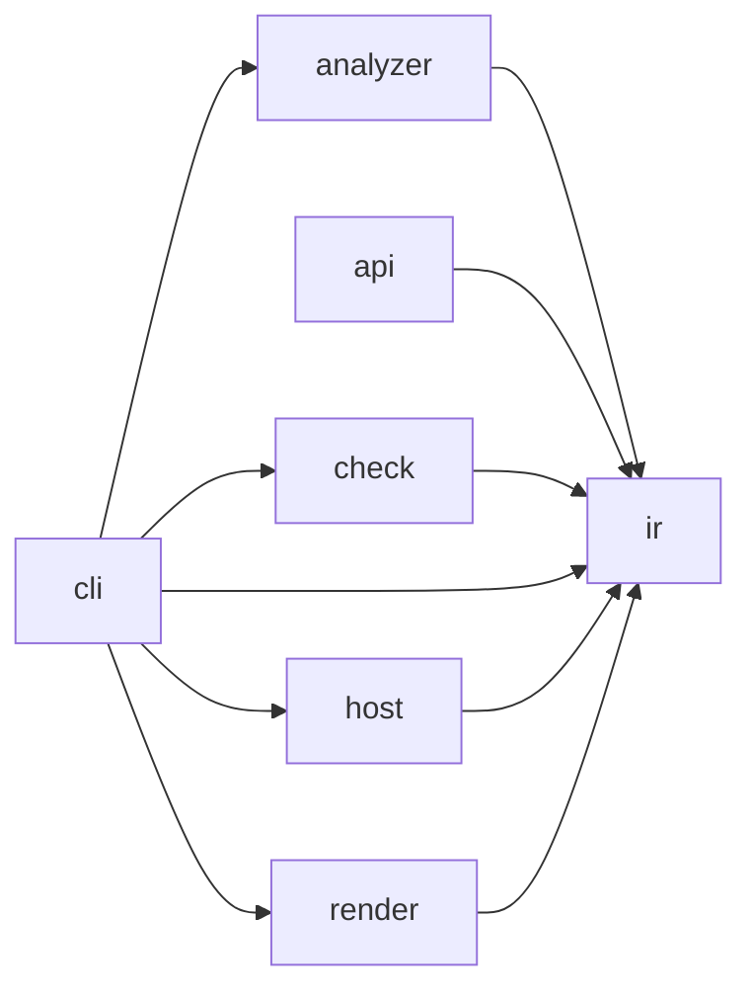

# Archkeel architecture

The [contract](../../architecture-contract.json) owns boundaries, interfaces and permissions.
[Source](../../src/archkeel) and [tests](../../tests/test_self.py) show the implementation.

## Layers

The CLI injects adapters and runs workflows. Core assembles and evaluates evidence;
render projects typed results. Collectors report source facts, not policy.
Layer labels do not grant dependencies. Nested [contracts](contracts/) govern inner boundaries.

## Allowed dependencies

Observed imports:

<!-- archkeel-component-graph -->

```mermaid
flowchart LR
    analyzer --> ir
    api --> ir
    check --> ir
    cli --> analyzer
    cli --> check
    cli --> host
    cli --> ir
    cli --> render
    host --> ir
    render --> ir
```

Declared permissions:

<!-- archkeel-target-graph -->

```mermaid
flowchart LR
    analyzer --> ir
    api --> ir
    check --> ir
    cli --> analyzer
    cli --> check
    cli --> host
    cli --> ir
    cli --> render
    host --> ir
    render --> ir
```

Graphs do not prove complete Target conformance. Read the native report's coverage and UNKNOWNs.

## Decisions

[Internal decision archive](decisions/README.md). Read individual records when reviewing a specific change.
