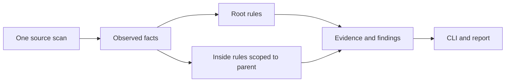

# AD-110 Inside rules use the shared evaluator

Previously, an inside contract enforced `complete_requires` but could silently ignore
other rule kinds. A declared rule is not evidence that its imports were checked.

Inside contracts now use the root rule evaluators over the same scan. Source modules
are limited to the parent's physical packages, including unassigned modules and
executable package initializers. Global targets, origin signatures and module cycles
remain available as evidence; they do not become additional sources for the rule.

Rule and component IDs retain their parent prefix. Type allowances remain facts,
not UNKNOWNs. An unsupported rule or missing inside contract remains incomplete;
known violations survive, but validate refuses baseline and graph writes.

`complete_requires` records the import fact IDs it evaluated. An inside edge is green
only when all its displayed import sites were checked, with no relevant UNKNOWN or
edge violation. Excluded `TYPE_CHECKING` sites are not checked. A module-cycle finding
marks its implicated edges red. Green does not certify every property of a component.

This changes rule evaluation, not contract depth or publication. Only one inside
level is loaded; recursive contracts (#169) and child-local APIs (#170) are separate.
Physical folder navigation is not a declaration of architecture boundaries.

Approved on 2026-09-26: the self-baseline's unresolved-call budget moves 505 → 513.
The implementation adds ten unresolved call sites and removes two; it does not change
the call resolver. These are receiver methods and calls to a local error helper, not
newly detected positions in unchanged code. A duplicate blank-module calculation was
removed first. UNKNOWN stays 41; no rule violation is exempted. The higher count records
the reviewed implementation's remaining analysis limits, not proof of runtime safety.

Evidence: `test_inside_rule_parity.py`, `test_inside_rule_coverage.py` and
`test_inside_rule_evidence_regressions.py`; the demo catalog includes clean and
violating inside `eval` cases and a missing inside alongside a known root violation.
