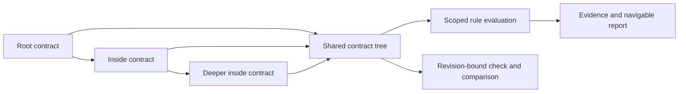

# AD-111 Explicit inside contracts form one revision-bound tree

One-level loading could leave a deeper declared rule unread while the report looked complete.
One shared loader now follows every explicit `inside` reference for observation, validation,
snapshots and comparison. It does not discover contracts from folders or impose a seven-item
limit. A physical group is navigation; a mounted contract is a policy boundary.

Paths are relative to the selected `--root`. Missing, malformed, cyclic, duplicate or escaping
mounts are refused. Normalized path identities also apply to Git snapshots. Rules and components
retain mount-qualified ids; a real generated-id collision is rejected without banning all
colons or renaming valid existing findings.

Each level evaluates sources only within its immediate parent's valid scope. Invalid children
cannot regain authority by mounting another contract. Ancestor and sibling ownership remain
available for target/type lookup, not as extra rule sources or automatic public exports.
Known findings survive incomplete branches. Incomplete validation cannot write a baseline or graph.

All mounted contracts are authenticated in the accepted `check` revision; candidate policy edits
are refused there. Provenance is read from the corresponding revision, so candidate documentation
edits need not be forbidden. `validate --against` compares the whole tree: a deep policy edit is
not invisible merely because the root stayed unchanged.

Observation digests retain raw-byte binding. Amendment digests use canonical contracts across
the tree; formatting alone does not require approval. No-inside digests and valid one-level
finding ids stay stable. Existing root-only amendments for inside trees must be regenerated and
reviewed explicitly; no legacy fallback silently blesses newly included policy. Schema 2.1.0 stays.

Nonempty inside `declarations` fields are unsupported and fail closed. Components, their `public`
entries, and rules are supported. Child-local publication is a separate decision (#170), not
part of recursive loading. A report drills through mounted levels and retains their findings;
its physical folder view does not claim rule coverage.

Evidence: recursive inside contract, independent contract, boundary and flow-navigation tests.
