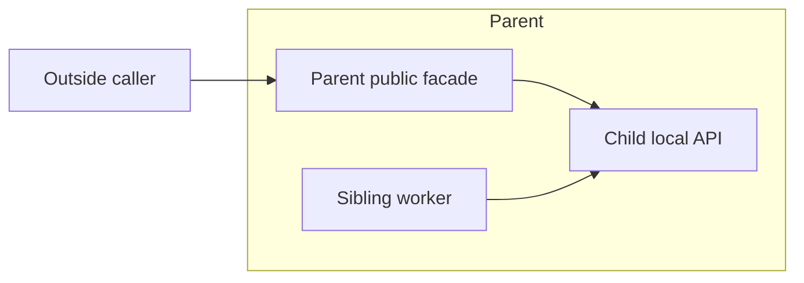

# AD-112 Public means public at that boundary

Requiring a parent's `public` list to equal all child lists forced internal sibling APIs
onto the outward API. Remove that equality, not the boundary checks (#170).

Each contract level declares its own API. An internal worker may use a child API; an outside
caller still needs the parent to publish that entry or a proven facade reexport. A parent
facade or executable `__init__.py` need not belong to a child. Child permissions never override
ancestor restrictions, and source ownership stays contained and unambiguous.

Inside validation reuses the existing reference checks for namespace, provenance and
`public`/`planned` ownership and underscore names. A local `interface_boundary` also rejects
public entries whose modules were not scanned. Diagnostics point to the mounted entry.
It does not add general unused-public or unbuilt-package checks. Schema 2.1.0 stays unchanged;
old `inside.public_mismatch` results remain readable, but new validation never emits that code.

Nested unused-public and planned-promotion diagnostics (#182) need level-specific importer and facade
type evidence. Reusing the root's global usage index would misclassify parent facades and leak
unrelated usage. Those lifecycle diagnostics remain root-only; local private imports are still
checked by the declared interface rule. Missing symbol records do not prove a missing constant.

Migration: keep outward publication explicit. Review copied child entries rather than
promoting every local API. ArchKeel's analyzer inside wrongly listed `archkeel.analyzer` under
orchestration, which does not own that parent module. Remove that duplicate; the root contract
continues to publish `archkeel.analyzer`. No package ownership or dependency permission is widened.

Evidence: `test_inside_publication.py`, `test_inside_rule_parity.py` and the executable
local-publication demo. Recursive loading and rule evaluation remain AD-110/AD-111.
