# Language adapter target

Status: approved; implementation in progress. The process boundary, Python/Dart
collectors and Core evaluation split are present in the working tree. Active
contracts are `architecture-contract.json` plus
`docs/architecture/contracts/{analyzer,python,dart,check,ir}.json`. These contracts declare the
target; they do not certify parity or completion. The current validation and full
test suite still need to pass on the integrated change.

## Boundary

Each replaceable adapter owns parsing, project resolution, its local IR and
source-fact collection. Shared IR owns the wire vocabulary. Core owns ownership,
rule availability, evaluation, metrics and verdicts.

```mermaid
flowchart LR
  CLI["CLI: configuration / wiring"] --> CHECK["check: workflows"]
  CHECK --> PORT["SourceCollector port"]
  PORT --> PROCESS["analyzer: process host"]
  PROCESS --> ADAPTER["Python / Dart / TypeScript adapter"]
  ADAPTER --> FACTS["ir: SourceFacts / coverage"]
  FACTS --> OBS["check: observation assembly"]
  OBS --> EVAL["check.evaluation: rules / coverage"]
  EVAL --> RESULT["ir: canonical Observation / verdict"]
```



Arrows show request/data flow. Import dependencies are separate:
`check -> ir`, `analyzer -> ir.facts`, `ir.source_records`, `ir.facts_codec`,
`ir.protocol`, `ir.state_facts`, `ir.type_shapes` and `ir.reexports`, and
`cli -> check/analyzer/host/render`, plus `cli -> ir.codec` for the legacy JSON
compatibility payload. `ir` imports none of those components.
Language adapters cannot import each other or Core evaluation.

## Physical structure

Keep the existing seven top-level components. `check` is the Core's workflow and
evaluation owner; a new generic `core/` package adds no necessary boundary.

```text
src/archkeel/ir/
  facts.py, source_records.py, state_facts.py, type_shapes.py, reexports.py, identity.py
                                        immutable facts and source identities
  protocol.py, facts_codec.py, facts_validation.py, state_codec.py
                                        process messages and validation
  graph.py                               shared SCC / path / rank algorithms
  model.py, codec.py, ...                governance IR / pure derivations
src/archkeel/analyzer/
  __init__.py, process.py, runtime.py    process port and provenance
  python/                                Python parser, resolver and collectors
  dart/                                  directive parser, resolver and collector
src/archkeel/check/
  ports.py                               collector and workflow ports
  observation.py, observe.py             facts + contract -> canonical observation
  evaluation/                            Core-owned policy and evidence sufficiency
  snapshot.py, git.py, ...                revision inputs / existing workflows
packages/typescript-adapter/
  src/{entry,project,collect,protocol}.ts  pinned compiler and source facts
  test/                                  collector and offline package acceptance
```

Python retains its specialist collectors. Shared graph algorithms live in
`ir.graph`; dependency/scope aggregation and policy live in `check.evaluation`.
Dart retains directive-only capability. TypeScript can start with four source
files because the compiler owns its AST and resolver. Add another internal
component only when responsibilities require it.

## Interfaces

| Owner | Interface | Invariant |
|---|---|---|
| `check.ports` | `SourceCollector.collect(request) -> SourceFacts \| CollectionError` | Core depends on this port; implementation is injected by CLI |
| `ir.protocol` | `CollectionRequest` | immutable revision inputs; no architecture contract, baseline or verdict |
| `ir.protocol` | `CollectionResponse` | exactly one versioned JSON message; diagnostics use stderr |
| `ir.facts` | `SourceFacts` | source claims carry identity and evidence; no policy decisions |
| `ir.facts` | `Capabilities` | claims ability to collect facts, never authority to pass a rule |
| `ir.facts` | `CollectionCoverage` | resolution-only input is not a fully observed graph node |
| `ir.facts` | `ImportTarget = LocalTarget \| ExternalPackageTarget \| BuiltinTarget \| UnresolvedTarget` | `.cjs` runtime and `.d.cts` declaration remain distinct |
| `ir.facts_codec` | `decode_request` / `encode_request` / `decode_response` / `encode_response` | typed envelopes; reject malformed versions, identities, references and coverage |
| `check.observation` | `assemble_observation` / `analyze_source_snapshot` | ownership and evaluator receipts are Core-owned |
| `check.evaluation.evaluate` | `ScanResult` / `evaluate_source(...)` | unsupported or incomplete evidence remains UNKNOWN |
| `check.evaluation.rules` | `public_api_exposed_types(...)` | declaration projection uses the same Core type evidence |
| `check.declarations` | `ContractError`, `load_contract`, `project_declarations`, `project_inside_declarations` | root and nested contracts share one validated projection |

`CollectionError` is a local host/port result, not a wire message.

Inside the shared IR: `protocol -> facts`, `profiles -> facts`,
`facts_codec -> protocol/facts/source_records`, `source_records -> facts`, and
`reexports -> source_records`. `facts` owns its typed values and local type helpers,
so request/response envelopes cannot create a model cycle. The governance IR may
read these interfaces; adapters cannot read governance models or graph derivations.
`profiles` owns capability and rule-availability policy; `measurements` reads its
scalar vocabulary.

Python's `parse_sources` returns `ParsedSources`; specialist collectors read its
`ParsedModule` entries and `build_symbol_index` supplies `SymbolIndex`. Dart's
`read_header` returns `Header`; `read_dart_sources` assembles `DartSources` and
`DartLibrary` entries. Each adapter's `collect` assembles `SourceFacts`;
`entry.main` serves the protocol. The Python contract isolates collector peers.

`SourceFacts` lives in `ir.facts`; the Core maps validated facts to the governance
model in `ir.model`. Requests identify the snapshot, scope namespace and
language-specific resolver. File facts bind repository-relative paths to module
names; collectors derive file IDs from module names. Adapter-local models never cross the port:
Python `ParsedModule`/`SymbolIndex`, Dart `Header`/`DartSources`, TypeScript compiler
`Program`/`SourceFile`. No universal AST or shared parser base class.

The typed protocol and codecs in `ir` own the process wire contract. Collection
limits, exit codes and invalid-response behavior are process-host responsibilities.
A process boundary is not an operating-system sandbox.

## Active contracts and delivery

The active root contract retains the existing rules and mounts contracts for
`analyzer`, `python`, `dart`, `check` and `ir` under `docs/architecture/contracts/`.
This document records the target; active contracts do not certify parity or completion.
The TypeScript npm package needs its own contract because the Python scanner cannot
observe `.ts`.

The target and Node/npm adapter choice are approved. The process/facts/Core and
Python/Dart migration is in implementation. Acceptance still requires Python/Dart
parity, replacement by another configured executable, negative protocol/coverage
cases and independent review. TypeScript packaging, revision identity and
extension onboarding remain separate follow-up work.

Future HTTP/queue relationships are a separate interaction model: declared API
contracts, source observations and runtime observations have distinct evidence.
Import edges do not imply network or queue connections. No HTTP/queue detector,
generic plugin registry, daemon or service is part of this target.
