# Language adapter target — owner review

Status: proposed. No implementation or active contract change.
Based on ArchKeel `7836515`; proposed interfaces below do not exist yet.

## Boundary

Each replaceable adapter owns parsing, project resolution, its local IR and
source-fact collection. Shared IR owns the wire vocabulary. Core owns ownership,
rule availability, evaluation, metrics and verdicts.

```mermaid
flowchart LR
  CLI["CLI: configuration / wiring"] --> CHECK["check: workflows"]
  CHECK --> PORT["SourceCollector port"]
  PORT --> PROCESS["analyzer: process host"]
  PROCESS --> ADAPTER["Python / Dart / TypeScript adapter"]
  ADAPTER --> FACTS["ir: SourceFacts / coverage"]
  FACTS --> OBS["check: observation assembly"]
  OBS --> EVAL["check.evaluation: rules / coverage"]
  EVAL --> RESULT["ir: canonical Observation / verdict"]
```



Arrows show request/data flow. Import dependencies are separate:
`check -> ir`, `analyzer -> ir.facts/protocol/facts_codec/profiles`,
`cli -> check/analyzer/host/render`. `ir` imports none of those components.
Language adapters cannot import each other or Core evaluation.

## Physical structure

Keep the existing seven top-level components. `check` is the Core's workflow and
evaluation owner; a new generic `core/` package adds no necessary boundary.

```text
schema/source-facts.schema.json          proposed canonical process vocabulary
src/archkeel/ir/
  facts.py                              source facts, identities, evidence
  protocol.py                           request / response envelopes
  facts_codec.py                        pure validation / serialization
  profiles.py                           supported fact vocabulary
  graph.py                              shared SCC / path / rank algorithms
  model.py, codec.py, ...                existing governance IR / pure derivations
src/archkeel/analyzer/
  __init__.py                           collect facade
  process.py, runtime.py                argv, execution, timeout, tool identity
  python/
    entry.py, collect.py                 process entry / collection order
    source.py, resolve.py                Python local IR / project resolution
    receiver_types.py                    Python receiver-type facts
    bindings.py, calls.py, ...           existing specialist collectors
  dart/
    entry.py, collect.py                 same process boundary
    lexer.py, directives.py, resolve.py  directive IR / URI resolution
src/archkeel/check/
  ports.py                              SourceCollector interface
  observation.py                        facts + contract -> canonical observation
  evaluation/rules.py, coverage.py       Core-owned policy / evidence sufficiency
  evaluation/topology.py                shared dependency / scope aggregation
  snapshot.py, git.py, ...               revision inputs / existing workflows
packages/typescript-adapter/
  package.json, package-lock.json        separate pinned npm artifact
  src/entry.ts                          stdin / stdout, no policy
  src/project.ts                        compiler Program / TSConfig / resolution
  src/collect.ts                        import facts / input coverage
  src/protocol.ts                       binding to shared wire vocabulary
```

The Python adapter retains language-specific collectors. Existing `graph.py`
algorithms move to `ir.graph`; shared dependency/scope aggregation and policy move
to `check.evaluation`. Dart retains its directive-only capability. TypeScript can
start with four source files because the compiler already owns its AST and
resolver. Add another internal component only when responsibilities require it.

## Interfaces

| Owner | Proposed interface | Invariant |
|---|---|---|
| `check.ports` | `SourceCollector.collect(request) -> SourceFacts \| CollectionError` | Core depends on this port; implementation is injected by CLI |
| `ir.protocol` | `CollectionRequest(protocol_version, snapshot, scope, resolver)` | immutable revision inputs; no architecture contract, baseline or verdict |
| `ir.protocol` | `CollectionResponse(protocol_version, facts) \| CollectionFailure` | exactly one versioned JSON message; diagnostics use stderr |
| `ir.facts` | `SourceFacts(adapter, capabilities, inputs, files, modules, imports, sections, coverage)` | source claims carry identity and evidence; no policy decisions |
| `ir.facts` | `Capabilities(fact_kinds, resolution_features)` | claims ability to collect facts, never authority to pass a rule |
| `ir.facts` | `Coverage(selected_files, observed_files, resolution_inputs, gaps)` | resolution-only input is not a fully observed graph node |
| `ir.facts` | `ImportTarget = LocalTarget \| ExternalPackageTarget \| BuiltinTarget \| UnresolvedTarget` | `.cjs` runtime and `.d.cts` declaration remain distinct |
| `ir.facts_codec` | `decode_request` / `encode_request` / `decode_response` / `encode_response` | typed envelopes; reject malformed versions, identities, references and coverage |
| `check.observation` | `assemble(facts, contract) -> Observation` | ownership and evaluator receipts are Core-owned |
| `check.evaluation` | `evaluate(facts, contract) -> RuleEvidence` | unsupported or incomplete evidence remains UNKNOWN |

Inside the shared IR: `protocol -> facts`, `profiles -> facts`,
`facts_codec -> protocol/facts`. `facts` imports none of them. Capability and
coverage values belong to `facts`, so request/response envelopes cannot create a
model cycle. The governance IR may read these interfaces; adapters cannot read
governance models or graph derivations.

Inside Python: `parse_sources(request) -> ParsedSources`,
`resolve_project(parsed) -> ResolvedProject`, then independent
`collect_<kind>(project) -> FactSection`. Inside Dart:
`parse_directives(request) -> DirectiveModel`,
`resolve_libraries(directives) -> ResolvedLibraries`. Each adapter's `collect`
assembles `SourceFacts`; `entry.main` serves the protocol. These are proposed
type boundaries, not placeholder implementations. Collector peer imports are
also forbidden by the draft's explicit `sibling_isolation` rule.

`SourceFacts` reuses the source-fact vocabulary already in `ir.model`; extraction
must preserve existing observation compatibility. File/module IDs include source
space and repository-relative path. Adapter-local models never cross the port:
Python `ParsedModule`/`ResolvedProject`, Dart directive model, TypeScript compiler
`Program`/`SourceFile`. No universal AST or shared parser base class.

The proposed JSON schema is the single wire-contract owner. Python and TypeScript
bindings share conformance fixtures. Schema/code generation is not required now.
Collection limits, exit codes and invalid-response behavior are process-host
responsibilities. A process boundary is not an operating-system sandbox.

## ArchKeel target contracts

`targets/language-adapters/archkeel.toml` selects a separate draft root and five
`inside` contracts. They declare intended component direction and concrete future
Python paths without creating placeholder source files. New decisions remain
`decided_by: agent` until owner approval. The active root contract stays unchanged.

Generate the native Target/Actual explorer from the worktree:

```bash
uv run --locked archkeel report --root . \
  --config docs/architecture/targets/language-adapters/archkeel.toml \
  --output /tmp/language-adapter-target.json --json
```

Expected: current-source violations and missing future modules. This is an
architecture proposal, not proof that the target is reached. ArchKeel currently
cannot represent `.ts` target files or scan TypeScript. A separate interactive
review diagram shows the npm adapter's real proposed paths and interfaces. The
native report currently also omits `planned` interfaces from component details;
those signatures are reviewable in the draft JSON and this proposal. Extend
the native profile-aware target model in #275/#276 before claiming enforcement;
#278 tracks planned-interface display.

## Approval and delivery

Approve these boundaries and the Node/npm adapter choice first. Then use separate
PRs for profile validation (#274), the facts/process/Core extraction (#122),
revision/target identity (#275), TypeScript (#276), and extension onboarding.
Acceptance requires Python/Dart parity, replacement by another configured
executable, negative protocol/coverage tests, and independent review.

Future HTTP/queue relationships are a separate interaction model: declared API
contracts, source observations and runtime observations have distinct evidence.
Import edges do not imply network or queue connections. No HTTP/queue detector,
generic plugin registry, daemon or service is part of this target.
