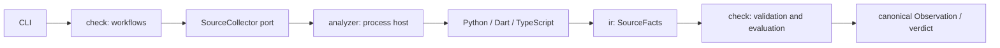

# Language adapter target

Status: approved and implemented. Publication and cross-platform acceptance are
separate delivery work.

Adapters parse and resolve source into `SourceFacts`. Python Core validates those
facts, assigns ownership and evaluates policy. An adapter's capability claim cannot
authorize PASS; unsupported or incomplete evidence remains UNKNOWN.

Requests identify immutable source and resolver inputs. They contain no contract,
baseline or verdict. The shared [protocol](../../src/archkeel/ir/protocol.py) and
[codecs](../../src/archkeel/ir/facts_codec.py) enforce message versions, identities,
references and coverage. Adapter-local ASTs never cross the port. Diagnostics use
stderr; stdout carries one response. The process boundary is not an OS sandbox.

Adapters cannot import each other or Core evaluation. Active
[contracts](contracts/) govern the dependency boundaries. Python retains specialist
collectors; Dart remains directive-only. TypeScript is a tree-sitter frontend with its
own resolver, run as a process collector like the others ([AD-210](decisions/ad-210-typescript-frontend-ships-in-the-package.md)).

Acceptance covers Python/Dart parity, executable replacement, invalid protocol and
coverage cases, revision-bound inputs, independent review and, for TypeScript, a
differential against the frozen output of the historical npm collector. See the
[TypeScript decision](typescript-foundation-proposal.md) for its gates.
Import facts do not prove HTTP, queue or runtime relationships.
