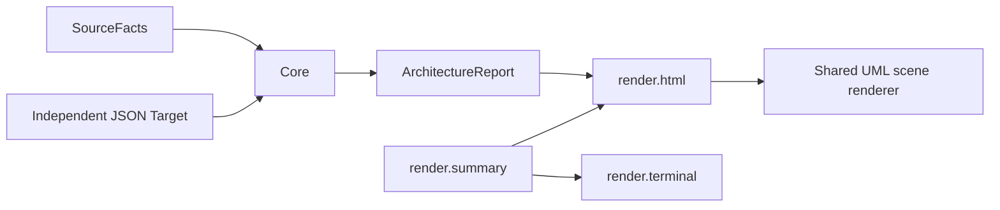

# Render target

Architecture data belongs to the shared IR. Core authenticates Target, validates
Source and publishes comparison receipts. Rendering changes no verdict.

| Owner | Responsibility | Allowed render dependency |
| --- | --- | --- |
| summary | Explain Core results once | none |
| html | Serialize the shared report; compose evidence and browser assets | summary |
| terminal | Format shared result explanations | summary |

Implemented: the browser receives one `ArchitectureReport` and uses one scene
projector, navigator and SVG renderer for As-Is, Target and Diff. Source modules
carry their observed file paths. Target files remain independent file intent.
External permissions and open dependency decisions retain their original meaning.
Missing authenticated Target data cannot produce a Target diagram.

Core tests inspect original graph sites and findings; browser tests exercise the shared renderer.
The component overview aggregates imports and permissions. External sites remain in Details
and module drill-down. Module overviews keep definitions and type context. Relationship filters and
Focus expose referenced operations. This changes the scene, never the graph or verdict.
Diff retains unowned observed namespaces even without explicit UML intent. Their
navigation does not invent a component owner or a comparison receipt.

[The render contract](contracts/render.json) enforces ownership and dependency
direction. [The report decision](decisions/ad-179-reports-render-one-graph-boundary.md)
defines the shared boundary. [The UML target](uml-model-target.md) tracks remaining
source capabilities and independent Target interiors.
