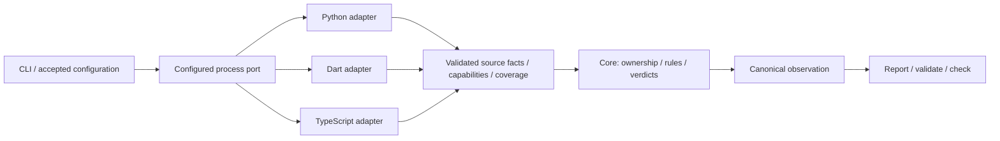

# TypeScript foundation — proposal

Status: revised proposal; owner requires replaceable language modules now.
Runtime/distribution and the revised implementation scope remain proposed.
Evidence: ArchKeel `7836515`, DATAMIMIC IDE working copy, 2026-10-03.

## Outcome

Establish replaceable language adapters, add TypeScript architecture checks,
then onboard the DATAMIMIC VS Code, Kiro and Antigravity extension. Keep changes
in separate PRs. Preserve Python/Dart behavior and the existing extension gate.

This is a design PR. TypeScript support is not implemented or advertised.

The [language adapter target](language-adapter-target.md) defines concrete paths,
internal IR ownership, proposed interfaces and separate ArchKeel draft contracts
for owner approval before implementation.

## Decision requested

**Recommended:** a Node analyzer using an exactly pinned TypeScript Compiler
API, initially 5.9.3, the version exercised against the extension. Install its
locked dependencies explicitly. Never install during `report` or `check`.
Every language adapter supplies source facts through the same configured
process port. The Python Core owns architecture-rule evaluation and verdicts.

The cost is a second runtime and a separately versioned npm artifact. A missing
or incompatible analyzer returns exit 2 with an actionable diagnostic.

Alternative: Python plus tree-sitter. This avoids Node but adds grammar/native
dependencies and our own TypeScript module resolver. Regex is insufficient for
the observed syntax and is excluded.

The implementation plan follows review of this revised scope. AD-22's process
boundary is now a prerequisite, not deferred work. Full Dart type/construct
analysis remains separate; replaceability does not require those capabilities.

## Confirmed prerequisites

| Finding | Current evidence | Required behavior |
|---|---|---|
| TypeScript cannot initialize | `cli/__init__.py:312`; `cli/config.py:60`; CLI/config probes reject `typescript` | explicit TypeScript profile through init/config/observe |
| Unknown analyzers inherit Python capabilities | `ir/profiles.py:99`; an unknown name selects Python | explicit analyzer/profile identity; review legacy observation compatibility |
| Python accepts absent required sections | `ir/codec.py:298`; registered Python observation accepts null symbols/references/bindings | validate nullability against the active profile |
| Snapshots omit other languages | `check/snapshot.py:75,98,144`; TS archive member is rejected | revision-bound source and resolver inputs |
| Delta comparison requires Python | `check/delta.py:390,411`; two absent Python runtimes reject | profile-specific runtime/parser comparability |
| Target files are Python-only | `ir/codec.py:928`; `analyzer/embedded/report.py:356` | profile-aware path validation and target identities |

AD-22 and [#122](https://github.com/rapiddweller/archkeel/issues/122) describe the
configurable process port. The current Python/Dart bridge is fixed and scanners
also evaluate rules. Extract the existing facts and policy boundary with parity
tests. The Core remains implemented in Python; its current internals need to
change. Reuse the rule semantics, not the scan/policy coupling.

## Concrete extension inputs

The extension has 76 production TS files and 52 adjacent test files.
Its TSConfig emits CommonJS and excludes `*.test.ts` from production.
An AST probe with TypeScript 5.9.3 found 305 source references:

| Form | Count |
|---|---:|
| import declaration | 200 |
| import type declaration | 90 |
| export declaration | 2 |
| export type declaration | 2 |
| import type expression | 8 |
| literal dynamic import | 3 |

These are syntax counts, not an architecture verdict. Node builtins have no
resolved source-file path in this probe; classify them as builtins explicitly.
`application/ports/hostIdentity.ts` refers to `supportedHosts.cjs` outside `src`;
the compiler resolves its declaration to `supportedHosts.d.cts`. Preserve the
runtime dependency and declaration identity separately. Neither may disappear
from coverage, assignment or snapshot provenance.
Observe the local JS dependency closure too, or leave affected transitive and
whole-graph cycle checks UNKNOWN. A declaration file does not prove the runtime
file has no outgoing imports.

## Replaceable language boundary

The module is a language adapter: parser, project resolver and fact extraction.
A parser alone produces syntax; it does not resolve module aliases or imports.
The complete analyzer is this adapter plus Core-owned policy evaluation.



- Configure an executable plus argument list, not a shell command. One
  versioned JSON request on stdin, one response on stdout, diagnostics on stderr.
  No discovery framework, dynamic loading or daemon.
- Request snapshot/scope/resolver inputs, not the architecture contract or
  baseline. Adapters do not decide allowed edges, violations or PASS/FAIL.
- Reuse the source-fact portion of the existing IR. The Core validates profile,
  protocol, identities, references, input provenance, capabilities and coverage
  before constructing the final observation and evaluator receipts.
- Python and Dart use this same port, with no privileged scan/policy shortcut.
  A replacement executable is proven through configuration and acceptance tests.
- Reject malformed/incompatible responses, unavailable tools and timeouts;
  preserve UNKNOWN or exit 2 according to the existing diagnostic contract.

## TypeScript scope

- Observe static imports, re-exports, import types, literal dynamic imports and
  proven CommonJS imports. Computed or shadowed imports cannot prove absence.
- Count type-only dependencies for architectural direction. Call cycles import
  cycles; do not claim they are runtime cycles.
- Use the compiler's TSConfig parser and module resolution. Honor the selected
  production/test scope without silently merging them.
- Distinguish selected scope files, resolution-only inputs and fully observed
  graph nodes. Production imports reached by a test scope remain visible; only
  a complete observed closure can prove a whole-graph absence or cycle result.
- Keep file identities distinct for `foo.ts`, `foo/index.ts`, `foo.test.ts`,
  hyphenated names and scoped packages. Do not normalize them into collisions.
  Repository-relative POSIX paths are file identity. Define their mapping to
  logical selectors/ownership in the foundation; existing Python dotted names
  retain their meaning. Reusing the evaluator requires explicit profile-aware
  coverage and identity adaptation, not merely adding a source suffix.
- First support only proven import-graph and ownership rules: assignment,
  dependency direction, external scopes, module/component cycles and layout.
  Define every rule's supported/partial/unsupported state explicitly.
- Symbol interfaces, boundary types, constructs, calls and typing/private-use
  metrics remain unsupported, UNKNOWN or null according to their existing
  contract. Unobserved symbols must not appear as a measured zero.
- Syntax/config errors, unresolved local dependencies, missing resolver inputs,
  out-of-repository paths and unavailable runtimes cannot produce a clean proof.
- Snapshot sources, TSConfig/extends, package metadata, local declarations and
  relevant JS/JSON dependencies from the same revision. Never borrow current
  working-tree inputs or project `node_modules` to fill historical gaps.
- Pin and record collector/compiler identity, resolver settings and observed
  input digests. Different or unknown analyzer identities are not comparable.
- Analysis does not execute project code, TSConfig plugins or package scripts.
  Validate the collector response, timeout and exit status at the process boundary.

External package resolution must be reproducible from declared snapshot inputs.
Cases requiring unavailable installed/generated data remain explicitly undecided.
There is no automatic dependency installation or guessed external source graph.

## Separate PRs, in dependency order

1. **Profile evidence:** active-profile IR validation, explicit capability
   decisions and legacy compatibility tests. No TypeScript feature claim.
2. **AD-22 facts/process contract:** configured executable boundary, validated
   facts/capabilities and Core-owned policy. Reuse existing IR records; define
   file identities, selectors and ownership mapping without parser AST leakage.
3. **Python/Dart migration and revision evidence:** both adapters use the port,
   with policy out of scanners; language-aware snapshots/runtime/target paths,
   semantic parity and unsafe-archive tests. Split transport migration from
   snapshots if needed for a coherent review.
4. **TypeScript vertical slice:** pinned collector, packaging, CLI/config/init,
   report/validate/check, negative fixture and Make demo target. Uses the same
   port, Core and declared capability boundary as Python/Dart.
5. **Extension onboarding:** initialize TypeScript scope, document reviewed
   target, encode supported constraints and compare with dependency-cruiser.
   This PR belongs in the extension repository.

## Future system interactions — design boundary only

An import proves a code dependency. HTTP and queue communication need distinct
relations, contract identities and evidence; they are not synthetic imports.

```text
TypeScript frontend -- HTTP operation / API contract --> Python backend
Python producer -- publishes message --> queue channel
Rust consumer -- consumes message --> queue channel
```

A later interaction observer can link source-backed clients, providers,
publishers and consumers through explicit API/channel/schema contracts. Service
and repository identities must not be conflated with a language module namespace.
Contract declarations, source evidence and runtime evidence remain distinct:

| Evidence | What it supports | What it does not prove |
|---|---|---|
| declaration | intended endpoint/channel/schema relationship | source usage or delivery |
| source | matching client/provider or publisher/consumer code | deployed wiring or execution |
| runtime | communication in an identified environment/time | universal behavior or complete source coverage |

Dynamic endpoints, queue bindings, versions and unknown identities stay
unresolved until evidence links them. Shared schema references alone do not
prove connected deployments, authorization, compatibility or message delivery.

Record this boundary now. Do not add HTTP/broker observers, cross-language rules,
Rust support, speculative schema fields or a universal graph framework in this
TypeScript project. Build those only for a concrete system and acceptance case.

## Acceptance before extension onboarding

- Python and Dart fixtures run through the same configured port with unchanged
  semantics. Known Python serialization/provenance changes are explicit; policy
  results and preserved compatibility must not drift under the extraction.
- A replacement test executable returns valid and deliberately invalid facts.
  Prove configuration selects it, the Core owns decisions, malformed/profile-
  incompatible output fails closed, and the Core never imports adapter ASTs.
- Every enabled rule has a positive and negative fixture; unsupported and
  partial cases cannot become PASS. Missing facts are never violations.
- Cover comments/strings, type imports, re-exports, literal/computed imports,
  shadowed CommonJS calls, aliases, index files, `.js` substitution, `.cjs` /
  `.d.cts`, JSON, scoped packages and Node builtins.
- Inject an import from `supportedHosts.cjs` back into application: it must be
  observed and checked, or bound the affected graph verdict to UNKNOWN. Merely
  assigning ownership or resolving its `.d.cts` must not produce PASS.
- Repeated observations are deterministic. A historical check uses only that
  revision; parser/runtime/config changes have explicit comparability outcomes.
- A real committed TypeScript fixture traverses init, report, validate and
  two-revision check. Working-tree report alone is insufficient.
- Python/Dart regression suites, `make check`, `make self-observation`,
  `make self-validate` and packaging smoke pass where applicable. Record local
  limitations separately from CI; update docs, schemas, ADRs and demos together.
- The extension fixture catches an injected upward import and cycle. Preserve
  existing gate coverage until positive/negative parity is demonstrated.

## Current verification

LOCAL VERIFIED: 112 existing config/Dart/profile/snapshot/onboarding tests;
CLI/config rejection, unknown-profile fallback, null-section acceptance,
Python-only snapshot and runtime probes; compiler AST/resolution probe.
Extension `npm run verify`: lint, architecture gate (140 modules / 469 edges),
URI drift check, strict typecheck, 636 tests in 52 files, coverage and compile.

CI-ONLY VERIFICATION: no implementation CI, extension-host smoke, Marketplace
package or live Platform verification. Full ArchKeel `make check` was not run.

## Tracking

- [#274: active-profile IR validation](https://github.com/rapiddweller/archkeel/issues/274)
- [#275: language-aware revision evidence](https://github.com/rapiddweller/archkeel/issues/275)
- [#276: TypeScript vertical slice](https://github.com/rapiddweller/archkeel/issues/276)

## Primary parser references

- [TypeScript Compiler API](https://github.com/microsoft/TypeScript/wiki/Using-the-Compiler-API)
- [Module resolution](https://www.typescriptlang.org/tsconfig/moduleResolution.html)
- [Path mapping](https://www.typescriptlang.org/tsconfig/paths.html)
