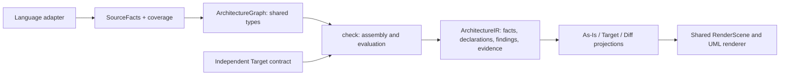

# UML model target

Status: shared types, generated schema, strict codecs and independent source/Target
producers exist. Core authenticates Target and compares it with recorded facts and
coverage. As-Is, Target and Diff use one `ArchitectureReport` and renderer (AD-179).
This extends [PR #282](https://github.com/rapiddweller/archkeel/pull/282).

Graph and Target-definition format 1.1.0 add `enum_literal` (AD-188). Format 1.0.0
remains readable with its original vocabulary. Known literal enum assignments use
a Literals compartment; dynamic member generation stays partial.

The standard is [the immutable dataclasses](../../src/archkeel/ir/architecture_graph.py).
[The JSON Schema](../../schema/architecture-graph.schema.json) is generated with
`make architecture-graph-schema`; do not edit it by hand.
`ArchitectureGraph.validate()` checks identities, references, containment, evidence and resolution.
Schema validation checks JSON types and allowed fields. Neither check evaluates architecture intent.
The graph is derived from canonical records or an independent contract.
It is not a second persisted observation. Core's contract values already use the shared entity,
relationship, signature and visibility types. Their declared type boundary exports only these
used dataclasses and graph producers. Render internals remain private.

Demo coverage is tracked in [#339](https://github.com/rapiddweller/archkeel/issues/339).
Remaining independent inner Target contracts are tracked in
[#340](https://github.com/rapiddweller/archkeel/issues/340).
The runnable H-uml examples keep one Target unchanged across matching, signature-failing
and partial enum observations. They use the ordinary CLI and shared report renderer.

## Goal and current gaps

Explore components → packages/modules → classes/interfaces → operations and static
bindings. Each view retains visibility, responsibilities, signatures and direction.
The shared renderer reads authenticated graphs; it does not infer file namespaces,
ownership, endpoints or verdicts.

Root overviews show component boundaries. File inventories stay in Details;
unowned code has an explicit entry (AD-195). Fit retains at least 85 percent scale;
large graphs remain pannable. Short inspector headings retain full qualified
identities below them (AD-192). Per-card heights and balanced columns help large
levels, but dense complete graphs still need a clearer overview.

Focus shows one entity and direct neighbors with subset counts and stable reset
(AD-174). Relationship filters retain every element without Focus (AD-175).
Element filters show matching cards and edges with two visible endpoints (AD-177).
Hidden edges have no hit areas. Counts, evidence and Core status remain complete.
Focused routing checks do not prove clean routing for every full graph.

Python records classes, fields, methods, annotations, bases, imports, calls and
references. Operations retain ordered parameter kinds and unevaluated defaults.
Private class-body annotations, lexical parents, callers and repeated attributes
retain definition-site IDs. Direct nested definitions and definitions under `if`,
loops, `try`, `with` and `match` retain ordered contexts. Conditional targets remain
candidates; Core reports UNKNOWN until binding is proven. Legacy rules keep their
conservative direct-definition view. Unbound local declarations do not become
function attributes or unused-symbol candidates.

A class implementing a Protocol stays a class; a subprotocol needs an explicit
`Protocol` base ([Python typing specification](https://typing.python.org/en/latest/spec/protocol.html#merging-and-extending-protocols)).

Direct call-result assignments retain initializer syntax, annotations, lexical
parents, contexts and evidence. Stable class names with default constructors can
prove a nominal result type. Qualified accesses, factories, custom initialization
and attribute storage retain candidates. Runtime values and lifetimes are unobserved.
Full lexical binding, classifier and instance inventories remain partial.
Dart and TypeScript currently collect imports/directives, not classes, methods or calls.

The own IR Target declares 17 immutable classes, fields, validation methods,
producer/codec functions and typed imports/calls/references, with eighteen class
dependencies (AD-173, AD-179). The SourceCollector port, envelopes, ProcessCollector,
three resolver variants, resolver union and wire-version identity have independent
Target intent (AD-183, AD-191). Presence and dependency checks do not certify runtime
version values or complete inventories. Other IR helpers and component interiors
still need explicit Target definitions.

## Responsibilities

| Owner | Responsibility | Excludes |
| --- | --- | --- |
| Language adapter | Parse source; publish symbols, bindings, relationships, source locations and resolution limits | Target intent, rule evaluation, layout |
| `ir` | Shared types/schema, identity and reference validation, codecs and pure graph derivations | AST parsing, I/O, rule evaluation |
| `check` | Combine facts with independent contracts; evaluate existence, signatures, visibility, dependencies and coverage | Language AST interpretation, drawing |
| `render` | Project recorded evidence into RenderScene; navigation, shared UML notation, routing and focus | Inferring source facts, evaluating rules |

Arrows show data flow. Import dependencies remain `analyzer → ir`, `check → ir`
and `render → ir`; adapters receive no architecture contract.
[The render contract](contracts/render.json) owns HTML, summary and terminal dependencies.

`ir.source_graph.observed_graph()` normalizes canonical records, retaining IDs,
evidence, candidates and profile limits. Namespace ownership never becomes a
lexical parent. `ir.target_graph.declared_graph()` compiles independent contracts.
Both return `ArchitectureGraph`; `ir.graph_codec` handles graph JSON and `ir.codec`
embeds the shared contract types. `ir.facts.Evidence` owns evidence;
`ir.model.Evidence` remains a compatible export.

Target projects components, permissions, explicit UML, responsibility roles,
ownership, namespaces, published/planned API selectors, provenance and inner
contracts. File inventories and layout rules share immutable contract types and
retain their declaring owner (AD-161–163). Allowed children do not require existence;
undeclared and explicitly empty inventories stay distinct. Planned selectors and
file intent do not invent UML entities.

Global `public_api` uses `PublicAPIEntry` with canonical declaration IDs and
independent provenance (AD-168). It defines no UML kind, signature or language
visibility. Source-derived exposed types stay outside Target; inside contracts
reject global API declarations. Missing provenance is an error.

Graph assembly and comparison stay in Core. Legacy Target and explicit UML share
the report boundary without adding a legacy conformance rule. HTML retains the
original result; no copied observation or second contract model is persisted.

## Shared vocabulary

| Record | Required information |
| --- | --- |
| Entity | Stable ID, kind, language, qualified name, lexical parent ID, evidence/provenance and originating record IDs |
| Class/interface | Attributes, owned operations, explicit bases, abstract/static traits where supported |
| Operation | Method/function kind, ordered parameters and their kinds/defaults, return annotation, async/static/class traits |
| Visibility | `public/private/protected/package/unknown`, language spelling, basis: language rule/convention/explicit declaration/unknown |
| Global API intent | Canonical declaration ID, contract selector and independent provenance; separate from symbol kind and language visibility |
| Static binding | Lexical scope, binding name, assignment/creation site, candidate type IDs and resolution status |
| Relationship | ID, kind, source/target IDs or unresolved candidate targets, resolution status and evidence/provenance |
| Assessment | Rule ID, fact/declaration IDs, `PASS/FAIL/UNKNOWN` and reason; separate from source resolution |
| Coverage | Capability and scope, supported/complete/partial/unavailable status with evidence of limits |

Entity kinds: component, package, module, class, interface, enum, method, function,
attribute, type alias, constant, binding and an unclassified referenced symbol.
Preserve existing record IDs. A qualified name is not a unique definition-site ID:
overloads and package initializers can share it. Display labels never identify nodes.
New Python records publish definition-site parents and caller IDs. Legacy snapshots with
ambiguous names are rejected rather than assigned to an arbitrary definition.
Same-name target definitions remain candidates; a name-level resolution does not select a definition.
Candidate totals count definition sites. A truncated name list cannot establish that total;
the graph retains truncation and leaves the total unknown. Original counts remain in the cited record.
Moves without an explicit mapping stay unmatched.
Aggregate relationship comparisons by kind and endpoint identities; retain every cited call/import site.

Lexical containment has one source: `parent_id`. Do not duplicate it as a relationship.
Architectural containment uses `ComponentIntent.parent_id`; it references the actual
outer component ID. Component labels and namespaces do not identify parents.
Its layout references assign rules to the component that declares the inside contract.
Relationships stay distinct: imports, calls, references, inherits, realizes, creates,
instance-of, ownership, requirements and publication. A declared `requires` permission remains separate from an observed
import or call. A partial call's candidates never become confirmed calls. An unresolved call
retains its expression and source even when it has no drawable target.
Both Target producers derive `requires` from existing component declarations (AD-164).
Typed `through` selectors, rationale, provenance and the effective decider survive projection.
Core authenticates their contents. Existing dependency rules evaluate permissions; UML
comparison and completeness cannot evaluate them again. Target/Diff Details labels them as
allowed imports, separate from mandatory UML calls. Reordering does not change identity.
Python class facts now retain each explicit base expression and its evidence (AD-181).
Stable direct module bindings can prove a classifier edge. Repeated definitions, lexical
lookup, replaced classes, unknown external kinds and custom generic origins stay uncertain.
Explicit implementation of a known Protocol records `realizes`; subprotocols record `inherits`.
Each recorded class has base-list coverage. The module's classifier inventory stays partial.
Core uses the nearest covering receipt and preserves descendant limits. Legacy base names
do not certify typed relationships. Child receipts cannot certify an unmeasured parent
inventory. Core must not infer realization from matching signatures.
An import or annotated field proves no composition. Recorded constructor and assignment
sites project to `creates` and `instance_of`; both retain the original call evidence.
Lexical resolution uses compiler scopes and conservatively retains ambiguity.
Broader instance typing and exhaustive inventory coverage remain open.

## Visibility and static instances

Show UML visibility on attributes and operations: `+ public`, `− private`, `# protected`,
`~ package`. Use `?` when undetermined. Language visibility and component API membership
are separate: `public`/`planned` declarations keep their current independent meaning.
For Python, a leading underscore is a naming convention; name mangling is not access control.
Special methods such as `__init__` must not become private merely because they start with `_`.
Declared intent can disagree with observed spelling/export usage; keep both and assess the rule.

A static binding describes a source site, not a live object's identity or lifetime.
An annotation alone does not prove construction. Rebinding, factories, metaclasses and
ambiguous constructor results retain candidate types/UNKNOWN; never merge all values of one class.
No tracing subsystem is needed for this scope.

## Target completeness and UML views

Contract 2.2 accepts `declarations.uml`: a versioned `TargetDefinition` containing shared entities,
typed relationships and scopes. Existing components own component IDs; UML declarations reference
them through `parent_id` and cannot redeclare them. Planned entities require responsibility and
provenance. Referenced entities describe external endpoints. Target cannot assert observed evidence,
record IDs, call resolution or candidates. [The tests](../../tests/test_target_graph.py) include a
complete independently authored class, interface, method and realization example.

`make architecture-graph-schema` generates both the graph schema and the contract's UML section.
Contract 2.1 remains readable and keeps its encoded bytes and digest. Adding UML requires explicit
version 2.2; old consumers can reject it instead of silently ignoring new intent.

Core reads the declaration revision and verifies its digest before retaining UML intent in the
canonical observation. Repeated assembly is idempotent; conflicting adapter content is rejected.
Core rejects invented adapter declarations and altered owner metadata. Evaluation is pure policy:
`check.uml_compare` compares graphs; `check.uml_evaluation` records its result through the existing
rule receipts, violations and UNKNOWN records. No second verdict pipeline or adapter policy is added.
Repeated evaluation is idempotent; conflicting receipt content is rejected.
`uml_target` is an implicit conformance rule for `declarations.uml`, not another rule authoring syntax.
The [comparison dataclasses](../../src/archkeel/ir/architecture_graph.py) and
[generated schema](../../schema/architecture-comparison.schema.json) retain Target subjects,
definition/call-site IDs, fact IDs, source evidence, status and reason.
Core retains Target-to-observed entity correspondences from its existing matching.
Ambiguous matches remain explicit; they add no verdict. Diff uses these IDs and recorded
parents to place unlisted relationship endpoints. It never matches names in the renderer.
Grouped edges retain every observed site and its source graph. Details shows Core receipts.
Diff can open observed-only classes and operation call graphs. Navigation retains graph
origin and entity ID; tab changes do not copy them into Target. Source interiors read
Core receipts by observed IDs. Missing assessments stay explicitly unassessed; unresolved
sites stay in Details without invented endpoints or PASS.

Known kind, signature, visibility or parent conflicts fail. Missing entities/edges fail only with
complete inventory and relevant resolution. Repeated definition sites stay ambiguous. Call candidates
cannot satisfy a required call. Closed scopes reject known extras; partial child coverage or unresolved
sites prevent PASS. Unknown traits and unavailable classifier/instance facts stay UNKNOWN.
Signatures compare recorded syntax, including parameter order, kinds and unevaluated defaults.
They do not prove equivalent types. Python method signatures include `self`/`cls`; Target must name them.
An empty Target reports UNKNOWN. Existing `requires` permissions remain separate from mandatory calls.
Nested Contract 2.2 UML declarations compile into one authenticated root target (AD-163).
Outer contracts can remain 2.1. Core retains scoped declaration IDs, component parents,
labels, file inventories and layout ownership. Missing inputs or changed references fail
authentication. Target/Diff drill-down uses the same renderer at every declared UML level.
The existing widening gate conservatively flags any UML declaration change. Removal, an opened
scope or a changed signature cannot quietly weaken accepted intent.

Target completeness is explicit per scope and kind: unspecified, open or closed.
Open scopes list known intentions; closed scopes additionally require every observed entity/edge
of the named kinds to be covered. Missing evidence cannot prove closed-scope conformance.
Generate a proposal from As-Is only as a draft; never install it automatically as its own oracle.

Use package/component overview, class/interface compartments, operation call graphs and
static-binding detail as levels of one explorer. UML dependencies use directed dashed lines,
inheritance uses a solid line/hollow triangle, explicit realization a dashed line/hollow triangle.
Label source-code imports and static calls distinctly; they are not UML runtime messages.
Composition/aggregation requires declared or sufficient evidence of the corresponding semantics.
Physical layout constraints belong in the structure view/Details, not among call dependencies.
Selection highlights only its visible connected neighborhood. Every hit area belongs to a visible
element; arrow endpoints and routes share geometry. No separate As-Is/Target renderer.

Notation reference: [OMG UML 2.5.1](https://www.omg.org/spec/UML/2.5.1/PDF).

## Delivery and acceptance

Implemented: graph types/schema/codecs, strict Target declarations, nested Target
compilation, Core comparison receipts, dependency-permission authentication and
one renderer. Python records definition-site parents, parameter kinds/defaults,
visibility, private annotations, explicit bases, conditional definitions and direct
call-result assignments.

Coverage remains partial for attributes, classifier inventories and static instances.
Per-class base receipts cannot close a parent inventory. Legacy parameter details
remain unknown. The legacy symbols section is not exhaustive; the reference collector
omits unresolved and external uses. Parameter/return references retain declaring
operations separately from Python evaluation scope (AD-184), proving positive edges
without proving inventory closure. Own independent inner Target coverage is partial.

Each increment needs positive/negative proofs: identical local labels in different modules,
private/public and Python special methods, call/reference distinction, partial/unresolved calls,
missing versus unavailable entities, rebinding, cyclic/self edges and absent Target declarations.
Round trips preserve identities and evidence; snapshots never alter verdicts. Old contracts and
profiles remain readable and cannot claim support for newly unavailable fact kinds.

## Working rules

Reuse records, evidence and Make targets. Keep policy and layout out of adapters.
Never infer interface realization, runtime object identity or composition without evidence.
Ship small changes with positive and negative proofs; report local and CI evidence separately.

Member inventories use the versioned source-only `MemberInventory` dataclass
(AD-185). The Python process writes receipts; IR validates their exact definition
identities; the graph projector emits coverage; Core compares independent closed
Target scopes. Neither Target intent nor rule verdicts enter the collector.

The explorer separates architecture boundaries from code symbols (AD-193). Components
own responsibilities and code scopes. Modules are source units; namespace groups do
not prove directories. Details retains recorded source paths and lexical containers.
Target paths are never inferred from observed code. Kind colors and glyphs are shared
across As-Is, Target and Diff; verdict borders remain independent.

## Language demo acceptance

make demo-uml OUTPUT=<fresh-directory> produces Python, Dart and TypeScript reports
(AD-194). Native source files and independently declared Targets share the same graph
format and renderer. The examples cover classifiers, members, operations, aliases,
constants, visibility, static bindings and typed relationships.

Python inner intent is observed. Dart/TypeScript collectors currently publish imports;
inner comparisons remain UNKNOWN. Their Target views show declared UML, while As-Is
shows recorded modules/imports and unavailable profile coverage. This is not language
parity or a complete own-repository Target. #339 owns demos; #340 owns ArchKeel's Target.
