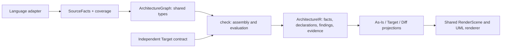

# UML model target

Status: shared types, generated schema, strict codecs and source and Target producers exist.
Core authenticates Target intent and evaluates it against recorded facts and coverage.
As-Is modules and Contract 2.2 Target/Diff entities use the shared UML renderer (AD-160).
Legacy component and physical intent uses the same authenticated graph producers (AD-167).
Global API intent retains declaration IDs, selectors and provenance (AD-168).
Legacy permission scenes retain shared identities and component details (AD-169).
The browser consumes one versioned `ArchitectureReport` (AD-179). It contains
independent observed/Target graphs, recorded Core comparison and findings,
component ownership references and existing open dependency decisions.
As-Is, Target and Diff share one scene projector and renderer. File paths come
from module entities and explicit Target inventories; no file-to-namespace guess.
External dependency permissions retain the same dataclass as the contract.
Conditional definitions retain typed control-flow contexts and unproven bindings (AD-170).
Direct call-result assignments retain static binding sites and construction evidence (AD-171).
Replaced Python projections are removed. Missing source capabilities stay open.
Extends the source-facts/Core boundary implemented in [PR #282](https://github.com/rapiddweller/archkeel/pull/282).

The standard is [the immutable dataclasses](../../src/archkeel/ir/architecture_graph.py).
[The JSON Schema](../../schema/architecture-graph.schema.json) is generated with
`make architecture-graph-schema`; do not edit it by hand.
`ArchitectureGraph.validate()` checks identities, references, containment, evidence and resolution.
Schema validation checks JSON types and allowed fields. Neither check evaluates architecture intent.
The graph is derived from canonical records or an independent contract.
It is not a second persisted observation. Core's contract values already use the shared entity,
relationship, signature and visibility types. Their declared type boundary exports only these
used dataclasses and graph producers. Render internals remain private.

## Goal and current gaps

Explore components → packages/modules → classes/interfaces → operations and static bindings.
As-Is and Target use the same element vocabulary and renderer. Diff compares their evidence.
Visibility, responsibilities, signatures and relationship direction remain inspectable.
Overview stays compact; drill-down reveals detail without visible scrollbar tracks.
Per-card heights and balanced columns improve large levels. Dense observed graphs
still need a clearer overview; Fit alone cannot keep every full UML card readable.
The existing Focus control narrows all three UML views to one entity and its direct
neighbors, with subset counts and stable reset/navigation (AD-174). It changes no
graph or Core verdict. Large neighborhoods still need clearer structure.
The UML legend separates relationship kinds using the same scene filter in each
view (AD-175). Details and Diff status remain complete; hidden edges have no hit
areas. Without Focus, type filtering retains every element at the current level.
Element-kind filtering shows matching cards and connections with two visible
endpoints (AD-177). It retains complete counts, evidence, Core status and saved
navigation. Focused own calls and class inventories have native routing and readability
checks. This does not prove clean routing for every complete graph.

The Python observation already records class kinds, fields, methods, annotations, bases,
imports, calls and references. This is static evidence, not an execution trace.
The removed `render.flow` folded methods into class names and joined calls/references into
symbol-use edges. The explorer uses the standard graph instead. Classes/interfaces show
attributes and operations; drill-down retains typed calls/imports/references, outside endpoints,
resolution and source sites. Contract 2.2 Target and Core Diff use the same renderer.
Diff displays Core assessments, known unlisted definitions and relationships (AD-165).
Observed-only interiors retain source identity and use the same renderer (AD-166).
Legacy Target component details and permissions now read the authenticated graph.
The report reads that graph once. Shared cards retain its roles and permissions;
each repeated permission remains selectable.
Repeated permissions retain separate IDs and real component endpoints. Physical
Target navigation now reads the graph. The browser no longer consumes file aliases
or legacy scene payloads. Replaced Python projections are removed. Core retains one
authenticated legacy graph descriptor. It adds no UML conformance rule or verdict.
Global `public_api` selectors use `PublicAPIEntry` in the same graph. Source-derived
exposed types stay outside independent Target intent. Selectors define no UML kind,
signature or language visibility; shared Target and Diff Details show them at root.
Inside contracts still reject global API declarations. Missing provenance remains an error.
Python operation facts now retain parameter order, kinds and unevaluated defaults.
Visibility records distinguish naming conventions from access rules; `__init__` is not private.
Private class-body annotations are recorded separately from the existing public API inventory.
Definitions, lexical parents, callers and repeated annotated attributes retain their source-site IDs.
Direct nested functions and local classes are recorded. Same-name declarations are never merged in the graph.
Definitions inside `if`, loops, `try`, `with` and `match` retain ordered control-flow contexts.
Their callers keep exact definition IDs. Calls and references retain conditional targets as candidates.
Core reports UNKNOWN for their Target availability and endpoints until binding is proven.
Legacy contract rules retain their conservative direct-definition view. Conditional classifier roles
and exhaustive inventory capabilities remain open. Local declarations do not become function
attributes or unused-symbol candidates merely because the resolver cannot bind them.
A class implementing a Protocol stays a class; a subprotocol needs an explicit `Protocol` base
([Python typing specification](https://typing.python.org/en/latest/spec/protocol.html#merging-and-extending-protocols)).
The [render contract](contracts/render.json) defines HTML, summary and terminal
responsibilities and their dependency direction. HTML serializes the shared report;
the browser projects its scenes. Existing `public`, `planned`, `requires` and module
targets retain their semantics. Contract 2.2 adds inner UML intent through `declarations.uml`.
The `bindings` collector reports unread names. Direct call-result assignments now publish
static binding sites through existing call records. They retain initializer syntax,
lexical parents, annotations, contexts and evidence. Direct stable class names with default
constructors can establish a nominal result type; qualified accesses and other known
class calls retain candidates. Factories,
custom initialization and attribute storage do not prove instance types. The full binding
and instance inventory stays partial. Runtime values and lifetimes are unobserved.
Dart and TypeScript currently collect imports/directives, not classes, methods or calls.
ArchKeel's IR Target declares the shared graph/report boundary: 17 immutable classes,
their annotated fields, public/private validation methods, producer/codec functions
and typed imports/calls/references (AD-173, AD-179). Eighteen class dependencies connect
the shared value types. These are independently authored design values.
Other IR helpers, the SourceFacts port and the remaining inner components still need
explicit Target definitions. This does not complete the whole repository's Target.

## Responsibilities

| Owner | Responsibility | Excludes |
| --- | --- | --- |
| Language adapter | Parse source; publish symbols, bindings, relationships, source locations and resolution limits | Target intent, rule evaluation, layout |
| `ir` | Shared types/schema, identity and reference validation, codecs and pure graph derivations | AST parsing, I/O, rule evaluation |
| `check` | Combine facts with independent contracts; evaluate existence, signatures, visibility, dependencies and coverage | Language AST interpretation, drawing |
| `render` | Project recorded evidence into RenderScene; navigation, shared UML notation, routing and focus | Inferring source facts, evaluating rules |

Arrows show data flow. Import dependencies remain `analyzer → ir`, `check → ir`,
`render → ir`; adapters receive no architecture contract. Main implements `ir.facts`, the process protocol and Core assembly (AD-148).
Python, Dart and TypeScript collect source facts; Core owns architecture verdicts.
`ir.source_graph.observed_graph()` currently normalizes existing observation records.
It preserves record IDs, evidence, call candidates, resolution limits and per-profile availability.
Recorded namespace groups use ownership edges; they do not become false lexical parents.
`ir.target_graph.declared_graph()` compiles Target without an observation. Both producers return
`ArchitectureGraph` with the same entity and relationship types. `ir.graph_codec` handles graph
JSON; `ir.codec` embeds the same types in contracts. `ir.facts.Evidence` owns the
shared evidence value; `ir.model.Evidence` remains a compatible export.
The Target graph projects components, `requires`, explicit UML intent and typed component intent.
`ArchitectureGraph.component_intents` retains roles, ownership selectors, namespace, published
and planned API selectors, excluded responsibilities, decider and inner contract (AD-161).
These declarations remain separate from language visibility and observed facts. A planned selector
does not invent a typed entity. Root Contract 2.2 module inventories and physical layout rules
now use graph fields (AD-162). The contract and graph share their immutable file/rule types
and validation. Core authenticates the existing declarations and records their IDs with UML
intent. The graph derives their contents; it stores no second contract copy. Target/Diff
display this intent in expandable details.
Allowed children do not require existence. Inventories retain undeclared versus explicitly empty;
file intent does not invent classes or calls. Global API selectors retain canonical
declaration IDs and independent provenance (AD-168). Their source-derived exposed
types stay outside Target. Legacy-only Target and explicit UML use the same report
boundary and browser renderer. HTML evidence tables retain the original Core result.
The existing SourceFacts port remains unchanged. Graph assembly and comparison stay
in Core; parsing stays in the adapters. Do not persist three copied graph models.

## Shared vocabulary

| Record | Required information |
| --- | --- |
| Entity | Stable ID, kind, language, qualified name, lexical parent ID, evidence/provenance and originating record IDs |
| Class/interface | Attributes, owned operations, explicit bases, abstract/static traits where supported |
| Operation | Method/function kind, ordered parameters and their kinds/defaults, return annotation, async/static/class traits |
| Visibility | `public/private/protected/package/unknown`, language spelling, basis: language rule/convention/explicit declaration/unknown |
| Global API intent | Canonical declaration ID, contract selector and independent provenance; separate from symbol kind and language visibility |
| Static binding | Lexical scope, binding name, assignment/creation site, candidate type IDs and resolution status |
| Relationship | ID, kind, source/target IDs or unresolved candidate targets, resolution status and evidence/provenance |
| Assessment | Rule ID, fact/declaration IDs, `PASS/FAIL/UNKNOWN` and reason; separate from source resolution |
| Coverage | Capability and scope, supported/complete/partial/unavailable status with evidence of limits |

Entity kinds: component, package, module, class, interface, enum, method, function,
attribute, type alias, constant, binding and an unclassified referenced symbol.
Preserve existing record IDs. A qualified name is not a unique definition-site ID:
overloads and package initializers can share it. Display labels never identify nodes.
New Python records publish definition-site parents and caller IDs. Legacy snapshots with
ambiguous names are rejected rather than assigned to an arbitrary definition.
Same-name target definitions remain candidates; a name-level resolution does not select a definition.
Candidate totals count definition sites. A truncated name list cannot establish that total;
the graph retains truncation and leaves the total unknown. Original counts remain in the cited record.
Moves without an explicit mapping stay unmatched.
Aggregate relationship comparisons by kind and endpoint identities; retain every cited call/import site.

Lexical containment has one source: `parent_id`. Do not duplicate it as a relationship.
Architectural containment uses `ComponentIntent.parent_id`; it references the actual
outer component ID. Component labels and namespaces do not identify parents.
Its layout references assign rules to the component that declares the inside contract.
Relationships stay distinct: imports, calls, references, inherits, realizes, creates,
instance-of, ownership, requirements and publication. A declared `requires` permission remains separate from an observed
import or call. A partial call's candidates never become confirmed calls. An unresolved call
retains its expression and source even when it has no drawable target.
Both Target producers derive `requires` from existing component declarations (AD-164).
Typed `through` selectors, rationale, provenance and the effective decider survive projection.
Core authenticates their contents. Existing dependency rules evaluate permissions; UML
comparison and completeness cannot evaluate them again. Target/Diff Details labels them as
allowed imports, separate from mandatory UML calls. Reordering does not change identity.
Python class facts now retain each explicit base expression and its evidence (AD-181).
Stable direct module bindings can prove a classifier edge. Repeated definitions, lexical
lookup, replaced classes, unknown external kinds and custom generic origins stay uncertain.
Explicit implementation of a known Protocol records `realizes`; subprotocols record `inherits`.
Each recorded class has base-list coverage. The module's classifier inventory stays partial.
Core uses the nearest covering receipt and preserves descendant limits. Legacy base names
do not certify typed relationships. Child receipts cannot certify an unmeasured parent
inventory. Core must not infer realization from matching signatures.
An import or annotated field proves no composition. Recorded constructor and assignment
sites project to `creates` and `instance_of`; both retain the original call evidence.
Lexical resolution uses compiler scopes and conservatively retains ambiguity.
Broader instance typing and exhaustive inventory coverage remain open.

## Visibility and static instances

Show UML visibility on attributes and operations: `+ public`, `− private`, `# protected`,
`~ package`. Use `?` when undetermined. Language visibility and component API membership
are separate: `public`/`planned` declarations keep their current independent meaning.
For Python, a leading underscore is a naming convention; name mangling is not access control.
Special methods such as `__init__` must not become private merely because they start with `_`.
Declared intent can disagree with observed spelling/export usage; keep both and assess the rule.

A static binding describes a source site, not a live object's identity or lifetime.
An annotation alone does not prove construction. Rebinding, factories, metaclasses and
ambiguous constructor results retain candidate types/UNKNOWN; never merge all values of one class.
No tracing subsystem is needed for this scope.

## Target completeness and UML views

Contract 2.2 accepts `declarations.uml`: a versioned `TargetDefinition` containing shared entities,
typed relationships and scopes. Existing components own component IDs; UML declarations reference
them through `parent_id` and cannot redeclare them. Planned entities require responsibility and
provenance. Referenced entities describe external endpoints. Target cannot assert observed evidence,
record IDs, call resolution or candidates. [The tests](../../tests/test_target_graph.py) include a
complete independently authored class, interface, method and realization example.

`make architecture-graph-schema` generates both the graph schema and the contract's UML section.
Contract 2.1 remains readable and keeps its encoded bytes and digest. Adding UML requires explicit
version 2.2; old consumers can reject it instead of silently ignoring new intent.

Core reads the declaration revision and verifies its digest before retaining UML intent in the
canonical observation. Repeated assembly is idempotent; conflicting adapter content is rejected.
Core rejects invented adapter declarations and altered owner metadata. Evaluation is pure policy:
`check.uml_compare` compares graphs; `check.uml_evaluation` records its result through the existing
rule receipts, violations and UNKNOWN records. No second verdict pipeline or adapter policy is added.
Repeated evaluation is idempotent; conflicting receipt content is rejected.
`uml_target` is an implicit conformance rule for `declarations.uml`, not another rule authoring syntax.
The [comparison dataclasses](../../src/archkeel/ir/architecture_graph.py) and
[generated schema](../../schema/architecture-comparison.schema.json) retain Target subjects,
definition/call-site IDs, fact IDs, source evidence, status and reason.
Core retains Target-to-observed entity correspondences from its existing matching.
Ambiguous matches remain explicit; they add no verdict. Diff uses these IDs and recorded
parents to place unlisted relationship endpoints. It never matches names in the renderer.
Grouped edges retain every observed site and its source graph. Details shows Core receipts.
Diff can open observed-only classes and operation call graphs. Navigation retains graph
origin and entity ID; tab changes do not copy them into Target. Source interiors read
Core receipts by observed IDs. Missing assessments stay explicitly unassessed; unresolved
sites stay in Details without invented endpoints or PASS.

Known kind, signature, visibility or parent conflicts fail. Missing entities/edges fail only with
complete inventory and relevant resolution. Repeated definition sites stay ambiguous. Call candidates
cannot satisfy a required call. Closed scopes reject known extras; partial child coverage or unresolved
sites prevent PASS. Unknown traits and unavailable classifier/instance facts stay UNKNOWN.
Signatures compare recorded syntax, including parameter order, kinds and unevaluated defaults.
They do not prove equivalent types. Python method signatures include `self`/`cls`; Target must name them.
An empty Target reports UNKNOWN. Existing `requires` permissions remain separate from mandatory calls.
Nested Contract 2.2 UML declarations compile into one authenticated root target (AD-163).
Outer contracts can remain 2.1. Core retains scoped declaration IDs, component parents,
labels, file inventories and layout ownership. Missing inputs or changed references fail
authentication. Target/Diff drill-down uses the same renderer at every declared UML level.
The existing widening gate conservatively flags any UML declaration change. Removal, an opened
scope or a changed signature cannot quietly weaken accepted intent.

Target completeness is explicit per scope and kind: unspecified, open or closed.
Open scopes list known intentions; closed scopes additionally require every observed entity/edge
of the named kinds to be covered. Missing evidence cannot prove closed-scope conformance.
Generate a proposal from As-Is only as a draft; never install it automatically as its own oracle.

Use package/component overview, class/interface compartments, operation call graphs and
static-binding detail as levels of one explorer. UML dependencies use directed dashed lines,
inheritance uses a solid line/hollow triangle, explicit realization a dashed line/hollow triangle.
Label source-code imports and static calls distinctly; they are not UML runtime messages.
Composition/aggregation requires declared or sufficient evidence of the corresponding semantics.
Physical layout constraints belong in the structure view/Details, not among call dependencies.
Selection highlights only its visible connected neighborhood. Every hit area belongs to a visible
element; arrow endpoints and routes share geometry. No separate As-Is/Target renderer.

Notation reference: [OMG UML 2.5.1](https://www.omg.org/spec/UML/2.5.1/PDF).

## Delivery and acceptance

1. Done: immutable graph types, generated schema, reference validation and source-record projection.
2. Done: Python parameter kinds/defaults, structured visibility and private annotated attributes.
3. Done: independent Target entity/operation declarations, open/closed scopes and strict codecs.
4. Done: Core existence, signature, visibility, edge and completeness assessments with typed comparison categories.
5. Done: Python definition-site parents/callers, direct nested definitions and attribute evidence.
6. Done: explicit Python inheritance and Protocol realization with binding limits and local coverage.
7. Done: conditional inventory and direct call-result binding sites. Open: complete lexical binding proof, explicit inventory capabilities and broader instance typing.
8. Implemented: one report schema and UML renderer for all views. Replaced Python projections are removed; Core and browser acceptance use the shared graph.
9. Done: compile nested explicit UML into one target and retain physical declaration ownership.
10. Done: retain authenticated dependency permissions in both Target producers without a second policy owner.
11. Partial: independently declare the own graph boundary's classes, fields, methods and functions. Other component interiors remain open (AD-173).

Core intake and assessment are implemented. Current source coverage is partial
for attributes, classifier inventories and static instances. Explicit base lists retain per-class
coverage. Direct constructor and call-result assignment facts exist; other binding forms stay open.
Legacy parameter details remain unknown. These are gaps, not PASS.
The legacy symbols section does not certify an exhaustive lexical inventory. Its reference collector
omits unresolved and external uses. Both remain partial until the SourceFacts port supplies explicit capabilities.

Each increment needs positive/negative proofs: identical local labels in different modules,
private/public and Python special methods, call/reference distinction, partial/unresolved calls,
missing versus unavailable entities, rebinding, cyclic/self edges and absent Target declarations.
Round trips preserve identities and evidence; snapshots never alter verdicts. Old contracts and
profiles remain readable and cannot claim support for newly unavailable fact kinds.

## Working rules

KISS, SPOT, DRY for knowledge, separation of concerns, YAGNI and Ponytail apply to this work.
Reuse records, evidence and existing Make targets. No policy or layout in adapters.
No guessed interface realization, runtime object identity or composition.
Ship small coherent steps with positive and negative proofs. Report local and CI evidence separately.
Docs use Alex Voice: engineering language, straight and simple.
