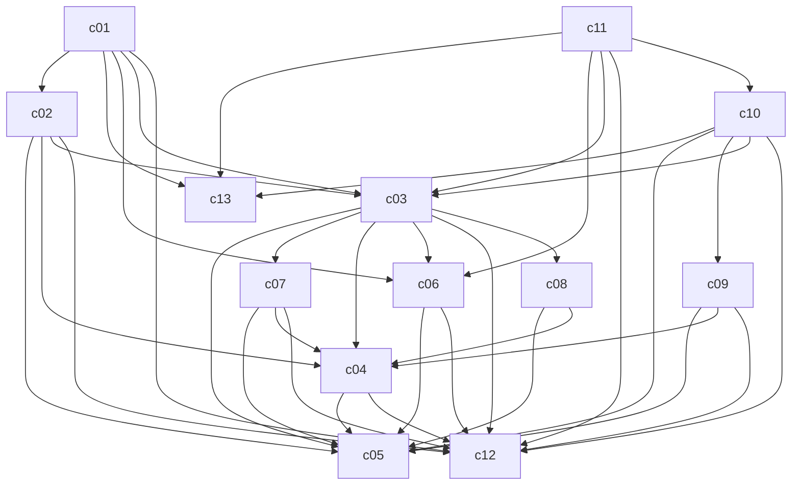

# svc architecture

Generated by `archkeel init` from observed imports. Replace every TODO with the
owner's intent, then run `archkeel validate`.

| Component | Package | Responsibility |
|---|---|---|
| `c02` | `svc.c02` | HTTP edge with routers and request dependency wiring. |
| `c13` | `svc.c13` | Settings surface. |
| `c05` | `svc.c05` | Domain model with plain objects, enums and invariants. |
| `c07` | `svc.c07` | Compute adapter A. |
| `c01` | `svc.c01` | HTTP composition root. |
| `c09` | `svc.c09` | Pipeline executor adapters. |
| `c11` | `svc.c11` | Outbox publisher process entry point. |
| `c04` | `svc.c04` | Port interfaces that adapters implement. |
| `c06` | `svc.c06` | Persistence adapter. |
| `c03` | `svc.c03` | Application layer implementing the command and query ports. |
| `c12` | `svc.c12` | Shared kernel with clock, errors and identifier types. |
| `c08` | `svc.c08` | Compute adapter B. |
| `c10` | `svc.c10` | Background worker process entry point. |

<!-- archkeel-component-graph -->

