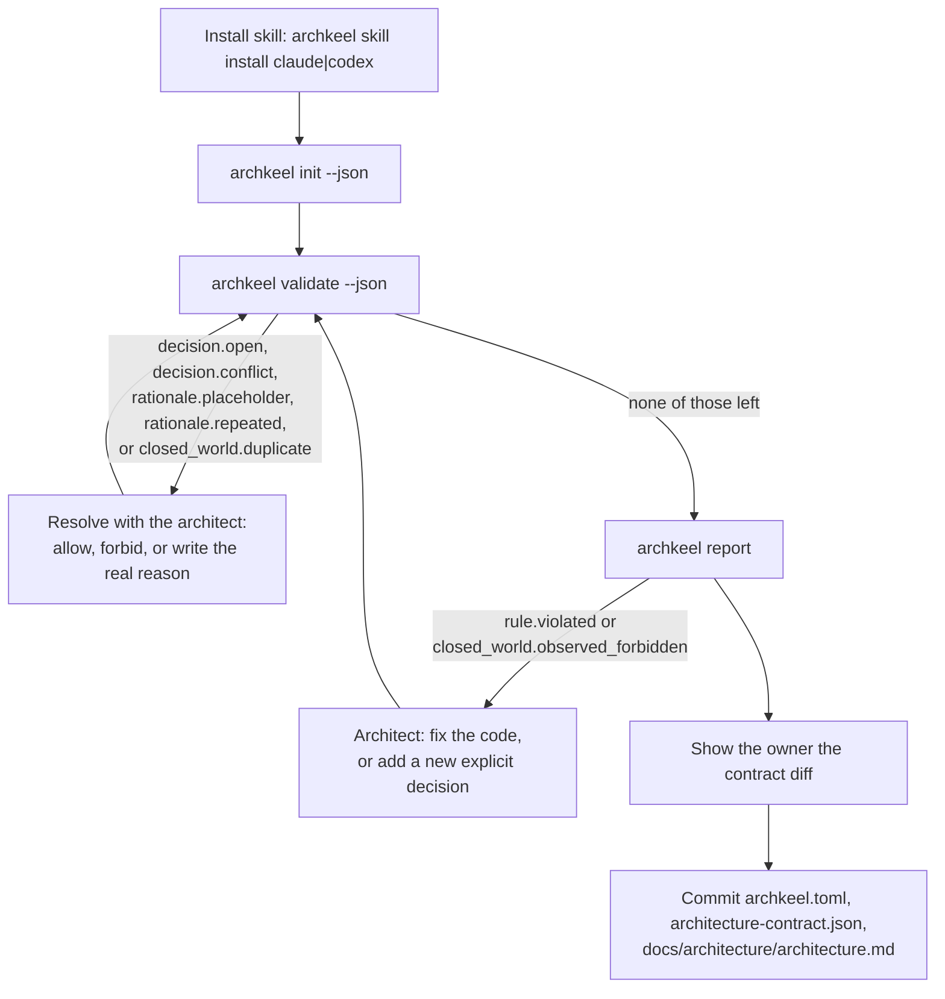

# Onboarding a repository with Archkeel

`architecture-contract.json` is the target architecture: where the system should be, not a
description of where the code already is. `archkeel report` measures the code's distance
from that target as violations. The architect owns the target and chooses how deep to
review it now; the agent supports with best practice, evidence from the repository, and the
architect's quality goals for this codebase — which components must scale, stay easy to
change, or are performance-critical. The agent reads those goals from ADRs and architecture
documents first, and asks the architect only when a goal is unknown and would change a
recommendation; every recommendation and rationale it writes cites the goal it rests on.
There is no contract field for a quality goal — it lives in the rationale, next to the rule
it justifies.

`archkeel init` writes a first draft of the contract's structure from what the code already
does, deciding no dependency; every rule it drafts carries `decided_by: "agent"` as a
placeholder, not an answer. From there, the architect picks one of two modes:

- **Interview mode** — the agent asks, the architect decides. Every decision the architect
  makes is written `decided_by: "architect"`. Best for a first pass on a repository whose
  boundaries matter enough to review now.
- **Auto mode** — the agent decides every open decision itself, from documents and
  confirmed layer principles first, judgment last, and writes `decided_by: "agent"`. Best
  for a fast first target; a later interview can revisit only the agent's decisions.

This page is the loop for interview mode, and the prompt to hand a coding agent to run it.
Auto mode runs the same commands without the human back-and-forth: the agent fills every
open decision itself, in the evidence order above, and ends with a summary of its decisions
by basis (document, layer principle, judgment) with the lowest-confidence ones named first.

`make demo-onboarding` runs the loop end to end on the two-level shop sample in
`fixtures/F-architecture`, one real command per step: what `init` drafts, why `validate`
refuses that draft, what the architect answers, how the report asks for a second level, and
what the gate says when a later edit crosses a boundary inside it. No agent runs there and
none is simulated; the decisions are this repository's committed ones, replayed, and a test
holds every printed number to what the commands answer.

## The onboarding loop (interview mode)



## Prompt for your coding agent

```text
Install the Archkeel skill for yourself, then onboard this repository:

1. Run `uvx archkeel skill install claude` (or `codex`, matching yourself).
2. Run `uvx archkeel init --json`. It drafts components and `public` interfaces and decides
   no dependency rule; every ordered component pair is `init --json`'s open decision for you
   to ask me about. Every drafted rule carries `decided_by: "agent"` as a placeholder.
3. Read this repository's ADRs and architecture documents before proposing anything.
   Propose the overall picture — components, layers, and the allowed directions between them
   — with `path:line` evidence for each claim, and ask me to confirm the whole picture once,
   not component by component. Review each drafted `public` list with me too. Anything you
   read from documentation is a hypothesis with its source, never the answer, until I
   confirm it.
4. After I confirm the picture, ask only about conflicts (the code contradicts a document)
   and gaps (the documents are silent). Each question names your recommended option first,
   with its evidence. Work through the open decisions heaviest observed edge first: ask
   allow, forbid, or something else, with my reason in my own words, then write the exact
   rule object from that decision's JSON `options` into architecture-contract.json with my
   reason and `"decided_by": "architect"`. Never invent a reason, and never pick allow or
   forbid yourself. Batch everything consistent with the confirmed picture into one
   confirmation instead of asking pair by pair.
5. When I choose against your recommendation, ask why before writing the rule. Always ask
   when my choice contradicts a document, an earlier decision in this interview, or the code
   you observed. Write my answer as the rationale.
6. Run `uvx archkeel validate --json` and read every diagnostic by its `code`, never by its
   message text: `decision.open` needs an allow or forbid decision from me (back to step 4);
   `decision.conflict` or `closed_world.duplicate` means the pair has more than one decision,
   keep exactly one; `rationale.placeholder` or `rationale.repeated` needs the real reason in
   my words. A `graph.drift` is no decision: after a component merge or rename, run
   `uvx archkeel validate --write-graph`, which rewrites only the marked graph's edges, or edit
   them by hand where the remedy says the graph holds structure the command does not rewrite.
7. The interview ends when none of those five codes remain in `validate --json` — not when
   it exits 0. If it still exits 2 with `rule.violated` or `closed_world.observed_forbidden`,
   the code still uses an edge I just decided against: show it to me with `archkeel report`.
   I resolve it by changing the code or by a new explicit decision (for example allowing the
   edge instead). Never edit or delete the rule yourself, and never keep looping
   `archkeel validate --json` waiting for exit 0.
8. If I delegate a choice ("whatever is consistent" or similar), derive it only from my
   earlier decisions in this interview, never from your own judgment. Label it agent-derived
   in your summary to me and list it for me to confirm.
9. Once the interview ends, run `uvx archkeel report` and show me the diff of the three
   generated files before committing anything. A remaining `rule.violated` or
   `closed_world.observed_forbidden` is follow-up code work, not a reason to hold the commit.
```

AD-15 makes onboarding a decision interview: `init` proposes components and interfaces, never a
dependency rule; the code proposes, the architect decides. AD-16 adds auto mode alongside it,
and `decided_by` on every rule so a later interview can find exactly the decisions the agent
made without the architect.

## What gets written

| File | Content | Who decides the content |
|---|---|---|
| `archkeel.toml` | Scan roots, namespace, contract path. | Deterministic from detection. |
| `architecture-contract.json` | Components, `complete_assignment`, `no_component_cycles` when acyclic, `interface_boundary` when any component has a `public` list. No `allowed_dependency` or `forbidden_dependency`: every component pair stays an open decision. Every drafted rule carries `decided_by: "agent"`. | Structure is deterministic; every rule `rationale`, every pair's allow/forbid decision, and who decided it, needs a human — either directly (interview mode) or by reviewing the agent's summary later (auto mode). |
| `docs/architecture/architecture.md` | Component table with each component's modules and inner edges, and a marked Mermaid graph of observed edges. | Deterministic from the observation; after a contract edit, `validate --write-graph` rewrites the graph's edges and leaves the rest of the page alone, unless the block holds a `subgraph`, a labeled edge or a style, which it leaves to a hand edit. |

`init` also proposes AD-9 `public` entries: a component with inbound cross-component imports
gets a `pkg.module` entry when the target module declares `__all__` or other components use at
least half of its public names, and a `pkg.module:Name` entry per used name otherwise. A
component nobody imports across the boundary gets no `public` key. Whenever any component
receives a `public` entry, `init` also drafts an `interface_boundary` rule with a `TODO:`
rationale, the same placeholder convention as the other drafted rules: a human still decides
why crossing imports must go through the declared interface, not `init`.

## Determinism

**Deterministic (`init` computes these from the repository, not from judgment):**
- Package and namespace detection: the only top-level package, or, when several sit side by
  side, the one whose name matches `pyproject.toml`'s `[project] name` (AD-47). Anything else
  exits 2 with `scope_empty` and asks for `--source` and `--namespace`; it never picks one.
- The set of observed import edges between components, and their import-site counts.
- Each drafted component's module count and inner edges, carried in the component table and
  under `draft_sizes` in `init --json`, with the largest one named in the terminal summary.
- The ordered pair, source and target package, and observed/import-site facts of every
  open decision `init --json` and `validate --json` report — but never which of them is
  allowed or forbidden.

**Needs human judgment (an agent must not guess these):**
- Whether a `TODO:` rationale is architecturally correct, not just present.
- Whether an observed edge is intended, and whether an unobserved pair should stay
  forbidden or be allowed for later — `init` reports the fact, never the intent behind it.
- Whether a rule the architect chose to forbid, but the code still crosses, is fixed by
  changing the code or by a new explicit decision. An agent never resolves it by editing or
  deleting the rule, and the interview's end is not the same as `validate --json` exiting 0:
  a genuinely forbidden observed edge can keep `validate` at exit 2 indefinitely, correctly.

The interview ends when `validate --json` reports none of `decision.open`,
`decision.conflict`, `rationale.placeholder`, `rationale.repeated` or
`closed_world.duplicate` — never by looping on the exit code, and never by weakening a
rule to reach it. A `rule.violated` or `closed_world.observed_forbidden` diagnostic after
that point is the architecture's own finding, shown with `archkeel report`, not an
onboarding step.

**Auto mode's evidence discipline (an agent must still not guess):** documents first, then
the layer principles the architect already confirmed or the documents state, then judgment
labeled as judgment in the rationale — never "the code already does this, so it is allowed."
`validate --json` and `report --json` carry `agent_decisions: [agent, total]`, counting one
rule declaration, one `requires` entry and one declared `public` list alike (AD-50); a nonzero
first value means decisions an interview has not yet reviewed, and the terminal and HTML
summaries say so as "N of M decisions made by the agent, awaiting the architect."

Every ordered component pair is a decision, made exactly once, by one `allowed_dependency`
rule or one `forbidden_dependency` rule with the architect's rationale; `validate` reports an
undecided pair as `decision.open`, naming whether it is observed and at how many import
sites. It also rejects `TODO:` placeholders; it cannot verify the judgment behind a
rationale, only that one was written.
