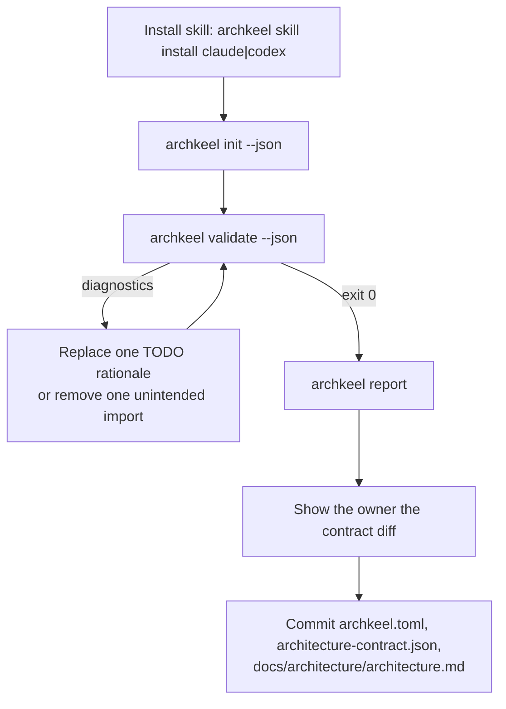

# Onboarding a repository with Archkeel

Archkeel observes your Python imports and checks them against a contract you own. `archkeel
init` writes a first draft of that contract from what the code already does; a human (or a
coding agent, guided by a human) still has to decide what each rule means and whether each
observed import is intentional. This page is the loop for doing that once, and the prompt to
hand a coding agent to run it.

## The onboarding loop



## Prompt for your coding agent

```text
Install the Archkeel skill for yourself, then onboard this repository:

1. Run `uvx archkeel skill install claude` (or `codex`, matching yourself).
2. Run `uvx archkeel init --json`.
3. Run `uvx archkeel validate --json` and work through every diagnostic in order.
   Each diagnostic names a JSON Pointer into architecture-contract.json.
4. Replace every `TODO:` rationale with the real architectural reason for that rule.
   Never invent a rationale — if you do not know why a rule exists, ask me.
5. Show me every edge in the Mermaid graph of docs/architecture/architecture.md.
   Keep the generated forbidden_dependency rules. If I call an edge unintended,
   remove that import in the code and add the forbidden_dependency rule for the pair.
6. Repeat steps 3-5 until `archkeel validate --json` exits 0. It exits 0 only once every
   ordered component pair carries an `allowed_dependency` or a `forbidden_dependency` rule
   with a real rationale, not just an observed import.
7. Run `uvx archkeel report` and show me the diff of the three generated files before
   committing anything.
```

AD-15 records onboarding as a decision interview: `init` output is planned to ask about each
undecided pair directly instead of drafting a `forbidden_dependency` rule for every unobserved
one.

## What gets written

| File | Content | Who decides the content |
|---|---|---|
| `archkeel.toml` | Scan roots, namespace, contract path. | Deterministic from detection. |
| `architecture-contract.json` | Components, `forbidden_dependency` per unobserved pair, `complete_assignment`, `no_component_cycles` when acyclic. | Structure is deterministic; every rule `rationale` needs a human. |
| `docs/architecture/architecture.md` | Component table and a marked Mermaid graph of observed edges. | Deterministic from the observation. |

`init` also proposes AD-9 `public` entries: a component with inbound cross-component imports
gets a `pkg.module` entry when the target module declares `__all__` or other components use at
least half of its public names, and a `pkg.module:Name` entry per used name otherwise. A
component nobody imports across the boundary gets no `public` key. Whenever any component
receives a `public` entry, `init` also drafts an `interface_boundary` rule with a `TODO:`
rationale, the same placeholder convention as the other drafted rules: a human still decides
why crossing imports must go through the declared interface, not `init`.

## Determinism

**Deterministic (`init` computes these from the repository, not from judgment):**
- Package and namespace detection.
- The set of observed import edges between components.
- Which component pairs have no observed edge today, and therefore get a draft
  `forbidden_dependency` rule.

**Needs human judgment (an agent must not guess these):**
- Whether a `TODO:` rationale is architecturally correct, not just present.
- Whether an observed edge is intended — `init` cannot tell intent from accident. An
  unintended edge is removed in the code, then forbidden in the contract.

Closed world keeps the contract complete: every component pair is either observed or
forbidden, so validate rejects a deleted rule for an unobserved pair. It also rejects `TODO:`
placeholders; it cannot verify the judgment behind a rationale.
