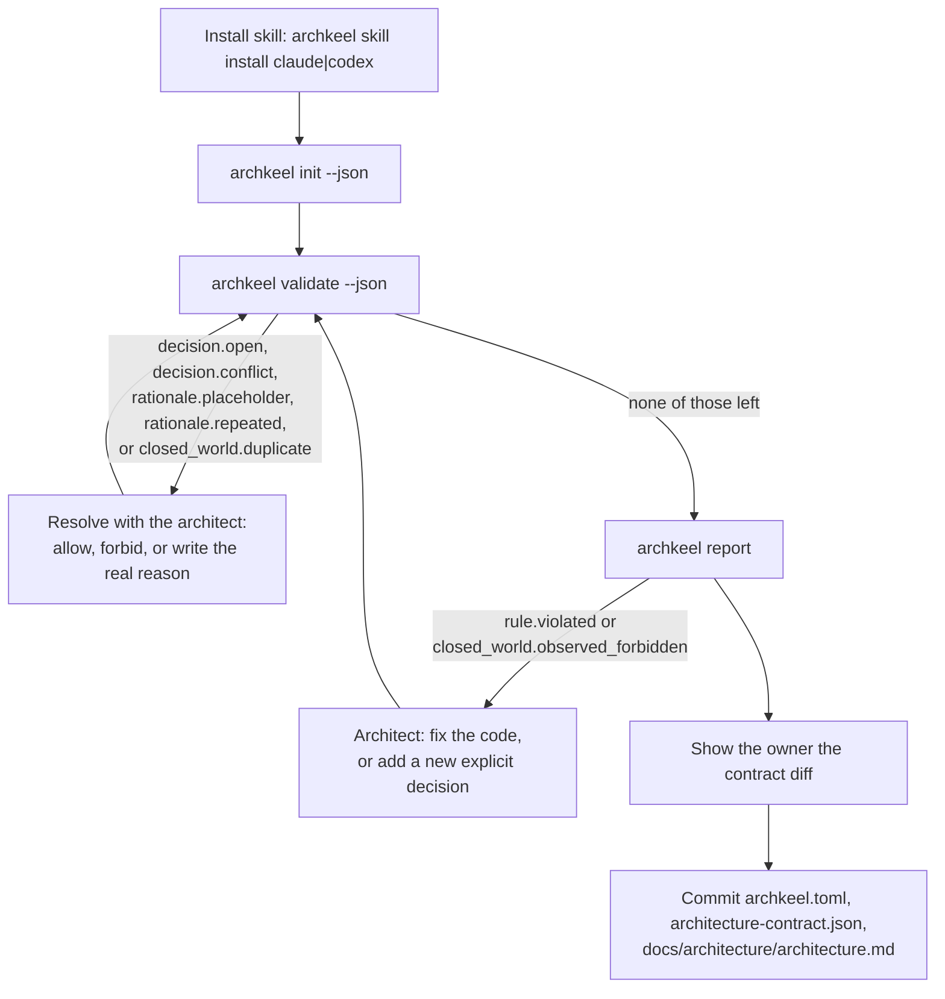

# Onboarding a repository with Archkeel

Archkeel observes your Python imports and checks them against a contract you own. `archkeel
init` writes a first draft of that contract from what the code already does; a human (or a
coding agent, guided by a human) still has to decide what each rule means and whether each
observed import is intentional. This page is the loop for doing that once, and the prompt to
hand a coding agent to run it.

## The onboarding loop



## Prompt for your coding agent

```text
Install the Archkeel skill for yourself, then onboard this repository:

1. Run `uvx archkeel skill install claude` (or `codex`, matching yourself).
2. Run `uvx archkeel init --json`. It drafts components and `public` interfaces and decides
   no dependency rule; every ordered component pair is `init --json`'s open decision for you
   to ask me about.
3. Confirm the drafted components with me: keep, merge, split, or something else.
4. Review each drafted `public` list with me.
5. Work through the open decisions with me, heaviest observed edge first. For each: ask
   allow, forbid, or something else, with my reason in my own words, then write the exact
   rule object from that decision's JSON `options` into architecture-contract.json with my
   reason. Never invent a reason, and never pick allow or forbid yourself. Offer me one
   decision for every remaining unobserved pair of a component once we agree on its shape.
6. Run `uvx archkeel validate --json` and read every diagnostic by its `code`, never by its
   message text: `decision.open` needs an allow or forbid decision from me (back to step 5);
   `decision.conflict` or `closed_world.duplicate` means the pair has more than one decision,
   keep exactly one; `rationale.placeholder` or `rationale.repeated` needs the real reason in
   my words.
7. The interview ends when none of those five codes remain in `validate --json` — not when
   it exits 0. If it still exits 2 with `rule.violated` or `closed_world.observed_forbidden`,
   the code still uses an edge I just decided against: show it to me with `archkeel report`.
   I resolve it by changing the code or by a new explicit decision (for example allowing the
   edge instead). Never edit or delete the rule yourself, and never keep looping
   `archkeel validate --json` waiting for exit 0.
8. If I delegate a choice ("whatever is consistent" or similar), derive it only from my
   earlier decisions in this interview, never from your own judgment. Label it agent-derived
   in your summary to me and list it for me to confirm.
9. Once the interview ends, run `uvx archkeel report` and show me the diff of the three
   generated files before committing anything. A remaining `rule.violated` or
   `closed_world.observed_forbidden` is follow-up code work, not a reason to hold the commit.
```

AD-15 makes onboarding a decision interview: `init` proposes components and interfaces, never a
dependency rule; the code proposes, the architect decides.

## What gets written

| File | Content | Who decides the content |
|---|---|---|
| `archkeel.toml` | Scan roots, namespace, contract path. | Deterministic from detection. |
| `architecture-contract.json` | Components, `complete_assignment`, `no_component_cycles` when acyclic, `interface_boundary` when any component has a `public` list. No `allowed_dependency` or `forbidden_dependency`: every component pair stays an open decision. | Structure is deterministic; every rule `rationale`, and every pair's allow/forbid decision, needs a human. |
| `docs/architecture/architecture.md` | Component table and a marked Mermaid graph of observed edges. | Deterministic from the observation. |

`init` also proposes AD-9 `public` entries: a component with inbound cross-component imports
gets a `pkg.module` entry when the target module declares `__all__` or other components use at
least half of its public names, and a `pkg.module:Name` entry per used name otherwise. A
component nobody imports across the boundary gets no `public` key. Whenever any component
receives a `public` entry, `init` also drafts an `interface_boundary` rule with a `TODO:`
rationale, the same placeholder convention as the other drafted rules: a human still decides
why crossing imports must go through the declared interface, not `init`.

## Determinism

**Deterministic (`init` computes these from the repository, not from judgment):**
- Package and namespace detection.
- The set of observed import edges between components, and their import-site counts.
- The ordered pair, source and target package, and observed/import-site facts of every
  open decision `init --json` and `validate --json` report — but never which of them is
  allowed or forbidden.

**Needs human judgment (an agent must not guess these):**
- Whether a `TODO:` rationale is architecturally correct, not just present.
- Whether an observed edge is intended, and whether an unobserved pair should stay
  forbidden or be allowed for later — `init` reports the fact, never the intent behind it.
- Whether a rule the architect chose to forbid, but the code still crosses, is fixed by
  changing the code or by a new explicit decision. An agent never resolves it by editing or
  deleting the rule, and the interview's end is not the same as `validate --json` exiting 0:
  a genuinely forbidden observed edge can keep `validate` at exit 2 indefinitely, correctly.

The interview ends when `validate --json` reports none of `decision.open`,
`decision.conflict`, `rationale.placeholder`, `rationale.repeated` or
`closed_world.duplicate` — never by looping on the exit code, and never by weakening a
rule to reach it. A `rule.violated` or `closed_world.observed_forbidden` diagnostic after
that point is the architecture's own finding, shown with `archkeel report`, not an
onboarding step.

Every ordered component pair is a decision, made exactly once, by one `allowed_dependency`
rule or one `forbidden_dependency` rule with the architect's rationale; `validate` reports an
undecided pair as `decision.open`, naming whether it is observed and at how many import
sites. It also rejects `TODO:` placeholders; it cannot verify the judgment behind a
rationale, only that one was written.
