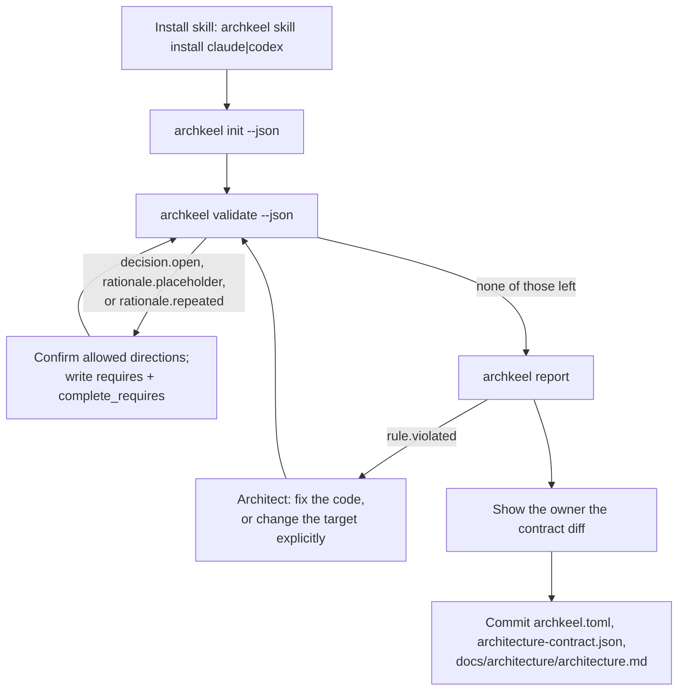

# Onboarding a repository with Archkeel

`architecture-contract.json` is the target architecture: where the system should be, not a
description of where the code already is. `archkeel report` measures declared constraints,
not the quality of the whole architecture. The architect owns the target and review scope;
the agent reviews that scope recursively, supported by evidence from the repository and the
architect's quality goals for this codebase — which components must scale, stay easy to
change, or are performance-critical. The agent reads those goals from ADRs and architecture
documents first, and asks the architect only when a goal is unknown and would change a
recommendation; every recommendation and rationale it writes cites the goal it rests on.
There is no contract field for a quality goal — it lives in the rationale, next to the rule
it justifies.

`archkeel init` writes a first draft of the contract's structure from what the code already
does. It drafts no dependency rules; it derives open component pairs from that structure.
Structural rules and proposed `public` lists may carry `decided_by: "agent"` as attribution,
not evidence of a human decision. The onboarding workflow then uses one of two modes:

- **Interview mode** — the agent asks, the architect decides. Every decision the architect
  makes is written `decided_by: "architect"`. Best for a first pass on a repository whose
  boundaries matter enough to review now.
- **Auto mode** — the agent authors decisions from documents and confirmed layer principles
  first, judgment last, and records `decided_by: "agent"`. This is an agent-authored target,
  not human approval; a later interview can revisit those decisions.

This page describes interview mode and includes a prompt for a coding agent. Auto mode is a
documented agent workflow, not a separate CLI mode: the agent fills each allowed direction in
the evidence order above, then summarizes decisions by basis (document, layer principle,
judgment), with the lowest-confidence ones first.

`make demo-onboarding` runs an INTERVIEW-MODE REPLAY on the two-level shop sample in
`fixtures/F-architecture`. It calls Archkeel command implementations and uses committed,
pre-approved contracts as decision fixtures; no live agent or architect approval occurs.
Seven steps show the top-level draft and refusal, the approved target and validation, the
oversized-component finding, a separate nested draft and approved target, and a later crossing
caught inside that level. A test holds each printed result to the command implementations.

## The onboarding loop (interview mode)


```mermaid
flowchart TD
    A["Install skill: archkeel skill install claude|codex"] --> B[archkeel init --json]
    B --> C[archkeel validate --json]
    C -->|"decision.open, rationale.placeholder,<br/>or rationale.repeated"| D["Confirm allowed directions;<br/>write requires + complete_requires"]
    D --> C
    C -->|none of those left| F[archkeel report]
    F -->|"rule.violated"| L["Architect: fix the code,<br/>or change the target explicitly"]
    L --> C
    F --> G[Show the owner the contract diff]
    G --> H["Commit archkeel.toml, architecture-contract.json,<br/>docs/architecture/architecture.md"]
```

## Prompt for your coding agent

```text
Install the Archkeel skill for yourself, then onboard this repository:

1. Run `uvx archkeel skill install claude` (or `codex`, matching yourself).
2. Inspect existing onboarding files and nested contracts first. Preserve them and continue
   from their decisions; do not force-overwrite them. For a new setup, run
   `uvx archkeel init --json`. It drafts components and `public` interfaces and decides
   no dependency rule; its ordered component pairs and import-site counts are evidence for the
   target, not decisions. Every drafted rule carries `decided_by: "agent"` as a placeholder.
3. Read this repository's ADRs and architecture documents before proposing anything.
   Review physical packages recursively within the agreed scope, including deep uncontracted
   folders. More than seven direct children triggers review, not an automatic split.
   Propose the overall picture — components, layers, and the allowed directions between them
   — with `path:line` evidence for each claim, and ask me to confirm the whole picture once,
   not component by component. Review each drafted `public` list with me too. Anything you
   read from documentation is a hypothesis with its source, never the answer, until I
   confirm it.
4. After I confirm the picture, ask only about conflicts (the code contradicts a document)
   and gaps (the documents are silent). Each question names your recommended option first,
   with its evidence. Work through the observed crossings heaviest first and batch everything
   consistent with the confirmed picture into one confirmation. Then encode each allowed
   direction as a `requires` entry on its source component, with my reason and
   `"decided_by": "architect"`, and add one `complete_requires` rule so every absent pair is
   forbidden. Never invent a reason or infer permission from an observed import.
5. When I choose against your recommendation, ask why before writing the rule. Always ask
   when my choice contradicts a document, an earlier decision in this interview, or the code
   you observed. Write my answer as the rationale.
6. Run `uvx archkeel validate --json` and read every diagnostic by its `code`, never by its
   message text: `decision.open` means the contract still lacks `complete_requires`;
   `rationale.placeholder` or `rationale.repeated` needs the real reason in my words. A
   `graph.drift` is no decision: after a component merge or rename, run
   `uvx archkeel validate --write-graph`, which rewrites only the marked graph's edges, or edit
   them by hand where the remedy says the graph holds structure the command does not rewrite.
7. The interview ends when those codes are gone — not when `validate --json` exits 0. If it
   still exits 2 with `rule.violated`, the code uses an edge the target does not allow: show it
   to me with `archkeel report`. I resolve it by changing the code or changing the target
   explicitly. Never edit the target yourself, and never keep looping
   `archkeel validate --json` waiting for exit 0.
8. If I delegate a choice ("whatever is consistent" or similar), derive it only from my
   earlier decisions in this interview, never from your own judgment. Label it agent-derived
   in your summary to me and list it for me to confirm.
9. Once the interview ends, run `uvx archkeel report` and show me the diff of the three
   generated files before committing anything. A remaining `rule.violated` is follow-up code
   work, not a reason to hold the commit. Record reviewed and deferred subtrees, justified
   exceptions and tool limits; green top-level rules do not complete a structural assessment.
```

AD-15 makes onboarding a decision interview: `init` proposes components and interfaces, never a
dependency rule; the code proposes, the architect decides. AD-16 documents auto mode, where an
agent authors decisions and `decided_by` lets a later interview find them; that attribution is
not human approval.

## Native skill installation

`archkeel skill install codex` writes `.agents/skills/archkeel/SKILL.md`;
`archkeel skill install claude` writes `.claude/skills/archkeel/SKILL.md`.
Both use the same packaged instructions. Reinstalling replaces the managed skill file.
Codex removes only the legacy marked Archkeel section from `AGENTS.md`. Other bytes remain
unchanged; malformed or duplicate markers fail before installation writes anything.
Use `$archkeel` in Codex or `/archkeel` in Claude Code. Start a new session if needed for discovery.

### Plugin bundle

From a checkout, export that same skill for team distribution:

```bash
make plugin OUTPUT=build/archkeel-plugin    # destination must not exist
```

The bundle and adjacent `.zip` contain portable `plugin.json`, a Claude compatibility manifest,
the skill, icon and license. Install the Archkeel CLI separately (`uv tool install archkeel`).
For local Claude testing, run `claude --plugin-dir ./build/archkeel-plugin`
and invoke `/archkeel:archkeel`.
For Codex, import the bundle through your host's supported local plugin source; availability
varies by surface. Native skill installation above is the direct repository setup path.

The bundle is an export, not a published marketplace listing. It adds no MCP server or hooks.
See the [Codex package format](https://developers.openai.com/plugins/build/plugins) and
[Claude plugin reference](https://code.claude.com/docs/en/plugins-reference).

### Repository marketplace and public directories

After this change reaches the default branch, users can add this repository as a marketplace:

```bash
codex plugin marketplace add rapiddweller/archkeel
codex plugin add archkeel@archkeel
```

In Claude Code, send these commands separately:

```text
/plugin marketplace add rapiddweller/archkeel
/plugin install archkeel@archkeel
```

The catalogs live in `.agents/plugins/marketplace.json` and `.claude-plugin/marketplace.json`.
The repository skill and icon link to their existing sources; the exported ZIP contains real files.
Git-backed Claude installs omit a fixed version so updates track the commit. For a public
submission, set the release version in the exported manifest before uploading.

To appear in public search, maintainers still need to submit and publish:

- Codex: upload the ZIP through [OpenAI's plugin dashboard](https://platform.openai.com/plugins),
  resolve validation findings, submit for review, then publish the approved version. Publisher
  verification and submission permissions are required.
- Claude: submit the GitHub plugin through [the directory portal](https://claude.ai/directory/manage).
  The official `claude-plugins-official` marketplace uses a separate partner route.

These steps are pending. Local manifest checks do not prove host activation or public listing.
See [OpenAI submission](https://developers.openai.com/plugins/deploy/submission) and
[Claude distribution](https://code.claude.com/docs/en/plugins/publish).

## Review the physical structure

Review maintained source packages down to their leaves, even without an `inside` contract.
Count direct modules and subpackages, excluding `__init__.py` from the count but not the review.
More than seven is a prompt to inspect cohesion, not a correctness limit: keep nine cohesive
children when splitting adds complexity; challenge four unrelated responsibilities too.
Trace entry points, shared types and data flow before proposing meaningful groups. Avoid
miscellaneous buckets, single-child wrappers and diagram-only grouping.

Use `inside` contracts for deliberate governance boundaries, not every directory. Record
review coverage and unresolved choices in the response and, when in scope, the architecture
document. Mark deferred subtrees explicitly. A read-only assessment does not authorize
`init`, contract edits or file moves; an uncertain boundary needs the architect's decision.

## What gets written

| File | Content | Who decides the content |
|---|---|---|
| `archkeel.toml` | Scan roots, namespace, contract path. | Deterministic from detection. |
| `architecture-contract.json` | Components and structural rules; no dependency decision. `decided_by: "agent"` marks authored proposals, not approval. | Structure is deterministic; the allowed directions become component `requires` entries plus one `complete_requires` rule after the interview decision. |
| `docs/architecture/architecture.md` | Component table with each component's modules and inner edges, and a marked Mermaid graph of observed edges. | Deterministic from the observation; after a contract edit, `validate --write-graph` rewrites the graph's edges and leaves the rest of the page alone, unless the block holds a `subgraph`, a labeled edge or a style, which it leaves to a hand edit. |

The [target-first guide](target-first.md) covers the ownership-first placement path when the
target goes beyond the structure that `init` can infer.

`init` also proposes AD-9 `public` entries: a component with inbound cross-component imports
gets a `pkg.module` entry when the target module declares `__all__` or other components use at
least half of its public names, and a `pkg.module:Name` entry per used name otherwise. A
component nobody imports across the boundary gets no `public` key. Whenever any component
receives a `public` entry, `init` also drafts an `interface_boundary` rule with a `TODO:`
rationale, the same placeholder convention as the other drafted rules: a human still decides
why crossing imports must go through the declared interface, not `init`.

## Determinism

**Deterministic (`init` computes these from the repository, not from judgment):**
- Package and namespace detection: the only top-level package, or, when several sit side by
  side, the one whose name matches `pyproject.toml`'s `[project] name` (AD-47). Anything else
  exits 2 with `scope_empty` and asks for `--source` and `--namespace`; it never picks one.
- The set of observed import edges between components, and their import-site counts.
- Each drafted component's module count and inner edges, carried in the component table and
  under `draft_sizes` in `init --json`, with the largest one named in the terminal summary.
- The ordered pair, source and target package, and observed/import-site facts of every
  open decision `init --json` reports — and `validate --json` reports until
  `complete_requires` closes the set — but never which pairs should be allowed.

**Needs human judgment (an agent must not guess these):**
- Whether a `TODO:` rationale is architecturally correct, not just present.
- Whether an observed edge is intended, and whether an unobserved pair should stay
  forbidden or be allowed for later — `init` reports the fact, never the intent behind it.
- Whether an edge the target omits, but the code still crosses, is fixed by changing the code
  or by changing the target. An agent never resolves it by editing the target, and the
  interview's end is not the same as `validate --json` exiting 0: a genuinely forbidden
  observed edge can keep `validate` at exit 2 indefinitely, correctly.

The interview ends when `complete_requires` has closed the dependency set and `validate --json`
reports none of `decision.open`, `rationale.placeholder` or `rationale.repeated` — never by
looping on the exit code, and never by weakening the target to reach it. A `rule.violated`
diagnostic after that point is the architecture's own finding, shown with `archkeel report`, not
an onboarding step.

### Gating a target that stays red

Where those findings are the point — the contract states the target architecture and the code
has yet to reach it — `validate` is red by design and gates nothing. Freeze the known
violations rather than describing the current code in the contract (AD-52):

```bash
archkeel validate --baseline known-violations.json --write-baseline   # initial file, then review it
archkeel validate --baseline known-violations.json                    # the CI gate
archkeel validate --baseline known-violations.json --write-baseline   # resolved-only cleanup
archkeel validate --baseline known-violations.json --write-baseline --accept-new  # deliberate widening
```

The gate exits 1 on a violation the file does not state, and on one it states that nobody
violates any more; a run whose baseline is exactly right exits 0 while `declared_rules` stays
`FAIL`. Each entry is named by rule and subjects, not by line, so unrelated edits do not move
it. Existing baselines are compared before writes: resolved-only drift may update the file, but
new or increased fingerprints require explicit `--accept-new`. Results expose deterministic
`baseline_new` and `baseline_resolved` counts of changed fingerprints, not violation occurrences.
One fingerprint contributes one even when its occurrence count changes by more than one. The
agent shrinks the file by fixing violations and rewriting it in the same change; adding an entry
to make a run pass is an architect's decision, and the diff is where it is reviewed.

Running that loop day to day — keeping the target from widening while the backlog shrinks,
picking the next violation to fix, and landing the interfaces the target already names ahead of
the code — is
[docs/target-first.md](https://github.com/rapiddweller/archkeel/blob/main/docs/target-first.md),
with a worked example on the shop sample.

**Auto mode's evidence discipline (an agent must still not guess):** documents first, then
the layer principles the architect already confirmed or the documents state, then judgment
labeled as judgment in the rationale — never "the code already does this, so it is allowed."
`validate --json` and `report --json` carry `agent_decisions: [agent, total]`, counting one
rule declaration, one `requires` entry and one declared `public` list alike (AD-50); a nonzero
first value means decisions an interview has not yet reviewed, and the terminal and HTML
summaries say so as "N of M decisions made by the agent, awaiting the architect."

Each component's `requires` entries record its allowed outbound directions and their reasons;
one `complete_requires` rule makes every absent pair forbidden. Until the contract adopts that
rule, `validate` reports undecided pairs as `decision.open`, with observation and import-site
evidence. It also rejects `TODO:` placeholders; it cannot verify the judgment behind a rationale,
only that one was written.
