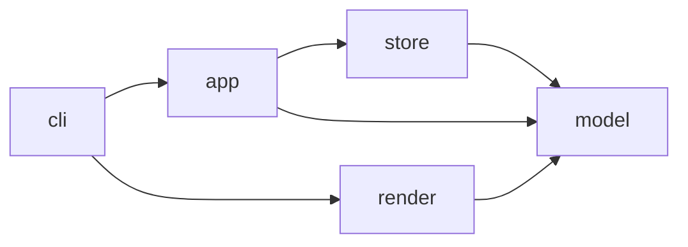

# Shop sample architecture

[The contract](../../architecture-contract.json) owns component boundaries for this fixture.
Every cross-component pair is either observed or forbidden.

## Components

| Component | Package | Responsibility |
|---|---|---|
| model | `shop.model` | Order and Line value types, Money arithmetic |
| store | `shop.store` | Persist orders as JSON files |
| app | `shop.app` | Place orders and summarise their totals |
| render | `shop.render` | Text projection of an order |
| cli | `shop.cli` | Argument parsing and composition |

Inside `store`, `shop.store.backend` owns the JSON file format so `shop.store.repository` keeps a
stable persistence API above it. The seam is internal: no rule decides a pair inside one component
(AD-24), and the package depth is what the report's drill-down walks.

## Allowed dependencies

| Edge | Reason |
|---|---|
| `store` → `model` | Persistence serialises the domain values it is given. |
| `app` → `model` | Use cases construct orders from domain values. |
| `app` → `store` | Use cases persist and load orders through the repository. |
| `render` → `model` | Text projection reads the values it renders. |
| `cli` → `app` | The composition root invokes the order use cases. |
| `cli` → `render` | The composition root prints the rendered order. |

<!-- archkeel-component-graph -->

