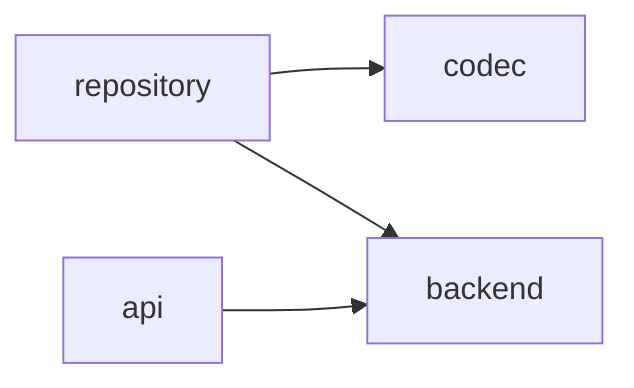
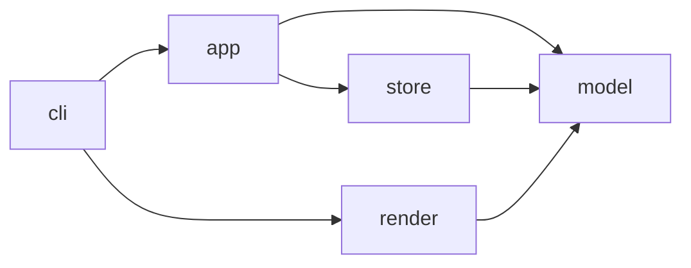

# Shop sample architecture

[The contract](../../architecture-contract.json) owns component boundaries for this fixture.
Every cross-component pair is either observed or forbidden.

## Components

| Component | Package | Responsibility |
|---|---|---|
| model | `shop.model` | Order and Line value types, Money arithmetic |
| store | `shop.store` | Persist orders as JSON files |
| app | `shop.app` | Place orders and summarise their totals |
| render | `shop.render` | Text projection of an order |
| cli | `shop.cli` | Argument parsing and composition |

From outside, the backend of `store` is out of reach: `DEP-APP-NO-STORE-BACKEND` scopes a
prohibition to that subpackage, one level below the `app` → `store` edge the contract otherwise
allows.

Inside `cli`, the error boundary is one function: `CONSTRUCT-NO-BROAD-EXCEPT` names
`shop.cli.main.main` in `exact_sources`, so only that function's own body may catch every
exception, and a helper nested inside it may not (AD-49).

## Inside store

`store` holds seven modules, more than this level has components, so the report names it as larger
than the level above it (AD-33) and it is opened as a level of its own.
[Its contract](../../shop/store/architecture-contract.json) is a second file, named by `inside` on
`COMP-STORE`; the two levels declare one and the same public surface, and the union of what the
sub-components offer is exactly what `store` offers.

| Sub-component | Package | Responsibility |
|---|---|---|
| api | `shop.store.sqlite` | Housekeeping on a whole store directory |
| repository | `shop.store.repository` | The order-facing persistence API |
| codec | `shop.store.codec` | The document format and its version |
| backend | `shop.store.backend` | Where a document lives, and how it is read and replaced |

`shop.store` itself belongs to no sub-component. It is carried rather than dropped: a module that
vanished between two levels is what this tool exists to prevent.

Pairs are decided here by `requires` alone, so absence forbids (AD-32); `STORE-REQUIRES-COMPLETE`
is what makes that checkable, and a crossing no entry covers is a violation naming the importing
module.

| Crossing | Import sites | Reason |
|---|---:|---|
| `repository` → `backend` | 3 | An order is stored somewhere, and the place is settled in one module. |
| `repository` → `codec` | 2 | Bytes are a format decision the persistence API delegates. |
| `api` → `backend` | 2 | Compaction walks the stored files and deletes them. |

## Allowed dependencies

| Edge | Reason |
|---|---|
| `store` → `model` | Persistence serialises the domain values it is given. |
| `app` → `model` | Use cases construct orders from domain values. |
| `app` → `store` | Use cases persist and load orders through the repository. |
| `render` → `model` | Text projection reads the values it renders. |
| `cli` → `app` | The composition root invokes the order use cases. |
| `cli` → `render` | The composition root prints the rendered order. |

<!-- archkeel-component-graph -->

