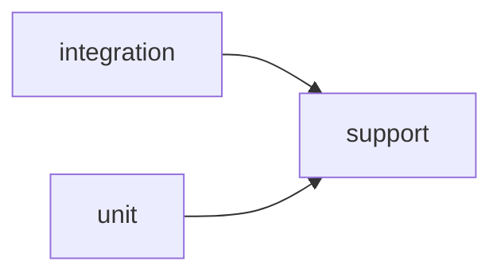

# Shop test architecture

[The test contract](../../tests/architecture-contract.json) governs `tests/` as a scope of its
own. `archkeel.toml` scans `shop` only, so a green product run says nothing about the tests;
`archkeel-tests.toml` scans `tests`, and `archkeel validate --config archkeel-tests.toml` checks
it. The product contract does not change.

| Suite | Package | Responsibility |
|---|---|---|
| support | `tests.support` | Builders every test may share |
| unit | `tests.unit` | One component at a time, no files on disk |
| integration | `tests.integration` | Use cases against a real store directory |

The contract decides the deterministic part of the test architecture:

- Layout: `TESTS-ROOT-LAYOUT` allows the three suites below `tests` and nothing else, and
  `TESTS-ASSIGNMENT-COMPLETE` makes every test module belong to one of them.
- Helper ownership: `TESTS-HELPERS-IN-SUPPORT` keeps every class below `tests` in `tests.support`.
  The test cases here are functions, so a class is always a helper.
- Suite dependencies: `TESTS-REQUIRES-COMPLETE` lets `unit` and `integration` import `support`
  and forbids every other suite pair.
- Packages: `TESTS-EXTERNAL-COMPLETE` and `TESTS-EXTERNAL-SHOP` name the one package beyond the
  standard library the tests may import, the product itself.

`shop` is outside this scan, so here it is one external package: a rule can decide which suites
import `shop`, not which of its modules. Whether a test is duplicated or its result is right is a
judgement about behaviour. The test suite and its oracle make it, not this contract.

<!-- archkeel-component-graph -->

