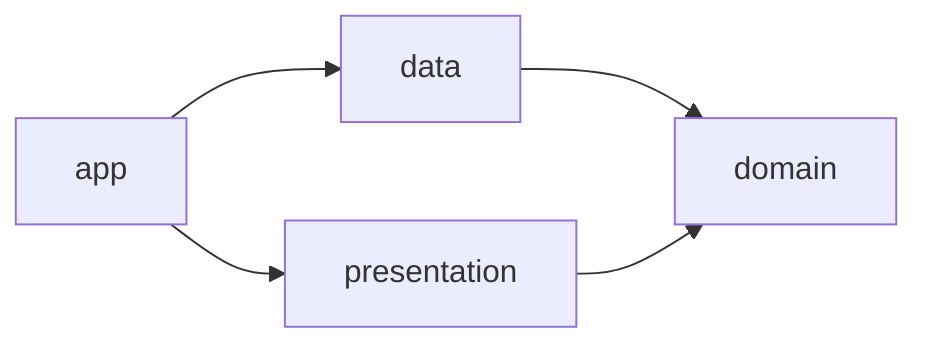

# Shop sample architecture (Dart)

[The contract](../../architecture-contract.json) owns the component boundaries of this Flutter-style
package. Archkeel reads only the directive header of each `lib/**/*.dart` file: `library`,
`import`, `export`, `part` and `part of`. Nothing is compiled, and no Flutter SDK is needed.

## Components

| Component | Package | Responsibility |
|---|---|---|
| app | `shop.main` | Composition root: wire the repository into the order screen |
| presentation | `shop.presentation` | Pages and widgets that show orders |
| domain | `shop.domain` | Order entities and the repository port |
| data | `shop.data` | Load and save orders over HTTP |

A module id is the package name followed by the path below `lib/`, so `lib/domain/domain.dart` is
`shop.domain.domain` and `lib/main.dart` is `shop.main`.

`domain` offers two things. Its facade library `shop.domain.domain` exports `Order`, `OrderLine`
and `OrderRepository` with `export … show …`, and the whole library is public. The repository
port is also public by name, `shop.domain.repository:OrderRepository`, for the data layer that
implements it. `OrderDraft` stays inside the domain: the facade does not export it.

An import with `show` names what it uses, so `INTERFACE-BOUNDARY` decides it the way it decides a
Python `from … import name`. An import without `show` of a library whose public entries are
per-name cannot be decided from the directive alone; that import is reported as UNKNOWN, never
as PASS.

`data` picks its HTTP client with a conditional import (`client_stub.dart` or, where `dart.library.io`
exists, `client_io.dart`). Both alternatives are real edges, and `DATA-PLATFORMS-ISOLATED` keeps
them from reaching each other. The order page's state lives in a `part` file, which belongs to the
page library and is no module of its own. The entry point loads the page with `deferred as`.

## External packages

`EXTERNAL-COMPLETE` requires a rule for every `package:` dependency. The `dart:` libraries are the
standard library and need none; `DEP-DOMAIN-NO-DART-IO` keeps `dart:io` out of the domain, which
also runs in a browser build.

| Package | Allowed in | Reason |
|---|---|---|
| `flutter` | app, presentation | Only the entry point and the widgets know Flutter, so order rules stay testable without a widget tree. |
| `http` | data | Only the data layer speaks HTTP. |

## Required dependencies

Pairs are decided by `requires` alone, so absence forbids (`REQUIRES-COMPLETE`).

| Edge | Reason |
|---|---|
| `app` → `presentation` | The composition root starts the order screen. |
| `app` → `data` | The composition root chooses the repository implementation the screen is given. |
| `presentation` → `domain` | Widgets render the domain's orders and load them through its repository port. |
| `data` → `domain` | The HTTP repository implements the domain's port and builds its entities. |

<!-- archkeel-component-graph -->

The contract permits exactly the edges the code uses, so the target graph draws the same four.

<!-- archkeel-target-graph -->

