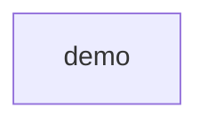

# Dart UML demo Target

The demo component owns the port, implementation and request entry point.
Client extends Base, implements Port and delegates run to helper. App imports core
and calls helper. Build creates Unit and assigns it to item. State names two literals.
Client has private token storage, a static limit and reset. Text is a type alias;
VERSION is a constant. The contract is independent of collector output.

The current Dart collector observes imports, not inner definitions or calls.
Target shows the declared design. As-Is shows recorded modules and imports.
Diff must retain unsupported inner observations as UNKNOWN, never PASS or absence FAIL.
This demo does not certify language UML parity or exhaustive inventories.

Replay with make demo-architecture VARIANT=uml-dart OUTPUT=demo-output/uml-dart.json.
Use a fresh output path. For TypeScript, first run make typescript-adapter with a
supported Node runtime. make demo-uml generates all three language reports.

Tracked in #339 (demos) and #340 (complete ArchKeel Target).

<!-- archkeel-component-graph -->

