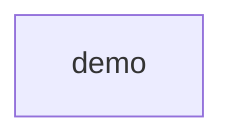

# TypeScript UML demo Target

The demo component owns the port, implementation and request entry point.
Client extends Base, implements Port and delegates run to helper. App imports core
and calls helper. Build creates Unit and assigns it to item. State names two literals.
Client has private token storage, a static limit and reset. Text is a type alias;
VERSION is a constant. The contract is independent of collector output.

TypeScript source-unit identities follow the collector's relative-path codec:
demo.src.core_x2e_ts and demo.src.app_x2e_ts. The UI labels their declared source files.

The current collector records TypeScript SourceFacts independently of this Target:
definitions, member inventories, calls, references, bases, and bindings. The original
closed module scopes remain UNKNOWN where evidence is incomplete. Three variants share
the same entities and relationships, closing only classifier member inventories with
complete receipts: matching source is PASS, a return-type change is FAIL, and a computed
constructor is UNKNOWN. As-Is and Diff show only recorded facts.

Replay with `make demo-architecture VARIANT=uml-typescript-match OUTPUT=demo-output/ts-match.json`.
The `uml-typescript-mismatch` and `uml-typescript-partial` variants exercise FAIL and
UNKNOWN. Use fresh output paths; `make demo-uml` generates these alongside Python and Dart.

Tracked in #339 (demos) and #340 (complete ArchKeel Target).

<!-- archkeel-component-graph -->

