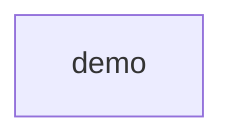

# UML demo Target

The component owns the port, implementation and request entry point.
Client inherits Base, realizes Port and delegates run to helper.
App imports core and calls helper. Build constructs Unit and binds it to item.
State has READY and STOPPED literals. Client has private token storage,
a static limit and a static reset operation. Text aliases str; VERSION names the demo version. Text is a type alias; VERSION is a constant.

This contract is authored independently of the source observation.
Open scopes require listed intent; they do not certify an exhaustive inventory.
Python visibility follows naming conventions. Static binding sites are not live objects.
Dynamic enum generation and complete instance inventories remain partial.

Replay with the existing Make target:

    make demo-architecture VARIANT=uml-match OUTPUT=demo-output/uml-match.json
    make demo-architecture VARIANT=uml-mismatch OUTPUT=demo-output/uml-mismatch.json
    make demo-architecture VARIANT=uml-partial OUTPUT=demo-output/uml-partial.json

Use fresh output paths. Match is PASS. Mismatch changes run's return type:
its signature is FAIL. Partial replaces READY with auto(): literal existence is
UNKNOWN. The Target is unchanged in all three runs.

These examples prove the Python collector against its independent Target. Dart and TypeScript
have separate source-only reports and retain their own unsupported facts as UNKNOWN.

Use make demo-uml OUTPUT=<fresh-directory> for Python, Dart and TypeScript reports.
Each language has an independently declared Target; see the catalog for source-fact verdicts.

Tracked in #339 (demo acceptance) and #340 (inner Target contracts).

Replay uml-complete for a closed static Target. It extends this authored contract,
not the observation, with the initializer, namespace groups, external references,
file inventory and all recorded relationship kinds used by this program.
Its describe function reads State.READY and VERSION inside core.py.
An extra definition fails the closed inventory. Exhaustive observation remains
UNKNOWN because the Python profile cannot certify all symbol and binding forms.
The open uml-match control remains PASS; PASS does not certify completeness.

A component is a responsibility boundary, not a folder. A Python module here maps
to one source file. Namespace groups do not prove physical package directories.

<!-- archkeel-component-graph -->

