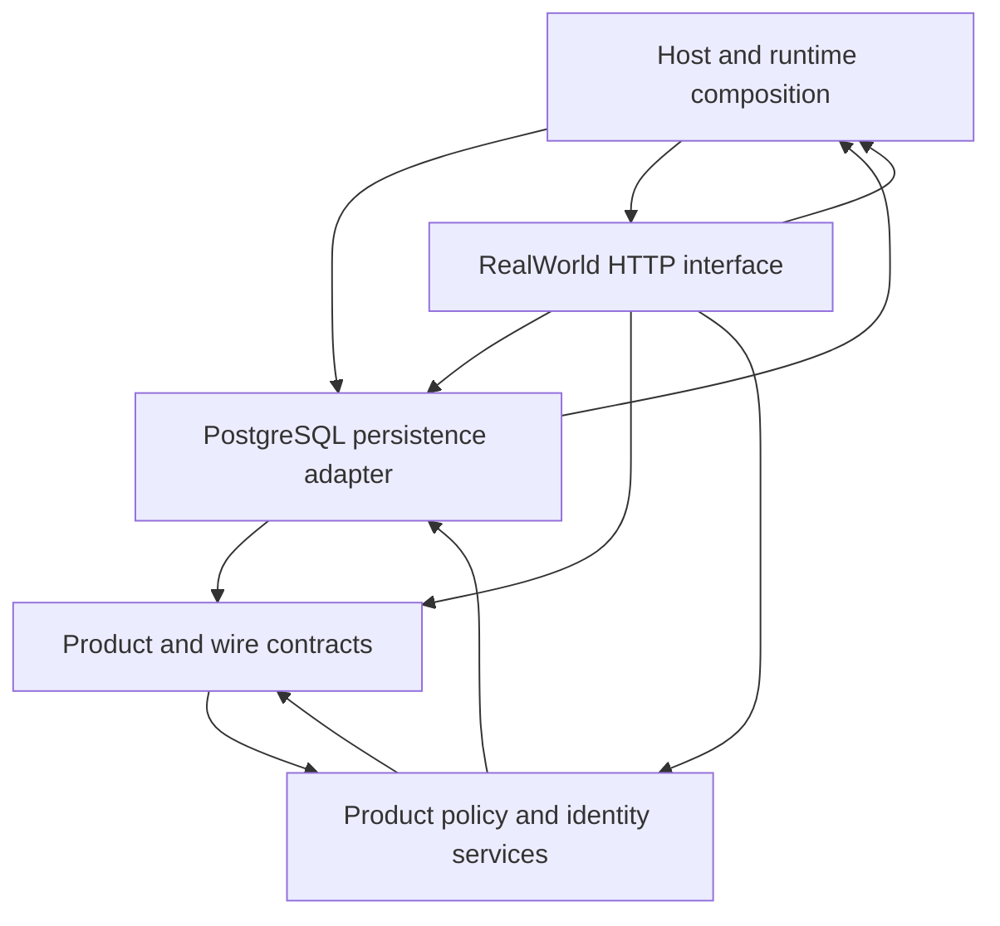

# FastAPI RealWorld project Target

This Target covers all 72 Python modules in the pinned `app/` tree, including its package initializers and Alembic Python migration files. The five responsibility areas are Host/runtime composition, the public HTTP interface, product policy, product and wire contracts, and the PostgreSQL adapter. Nested components divide account, profile, article/feed/favorite, comment, tag, repository, query, and migration work. The Target retains the source's dependency directions; in particular, `UserInDB` imports the password helper from product policy.

The API surface includes register/login, current-user read/update, profile read/follow/unfollow, tags, article list/create/read/update/delete, feed, favorite/unfavorite, and comment list/create/delete. Article filters include tag, author, favorited, limit, and offset. Optional authentication remains public on source-declared article/profile/comment reads; feeds and mutation handlers use required authentication. Route decorators and `Depends` defaults are declarations; this Target does not prove FastAPI registration or dependency execution.

The principal login path is `authentication.login(UserInLogin, UsersRepository, AppSettings) -> UserInResponse`, with the source-declared call to `jwt.create_access_token_for_user(User, secret_key) -> str`; `UsersRepository.get_user_by_email(*, email: str) -> UserInDB` and `UserInDB.check_password(password: str) -> bool` are the request-side repository and credential contracts. Python profile evidence does not prove dynamic repository receiver dispatch, database contents, transaction execution, JWT library behavior, or HTTP runtime behavior.

The closed principal APIs declare source-local fields and operations. Inherited Pydantic fields stay on their declaring base; Pydantic/FastAPI and database library types are external symbols. The source declares `tagList` aliases for response and create article tags, but this UML vocabulary does not encode Pydantic field aliases. Settings declare the API/JWT prefix, connection bounds, DB URL, secret, and environment variants; this Target does not prove environment resolution.

The selected app contains 79 files: 72 Python modules plus five SQL files, one `queries.pyi`, and one Alembic Mako template. Only Python modules have UML ownership. SQL query text, stub-provided APIs, the Mako template, PostgreSQL state/transactions, third-party Pydantic/FastAPI behavior, and real HTTP/database execution are outside this Target and remain unproven.

Upstream: `nsidnev/fastapi-realworld-example-app` at `029eb7781c60d5f563ee8990a0cbfb79b244538c` (MIT).

## Required module paths

The Target links host startup and route registration to the account, article/feed, comment, profile/follow, and tag endpoints. These routes connect to request dependencies, repositories, policy services, domain/wire models, and SQL query modules where the selected source directly imports them. The Alembic environment imports shared application configuration; the revision file has only external imports and remains an isolated module. The graph is intentionally partial: module import scopes remain open, and imports outside these principal paths are not asserted.

## Observed source imports

The graph records cross-component imports found in pinned source and attributed to Target ownership.

<!-- archkeel-component-graph -->

Target bundle SHA-256: `5dcc89c72c96c49f80524b86137a4aba103bbe604f83bc2518aa542c6fa0519d`
