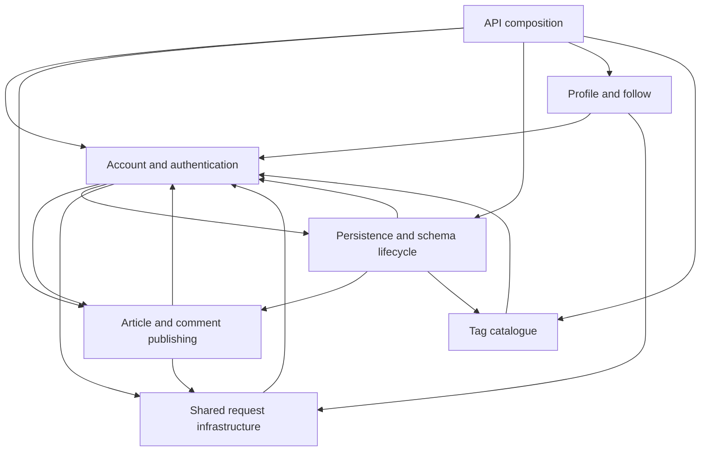

Independently authored Target

Pinned source is mikro-orm/nestjs-realworld-example-app at a6818d84b6a019cf2df4ef391dc87cea7d02c6a9, MIT. The Target follows the pinned README, direct source declarations/imports, and seven source responsibilities; it was not authored from an observed graph.

The top level exposes API composition, shared request infrastructure, account/authentication, article/comment publishing, profile/follow, tag catalogue, and persistence/schema lifecycle. Each of 41 prepared modules has one owner at each applicable level. Feature entities and repositories remain with their feature; persistence owns registry/configuration, migrations, and development seed. The two derived configs are README-prescribed byte copies.

Requires describe direct source imports, not Nest route or DI runtime behavior. The UML closes direct member scopes for principal account, feed/favorite/comment, profile/follow, tag, middleware, lifecycle and seed APIs; module scopes stay open because selected-source inventory can remain incomplete. UserService.create to User is a required creates invocation based on new User in source.

Decorators express ORM association intent, but current UML has no association or multiplicity kind and decorator details are not emitted. User, Article, and Comment relationships are described as design intent, not proven UML edges. Article.tagList is a string list; there is no normalized Article-to-Tag entity association. Optional/default signatures, implicit return types, parameter properties, computed keys, readonly and decorator semantics may remain incomplete or UNKNOWN.

Target bundle SHA-256: `95b3e4d16b8feeb073cb31d0e1057dfff7631ec0ed41f8c60a5284242302edc9`

<!-- archkeel-component-graph -->

