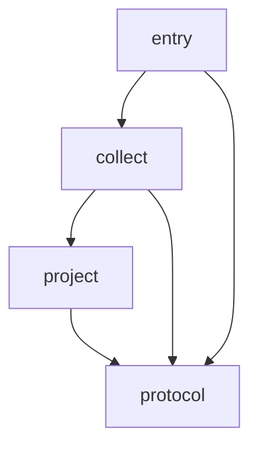

# TypeScript source adapter

The package collects source facts through one JSON process boundary. Core owns
architecture policy, metrics and verdicts. The four modules stay in `src`.

| Module | Responsibility | Internal dependencies |
|---|---|---|
| `entry.ts` | stdin, stdout and process errors | collect, protocol |
| `collect.ts` | AST imports and source evidence | project, protocol |
| `project.ts` | Selected project and contained resolution inputs | protocol |
| `protocol.ts` | Wire values, request validation and stable identities | none |

The project model is private to this adapter. The component `public` lists allow
whole-module sibling imports; they do not publish an npm API. Symbol-level
interfaces and typing metrics are unavailable in the TypeScript import profile.
Their measurements remain `null`; this contract makes no type-safety claim.

<!-- archkeel-component-graph -->


<!-- archkeel-target-graph -->


`complete_requires` forbids every other internal direction, including type-only
imports. Exact module ownership rejects undeclared source files. Both module and
component cycles are forbidden. Only `collect` and `project` may import
`typescript`, pinned to 5.9.3 in `package.json` and the lockfile. Node builtins
remain runtime dependencies.

Run from this package with the installed `archkeel-typescript` command on PATH:

```sh
archkeel report --root . --json
archkeel validate --root . --json
```

`archkeel.toml` selects `src` through `tsconfig.json`. Resolution metadata must be
inside the observed snapshot. Missing or unsupported evidence remains UNKNOWN.
The source review covers all four modules. Tests, build scripts and generated
`dist` are outside this source scope. Cross-language dependency contracts are
future work; the Python Core scan has its own source root.
